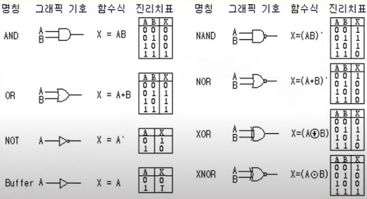
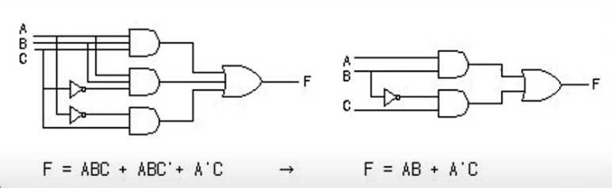
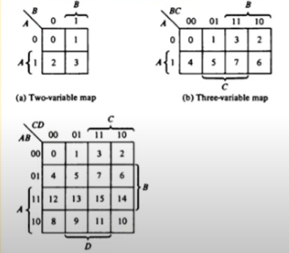
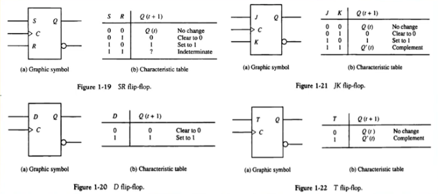
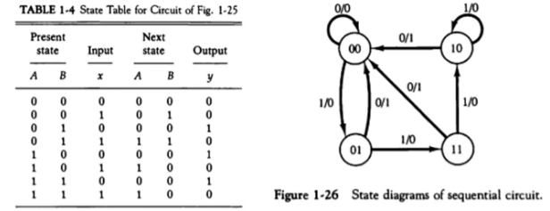

# 디지털 논리회로

**목차**

1. [디지털 컴퓨터](#디지털-컴퓨터)
2. [논리 게이트](#논리-게이트)
3. [부울 대수](#부울-대수)
4. [맵의 간소화](#맵의-간소화)
5. [조합 회로](#조합-회로)
6. [플립 플롭](#플립-플롭)
7. [순차 회로](#순차-회로)

---

### 디지털 컴퓨터

**정의**

* 이진 시스템을 사용해 계산을 수행하는 디지털 시스템
* 비트의 그룹을 사용해 숫자, 문자 및 기타 정보를 표시하거나 처리

**컴퓨터 하드웨어**

* CPU (Central Processing Unit)
  * 중앙처리 장치로 컴퓨터 그 자체로 정의된다
  * 산술 논리 처리와 데이터의 저장, 제어 기능 수행
* 주변장치
  * 메모리 (RAM / ROM)
  * 저장장치 (Storage)
  * 입출력 장치 (I/O devices)

**컴퓨터 소프트웨어**

* 운영체제
  * OS (Operating System)
* 시스템 프로그램
  * 유틸리티
  * 데이터 베이스
  * Editor
    * OS 에 포함되거나 연결돼 시스템 운영을 보조
* 응용프로그램

---

### 논리 게이트

**이진 정보의 표시**

* 0과 1의 전압 신호
* 0V - 5V 시스템
* 0.5V - 3V 시스템

**논리 게이트**

* 기본 게이트로 진리표로 동작 정의

  

  * NAND / NOR : Not 이 붙어서 반대로 동작
  * XOR / XNOR : 같은 결과면 0, 다른 결과면 1 / 같은 결과면 1, 다른 결과면 0

---

### 부울 대수

**이진 변수와 논리 동작을 취급하는 대수**

**기본 대수 동작**

* AND, OR, NOT

**부울 대수의 사용 이유**

* 변수 사이의 진리표 관계를 대수적으로 표시
* 논리도의 입출력 관계를 대수 형식으로 표시
* 같은 기능을 가진 더 간단한 회로 발견

**기본 관계**

* 항등원, 역원, 교환법칙, 결합법칙, 드모르간의 법칙

**예시**

* `'` 는 NOT 

  **부울 대수의 간략화와 등가회로**

  * `F = ABC + ABC' + A'C = AB(C + C') + A'C`

    

  **부울 대수의 보수**

  * `F = AB + C'D' + B'D`
  * `F' = (A' + B')(C + D)(B + D')`

---

### 맵의 간소화

**맵 방식의 부울 수식 간소화**

* 부울 함수를 visual diagram 을 통해 간소화
* Karnaugh map, Veitch diagram
* Minterm, Maxterm 을 이용한 간소화

**무정의 조건**

* 사용하지 않는 항을 활용해 간소화

---

### 조합 회로

**정의**

* 입출력을 가진 논리 게이트의 집합
* 출력의 값은 입력의 0, 1의 조합에 의해 결정되는 함수 결과로 표시
* n 개의 입력 조합이 있을 경우 가능한 입력 조합은 `2^n` 가지

**설계 절차**

1. 해결할 문제의 제시
2. 입출력의 변수에 문자 기호 부여
3. 입출력 관계를 정의하는 진리표 도출
4. 각 출력에 대한 간소화된 부울 함수 도출
5. 부울 함수에 대한 논리도 작성
6. 논리도 바탕으로 회로 구현

**예시**

* 반가산기 (Half adder)
  * 2 개의 비트값을 산술적으로 가산
* 전가산기 (Full adder)
  * 캐리값을 포함하여 3비트 가산

---

### 플립 플롭

**정의**

* 1 비트의 디지털 정보를 저장하는 이진 셀 (디지털 메모리)
* 동기식 순차 회로의 기본적 요소로 사용하며 조합 회로와 함께 순차 회로를 구성
* 입력의 상태가 변화를 일으키기 전까지는 이전의 출력 상태를 그대로 유지

**종류**

* SR / JK / D / T

**모서리 변이형 플립플롭 (Edge triggered FF)**

* 입력값의 변화 모서리에서만 동작
  * Upward triggered FF
    * 입력값이 상향일 경우에만 동작 (0 &rarr; 1)
  * Downward triggered FF
    * 입력값이 하향일 경우에만 동작 (1 &rarr; 0)
* 올바른 동작을 위해서는 최소의 신호 유지 시간 필요
  * Setup Time
    * 출력 변화를 위하여 입력이 유지돼야 하는 최소 시간
  * Hold Time
    * 출력 유지를 위해 입력이 바뀌지 않아야 하는 최소 시간

---

### 순차 회로

**정의**

* 플립 플롭과 게이트 (or 조합 회로) 를 서로 연결한 회로
* 클럭 펄스에 의해 동기화된 입력 순차에 의해 제어
* 출력은 외부 입력과 플립 플롭의 현 상태 함수로 표시

**플립 플롭의 입력식**

* FF 의 입력을 만들어내는 조합 회로 부분

* 부울 수식에 의해 표현

* 상태표 (State Table) / 상태도 (State Diagram)

  

**설계**

1. 상태표 / 상태도 작성
2. 순차 회로 여기표 작성
3. 플립 플롭의 선택과 입력식 도출
4. 회로도 구현