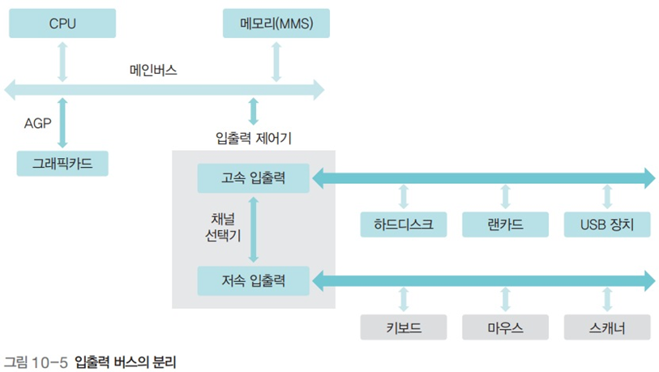
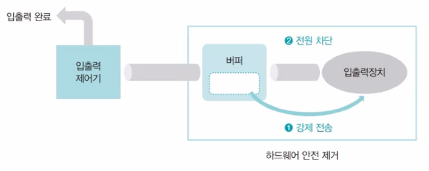
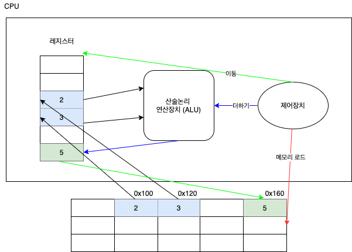
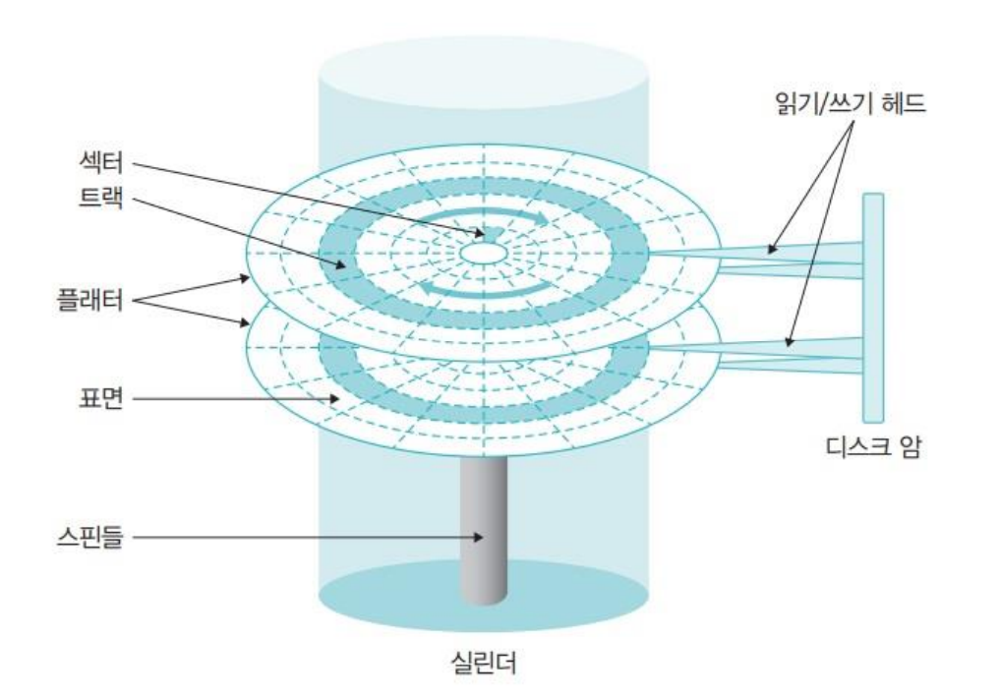

# 컴퓨터 구조

**목차**

1. [하드웨어](#하드웨어)
2. [폰 노이만 구조](#폰-노이만-구조)
3. [성능 향상](#성능-향상)
   * [채널](#채널)
   * [버퍼](#버퍼)
   * [캐시](#캐시)
4. [CPU](#cpu)
5. [메인메모리](#메인메모리)
6. [저장장치](#저장장치)
7. [하드웨어 사양](#하드웨어-사양)

---

## 하드웨어

*소프트웨어 : 하드웨어를 작동하려고 만든 알고리즘을 프로그램 형태로 제작한 것*

| 하드웨어 이름                  | 설명                                                         |
| ------------------------------ | ------------------------------------------------------------ |
| **CPU (중앙 처리 장치)**       | 명령어를 해석해 실행하는 장치                                |
| **메인메모리**                 | 작업에 필요한 프로그램과 데이터를 저장하며 CPU 에 데이터를 넘겨주고 처리한 데이터를 다시 저장 |
| **입력 장치**                  | 컴퓨터에 데이터를 전달하는 장치 천공 카드 &rarr; 키보드 &rarr; 마우스 순으로 개발, 현재는 터치 스크린과 카메라가 중요한 입력 장치 |
| **출력 장치**                  | 작업 결과를 나타내는 장치 진공관 &rarr; 라인 프린터 &rarr; 모니터, 그래픽 카드 등 순으로 개발 |
| **저장 장치 (보조 저장 장치)** | 전원이 꺼진 이후에도 데이터 보관할 수 있는 장치              |
| **메인보드**                   | CPU 와 메모리 등 다양한 컴퓨터 부품을 연결 시켜 주는 커다란 판 (버스로 연결, 전기 공급) |
| **버스**                       | 메인보드 내 고정된 부품들 사이를 연결하는 선의 집합으로 전기와 데이터의 통로 메인보드에 있는 버스를 System bus 혹은 Front-Side Bus (전면 버스) 라고 한다 |
| **포트 (Port)**                | 메인보드에 각종 부품을 꽂을 수 있는 단자                     |

---

## 폰 노이만 구조

**모든 하드웨어가 버스로 연결된 구조**

* 하드웨어는 그대로 둔 채 작업용 프로그램만 교체해 메인 메모리에 올리는 방식

  &rarr; ***메인메모리로 프로그램이 가능한 컴퓨터 구조***

* 하드와이어링 형태의 컴퓨터의 문제를 해결하기 위해 미국 수학자 존 폰 노이만이 고안

  * 하드와이어링의 경우, 다른 용도로 컴퓨터를 사용하기 위해선 전선 연결을 바꿔 회로를 변경해야 했다

* 현대 모든 컴퓨터가 이 방식을 따른다
* ***모든 프로그램은 메인메모리에 올라와야 실행이 가능하다***

*메인 메모리 크기는 컴퓨터 속도에 영향을 미친다*

* 그러나 메인 메모리가 *필요 없이* 커지면 컴퓨터가 더는 빨라지지 않는다
  * 그래도 메인 메모리가 클수록 컴퓨터 속도가 향상된다

---

## 성능 향상

### **채널**

| 장치명         | 설명                                                         |
| -------------- | ------------------------------------------------------------ |
| 저속 주변 장치 | 메인 메모리와 주변 장치 사이에 오고 가는 데이터의 양이 적어 데이터 전송률이 낮은 장치 키보드, 마우스 등 |
| 고속 주변 장치 | 메인 메모리와 주변 장치 사이에 대용량의 데이터가 오고 가는 데이터 전송률이 높은 장치 그래픽 카드, 하드 디스크, USB 메모리 등 |

병목 현상을 방지하기 위해 여러 개의 버스를 사용, 이 때 버스 여러 개에서 데이터가 지나다니는 하나의 통로를 채널이라 한다

* **채널 분리**

  * 여러 채널을 효율적으로 사용하기 위해 속도가 비슷한 장치끼리 묶는 것

* **다채널 버스 구조**

  * 여러 채널을 운영하는 컴퓨터의 버스는 `메인버스` 와 `입출력 버스` 로 나뉜다
  * **메인버스**
    * CPU 와 메인메모리가 사용하는 버스로 컴퓨터 내 버스 중 가장 빠르다
    * 주변 장치는 메인 버스에 직접 연결되지 못하지만 **그래픽 카드는 메인 버스에 바로 연결 가능**
      * 그래픽 관련한 작업은 CPU 가 담당하지 않고 GPU 가 담당
      * 그래픽 카드는 자체적 연산이 가능하기 때문에 메인 버스에 연결 
  * **입출력 버스**
    * 주변 장치와 직접 연결된 버스로 고속 입출력 버스와 저속 입출력 버스로 나뉜다
    * 고속 입출력 버스와 저속 입출력 버스 사이의 데이터 전송은 채널 선택기가 관리
  
  

### 버퍼

**속도 차이가 나는 두 장치 사이에서 일정 양의 데이터를 모아 옮김으로서 속도 차이를 완화하는 장치**

* 같은 사양의 하드디스크라면 버퍼 용량이 큰 것이 더 빠르다

* 예시

  * 동영상 스트리밍의 경우, 플레이어가 재생하는 도중 데이터가 도착하지 않으면 동영상이 끊긴다
  * 이런 현상을 방지하고자 동영상 데이터의 일정한 양을 버퍼에 넣은 후 실행시킨다
  * 버퍼에 있는 데이터를 다 쓸 때까지 데이터가 도착하지 않으면 화면이 멈추며 버퍼링을 다시 한다

* **소프트웨어적 버퍼**

  * **스풀 (SPOOL)**
    * CPU 와 입출력 장치가 독립적으로 동작 되도록 고안된 소프트웨어적 버퍼
  * 스풀러 (SPOOLer)
    * 프린터에 사용
    * 스풀러 사용 시 인쇄할 내용은 하드디스크의 스풀러 공간에 저장, 워드 프로세서는 다른 작업 가능
    * 문서 작업과 프린터 출력 작업을 독립적으로 진행, 시스템 효율이 올라간다
    * 일종의 버퍼지만 차이점 有
      * 버퍼는 어떤 프로그램을 사용하는 데이터든지 간에 버퍼가 차면 이동 시작 (버퍼 공유)
      * 스풀러는 배타적 (공유 X)

* 문제점

  * 버퍼에 데이터가 차 있지 않으면 버퍼가 찰 때까지 기다렸다가 데이터 전송

  * 이 때 버퍼 내 데이터를 옮길 대상이 제거 시 문제 발생

    * `하드웨어 안전 제거` 를 사용 시 버퍼가 다 차지 않아도 강제로 버퍼 내용을 저장 장치로 옮긴 후 입출력 장치의 전원을 차단

    

### 캐시

두 장치 간 속도 차이를 완화 시켜 주는 것으로 버퍼의 한 종류

**필요할 것이라 예상되는 데이터를 미리 가져오는 장치 (prefetch)**

* 특징
  * CPU 속도로 동작하기 때문에 일반 메인 메모리보다 훨씬 빠르고 CPU 내에 있다
  * 앞으로 필요한 데이터를 캐시에 미리 가져다 놓으면 CPU 가 작업을 빠르게 진행할 수 있다
* 소프트웨어적 캐시
  * 방문했던 웹 사이트의 데이터를 보관하다가 재방문 시 재사용 해 속도 높인다
  * 캐시에 너무 많은 양이 있으면 데이터를 찾는 데 시간이 걸려 오히려 웹 브라우저의 속도 저하될 수도 있다
    * 캐시 청소 필요

---

## CPU

***산술 논리 연산 장치 (Arithmetic and Logic Unit, ALU), 제어 장치 (Control Unit), 레지스터 (Register) 로 구성***

| CPU 구성 요소           | 설명                                                         |
| ----------------------- | ------------------------------------------------------------ |
| **산술 논리 연산 장치** | 주어진 데이터를 사용해 산술 연산과 논리 연산을 수행          |
| **제어 장치**           | CPU 에서 작업을 지시하는 장치 저장 장치에서 메인메모리로 데이터를 가져오거나 저장 장치로 데이터를 내보내기 입출력 장치에서 데이터 제어하는 명령 등을 내림 |
| **레지스터**            | CPU 내 데이터를 임시로 보관하는 장치 계산하는 데 필요한 데이터를 잠시 저장하거나 계산의 중간 값을 저장 |

**CPU 구성과 동작**

`2+3` 동작

**CPU 성능**

* 데이터 처리량
  * 한 번에 처리할 수 있는 데이터에 따라 32 비트 와 64 비트로 나뉜다
  * 각 버스의 대역폭 (bandwidth) 와 레지스터 크기를 의미
  * 데이터가 2 배 처리 가능한 것이며 속도가 2 배 되는 것이 아님
* 성능 향상 방법
  * **CPU 클록 높이기**
    * 발열 문제로 현재 5GHz 가 넘는 CPU 개발하기 어렵다
  * **캐시 크기 늘리기**
    * 비용 문제
  * 그래서 CPU 핵심 기능을 가진 코어를 여러 개 만들거나 동시에 실행 가능한 명령 개수를 늘리는 방법 사용 

---

## 메인메모리

**작업에 필요한 프로그램과 데이터를 저장하는 장소**

* 주소

  * 전체 크기를 1 바이트 씩 나누고 각각의 바이트에 데이터 저장
  * 특정 데이터를 저장하거나 가져올 때는 주소를 사용

* 종류

  * **램 (Random Access Memory, RAM)**

    * 읽거나 쓸 수 있다

    * 저장된 위치와 상관없이 같은 속도로 데이터를 읽을 수 있다

    * 휘발성 (volatility) 메모리와 비휘발성 (non-volatility) 메모리로 나뉜다

      * **휘발성 메모리** : 전원이 없으면 데이터가 사라지는 대신 접근 속도가 빠르다

      | 종류                        | 설명                                                         |
      | --------------------------- | ------------------------------------------------------------ |
      | DRAM (Dynamic RAM, 동적 램) | 저장된 데이터가 일정 시간이 지나면 사라진다 일정 시간마다 재생 (refresh) 필요 메인 메모리로 사용 |
      | SRAM (Static RAM, 정적 램)  | 재생할 필요가 없다 속도는 빠르지만 가격이 비싸다 캐시 메모리로 사용 |
      | SDRAM (동기 DRAM)           | DRAM 의 발전된 형태로 클록 틱이 일어날 때마다 데이터 저장 컴퓨터 메인 메모리나 스마트폰에서 사용 |

      [참고]

      SDRAM : 클록 틱 한 번에 데이터 1 개 저장

      DDR SDRAM : 클록 틱 한 번에 데이터 2 개를 저장

      DDR2 SDRAM : SDRAM 보다 대역폭이 4 (22) 더 크다

      DDR3 SDRAM : SDRAM 보다 대역폭이 8 (23) 더 크다

      `... 현재 DDR5 까지 나옴`

      * **비휘발성 메모리** : 플래시 메모리, FRAM, PRAM

  * **롬 (Read Only Memory, ROM)**

    * 읽기만 가능

    * 전원이 꺼져도 데이터를 보관하는 장점과 데이터를 한 번 저장하면 내용을 바꿀 수 없다

      | 종류                           | 설명                                          |
      | ------------------------------ | --------------------------------------------- |
      | 마스크 롬 (Mask ROM)           | 데이터를 지우거나 쓸 수 없다                  |
      | PROM (Programmable ROM)        | 전용 기계를 사용해 데이터를 한 번만 저장 가능 |
      | EPROM (Field Programmable ROM) | 여러 번 데이터를 쓰고 지울 수 있다            |

---

## 저장장치

* 구동 장치가 있는 기계라서 속도가 느리다
* 메모리보다 싸고 용량이 크다
* 전원 공급과 상관없이 데이터를 영구적으로 보관

* 종류
  * **자성** : 카세트 테이프, 플로피 디스크, 하드 디스크
  * **레이저** : CD, DVD, 블루레이
  * **메모리** : USB, SD, CF

### 하드디스크

**움직이는 헤드를 가진 하드디스크 드라이브로 대용량 데이터 저장 (moving-head hard disk drive)**

**구조** : 스핀들이라는 원통 축에 플래터가 여러 개 달려있다

**플래터**

표면에 자성체를 발라 자기를 이용해 0 과 1 데이터 저장 가능

플래터 표면이 N 극을 띠면 0 이라 인식, S 극을 띠면 1 이라 인식

두 장 이상으로 구성되며 항상 일정한 속도로 회전, 두 개의 면에 데이터 저장 (양쪽의 표면 모두 사용)

**섹터**

가장 작은 저장 단위로 물리적 개념이며 섹터 1 개에는 한 덩어리의 데이터가 저장

**트랙**

플래터에서 회전축을 중심으로 데이터가 기록되는 동심원 = 동일한 동심원 상에 있는 섹터의 집합

**데이터 전송 단위** : **블록**

하드디스크와 컴퓨터 사이에 데이터를 전송하는 논리적 가장 작은 저장 단위로 섹터 여러 개로 구성

'블록' 이라는 용어 대신 '할당 단위' 라고 표현

하나의 블록에 주소 1 개가 배정

### CD

* 하드 디스크 처럼 트랙과 섹터로 구성되며 수평으로 움직이는 헤드가 트랙 사이를 움직이며 데이터를 읽는다
* 표면의 미세한 홈에 헤드에서 발사한 레이저가 홈에 들어가 반사되지 않으면 0, 반사되면 1이라 인식
* 헤드 위치에 따라 디스크 회전 속도 변화 = rpm 단위 쓸 수 없다
* 저장 용량
  * 오디오 74 분
  * 디지털 데이터 650 MB
  * mpeg 레벨 1로 압축 돼 최대 83 분 분량의 비디오

&rarr; 용량과 화질 개선을 위해 **DVD** 등장 &rarr; **블루레이** 로 개선 

---

## 하드웨어 사양

**코어 (core)**

CPU 에서 작업을 하는 주요 장치

**SSD**

반도체 메모리를 사용해 하드디스크 구현한 것으로 하드디스크처럼 모터를 사용하는 부분이 없어 전자적으로 데이터 저장

* 저장 속도 빠르고 무게 가볍고 충격에 강하다

**CPU 와 병렬 처리**

CPU 의 클록 속도를 높이면 성능도 높아지지만 발열 문제로 5GHz 이상은 어렵다

&rarr; 동시에 여러 개의 명령을 처리해 작업 능률을 올리는 병렬 처리 도입

* 파이프라인 기법
  * CPU 에서 가장 작은 작업을 스레드 (thread) 라고 부른다
  * 하나의 코어에 여러 개의 스레드를 동시에 실행
    * 하나의 코어 안에서 작업 단위가 여러 개를 가질 수 있다는 의미
* 슈퍼 스칼라 (super scalar) 기법
  * 코어를 늘려 동시에 작업 처리
  * 듀얼 코어는 작업 2 개를 동시에 처리

**포트**

외부 장치를 메인보드에 접속하려고 만든 것

* 메인보드의 포트
  * CPU 포트
  * 램 포트 : 메인 메모리를 꽂는 포트
  * SATA (Serial ATA) 포트 : 하드디스크, SSD, CD-ROM 같은 저장 장치 연결
* 컴퓨터의 후면 포트
  * 직렬 포트 : 마우스, 키보드 등 느린 장치
  * USB 포트 : 주변 기기를 연결하려고 만든 표준 연결 포트

**포트 연결 단자 종류**

| 단자 종류 | 전원 공급 | 특징                                                  |
| --------- | --------- | ----------------------------------------------------- |
| USB       | O         | 대부분의 기기를 연결하는 범용 단자                    |
| SATA      | X         | 하드디스크 같은 저장 장치를 고속으로 연결하는 단자    |
| D-SUB     | X         | 아날로그 신호를 모니터로 전송하는 단자                |
| DVI       | X         | 디지털 신호를 모니터로 전송하는 단자                  |
| HDMI      | X         | 그래픽과 사운드를 동시에 모니터나 TV 로 전송하는 단자 |

---

## 연습문제 (객관식)

| 문제 | 답   | 문제 | 답   |
| ---- | ---- | ---- | ---- |
| 1    | 1    | 19   | 3    |
| 2    | 2    | 20   | 4    |
| 3    | 3    | 21   | 2    |
| 4    | 3    | 22   | 3    |
| 5    | 4    | 23   | 3    |
| 6    | 1    | 24   | 3    |
| 7    | 2    | 25   | 4    |
| 8    | 2    | 26   | 1    |
| 9    | 4    | 27   | 4    |
| 10   | 2    | 28   | 3    |
| 11   | 3    | 29   | 1    |
| 12   | 1    | 30   | 2    |
| 13   | 3    | 31   | 2    |
| 14   | 4    | 32   | 3    |
| 15   | 2    | 33   | 1    |
| 16   | 3    | 34   | 2    |
| 17   | 1    | 35   | 2    |
| 18   | 2    | 36   | 1    |

## 연습문제 (주관식)

| 문제 | 답              | 문제   | 답                  |
| ---- | --------------- | ------ | ------------------- |
| 37   | CPU, 메인메모리 | 55     | 산술 논리 연산 장치 |
| 38   | 주변 장치       | 56     | 제어 장치           |
| 39   | CPU             | 57     | RAM                 |
| 40   | 메인메모리      | 58     | ROM                 |
| 41   | GPU             | **59** | 플래시 메모리       |
| 42   | 입력 장치       | 60     | 4                   |
| 43   | 출력 장치       | 61     | 메모리              |
| 44   | 저장 장치       | 62     | 섹터                |
| 45   | 메인보드        | 63     | 트랙                |
| 46   | 버스            | 64     | 실린더              |
| 47   | 폰 노이만       | 65     | 포맷팅              |
| 48   | 메인 메모리     | 66     | 블루레이            |
| 49   | 채널            | 67     | AP                  |
| 50   | 버퍼            | 68     | AGP                 |
| 51   | 스풀러          | 69     | SATA                |
| 52   | 캐시            | 70     | USB                 |
| 53   | 버퍼            | **71** | 파이프라인          |
| 54   | 레지스터        | **72** | 슈퍼스칼라          |

