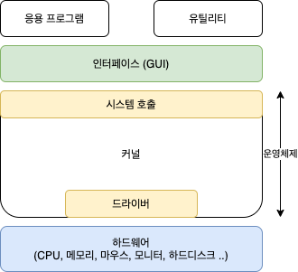
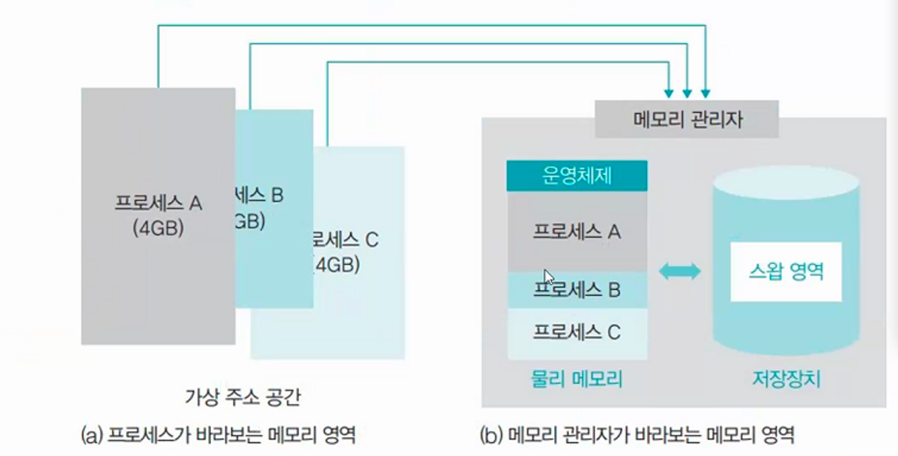

# 운영체제 (OS, Operating System)

### `컴퓨터나 노트북 전원을 켜면 가장 먼저 만나는 소프트웨어`

**사용자에게 편리한 인터페이스를 제공하고 자원을 효율적으로 관리하는 소프트웨어**

---

**목차**

1. [종류](#종류)
2. [역할과 기능](#역할과-기능)
3. [구조](#구조)
4. [역사](#역사)
5. [프로그램 vs 프로세스](#프로그램-vs-프로세스)
6. [메모리 관리](#메모리-관리)
7. [파일](#파일)

---

## 종류

* 대형 컴퓨터 : 유닉스
* 개인용 컴퓨터 : 윈도우, 맥 OS, 리눅스 등
* 스마트폰 (모바일 운영체제) : iOS, 안드로이드

* 임베디드 
  * CPU 성능도 낮고 메모리 크기도 작아 특정 시스템에 내장할 수 있도록 만든 운영체제
  * 내비게이션, 스마트 TV, 워치 등

---

## 역할과 기능

**성능 향상**

새로운 기능 추가, 성능 변경이 가능하므로 성능 및 효율성 향상을 꾀할 수 있다

**자원 관리 (resource management)**

제한된 장치를 서로 독차지 하려 하는 응용 프로그램 사이에서 자원을 관리하는 중재자 역할

**자원 보호 (보안)** 

자원을 악의적인, 혹은 미숙한 사용자에게서 보호

응용 프로그램이 자신의 작업 영역을 넘어 남의 영역을 침범하지 않도록, 비정상적인 작업에서 컴퓨터 자원을 지키는 역할

**사용자 인터페이스 제공**

과거 유닉스, MS-DOS 운영 체제는 마우스 없이 키보드만 사용해 매우 불편 (현재는 GUI)

컴퓨터 하드웨어와 소프트웨어를 편리하게 사용할 수 있도록 환경 제공

**핵심 기능**

| 핵심 기능        | 설명                                                         |
| ---------------- | ------------------------------------------------------------ |
| 프로세스 관리    | 프로세스에 CPU 를 배분하고 작업에 필요한 제반 환경 제공      |
| 메인 메모리 관리 | 프로세스에 작업 공간을 배치하고 실제 메인 메모리보다 큰 가상 공간을 제공한다 |
| 저장 장치 관리   | 데이터를 저장하고 접근할 수 있는 인터페이스를 제공한다       |

---

## 구조

### **커널** 

프로세스 관리, 메모리 관리, 저장 장치 관리 같은 운영체제의 핵심 기능을 모아둔 것

* **시스템 호출**
  * 어떤 응용 프로그램이나 사용자도 커널에 직접 접근할 수 없다
    * 대신, 운영체제에서 어떤 작업을 부탁할 때는 시스템 호출 (system call) 을 사용
    * 사용자가 커널을 사용할 수 있도록 운영체제가 제공하는 프로그램 함수 (function) 의 집합

* **드라이버**

  * 운영체제가 하드웨어 장치와 상호 작용하려고 만든 컴퓨터 프로그램

  * 장치 드라이버, 디바이스 드라이버, 장치 제어기, 소프트웨어 드라이버라고도 한다

  * 그래픽 카드나 프린터 같이 복잡한 드라이버는 CD 형태로 제공

### **사용자 인터페이스** 

운영체제가 사용자와 응용 프로그램에 인접해 커널에 명령을 전달하고 실행 결과를 사용자와 응용 프로그램에 돌려주는 기능을 의미

**운영체제 특징**

* 모든 응용 프로그램은 운영체제 위에서 작동, 운영체제가 불안정하면 다른 응용 프로그램도 함께 불안정
* 운영체제는 바이러스나 악의적인 소프트웨어에서 하드웨어 뿐 아니라 자기 자신도 보호
* 운영체제는 ***사용자가 직접 자원에 접근하는 것을 막음으로서*** 자원을 보호

---

## 역사

**유닉스** 여러 명이 동시에 사용할 수 있는 운영체제 

* 1960 년대, AT&T 연구원 켄 톰프슨 개발
  * System V 계열
* 1970 년대 말, 빌 조이와 척 헤일리
  * BSD

***GNU (GNU is Not Unix)** 소프트웨어를 자유롭게 실행, 복사, 수정, 배포할 수 있도록 만든 OS*

* copy left
* 리눅스나 안드로이드는 GNU 결과물로 만든 운영 체제

**리눅스** 개인용 컴퓨터에서 동작하는 유닉스 호환 커널

* 1991 년, 리누스 토르발스 개발
* FreeBSD 기반

**맥 OS** 

* FreeBSD 변형해 매킨토시에서 동작하는 OS

**윈도우**

* 마이크로소프트 MS-DOS 에 GUI 붙인 것이 윈도우

---

## 프로그램 vs 프로세스

### 프로세스

**하나의 작업 단위**

* 사용자가 마우스를 더블 클릭해 프로그램을 실행하면 그 프로그램은 프로세스가 된다
* 프로그램으로 작성된 작업 절차를 실제로 실행에 옮긴다는 의미
  * 메모리에 올라와서 작업을 수행하는 동적인 상태

**상태**

**시분할 작업**

* **프로세스 제어 블록 (Process Control Block, PCB)**
* 프로세스 = 프로그램 + 프로세스 제어 블록

| 상태                         | 설명                                                         |
| ---------------------------- | ------------------------------------------------------------ |
| 생성 상태 (create status)    | 프로세스가 메모리에 올라와 실행 준비를 완료한 상태, PCB 생성 |
| 준비 상태 (ready status)     | 생성된 프로세스가 CPU 를 얻을 때까지 기다리는 상태           |
| 실행 상태 (running status)   | 준비 상태에 있는 프로세스 중 하나가 CPU 를 얻어 실제 작업을 수행하는 상태 |
| 완료 상태 (terminate status) | 실행 상태의 프로세스가 주어진 시간 동안 작업을 마치면 완료 상태로 진입, PCB 반납 |

### 프로그램

**어떤 데이터를 사용해 어떤 작업을 할 지 그 절차를 적어놓은 것**

* 하드 디스크 같은 저장 장치에 보관하고 있다가 마우스로 더블 클릭 시 실행

---

## **메모리 관리**

* 폰 노이만 구조의 컴퓨터에서는 메모리는 유일한 작업 공간, 모든 프로그램은 메모리에 올라와야 실행 가능
  * 운영체제도 프로세스 이므로 메모리로 올라와야지만 실행 가능
  * 따라서 메모리 영역을 운영체제 영역과 일반 영역으로 나눈 후, 어떤 일반 프로세스도 운영체제 영역으로 침범할 수 없도록 한다

### **메모리 관리 시스템 (Memory Management System, MMS)**

* 운영체제 영역과 다른 작업 영역 침범 막기
* 자리 부족 시 빈 공간 확보
* 프로세스 종료 시 자리 치우기
* 수행하는 일
  * **가져오는 작업 (fetch)** 프로세스와 데이터를 메모리로 가져오는 것
  * **배치 작업 (placement)** 가져온 프로세스와 데이터를 메모리의 어떤 위치에 놓을 지 결정하는 것
  * **재배치 작업 (replacement)** 꽉 차 있는 메모리에 새로운 프로세스를 가져오기 위해 오래된 프로세스를 내보내는 것

### **가상 메모리 (Virtual memory)**

* 사용자가 가지고 있는 실제 메모리 크기와 프로세스가 올라갈 메모리 위치를 신경 쓰지 않고 프로그래밍을 하도록 지원
* 실제 메모리 크기와 상관없으며 이론적으로 가상 메모리 크기는 무한대
* **구성**
  * `프로세스가 바라보는 메모리 영역`
  * `메모리 관리자가 바라보는 메모리 영역`

***이론적으로 가상 메모리가 무한대더라도 하드웨어 한계가 있어서 무한대로 사용할 수 없다!***

&rarr; 따라서 가상 메모리의 크기는 **`실제 메모리 크기 + 스왑 영역`**크기 가 된다

**스왑 영역 (swap area)**

* 메모리가 모자라서 쫓겨난 프로세스를 저장 장치의 특별한 공간에 모아두는 영역
* 하드디스크 같은 저장 장치는 장소만 빌려주고 메모리 관리자가 담당
  * 최대 절전모드
    * CPU 와 메모리의 전력 공급을 끊기 때문에 메모리에 있는 데이터 사라진다
    * 따라서 메모리를 스왑 영역으로 옮긴다

---

## 파일

**논리적인 데이터 집합으로 하드 디스크나 CD 같은 제 2 저장 장치에 저장**

### 파일 확장자

* 파일 구분은 확장자를 사용, 확장자에 따라 파일 성격 구분
* 파일 이름
  * 마지막 마침표 다음 글자를 확장자로 인식
  * 현재 경로 이름을 포함하여 최대 255자
* 파일 헤더
  * 파일 이름, 버전, 크기, 만든 날짜 등 정보가 저장된다

***운영체제 입장에서 볼 때 파일 분류***

* **실행 파일**
  * 운영체제가 메모리로 가져와 CPU 를 사용해 작업하는 파일 (사용자 요청으로 프로세스가 되는 파일)
* **데이터 파일**
  * 프로세스나 응용 프로그램이 사용하는 데이터를 모아 놓은 파일

### 디렉터리

* 관련 있는 파일을 하나로 모아 놓은 곳으로 여러 층 구성 가능
* 최상위 디렉터리를 루트 디렉터리 (root directory) 라고 한다
  * `\` 는 루트 디렉터리를 의미
* 디렉터리 헤더에는 디렉터리 이름, 만든 시간, 접근 권한 등 정보가 기록돼있다

### 파일 시스템

**포맷팅** : 디스크에 파일 시스템을 탑재하고 디스크 표면을 초기화하여 사용할 수 있는 형태로 만드는 작업

* 빠른 포맷팅 : 데이터는 그대로 둔 채 파일 테이블을 초기화
* 느린 포맷팅 : 파일 시스템을 초기화하며 저장 장치의 모든 데이터를 0 으로 만든다

***파일 테이블***

### **`모든 파일을 파일 테이블로 관리한다`**

* 파일 이름, 파일이 저장된 위치 정보 등이 저장돼있고 모든 운영 체제는 고유의 파일 테이블을 가진다
* 윈도우는 **FAT(File Allocation Table)** 나 **NTFS**, 유닉스는 **i-node** 같은 파일 시스템 운영
  * FAT32
    * 32 GB 까지 지원하고 파일 하나의 크기가 4 GB 로 한정
    * USB 는 대부분 FAT 32를 사용
  * NTFS 
    * 32 GB 제한은 없으나 자동차나 오디오와 같은 기기에서 인식이 안될 수도 있다

**데이터 전송 단위**

데이터는 운영체제와 저장 장치 간에 **블록** 단위로 전송

* 블록은 저장 장치에서 사용하는 가장 작은 단위로, 한 블록에 주소 하나 할당
* 하드디스크의 가장 작은 저장 단위는 섹터나 너무 많은 주소가 필요하므로 섹터를 묶어 블록으로 사용

**조각화 (단편화)**

* 하드 디스크를 처음 사용할 때는 데이터가 차곡차곡 쌓이나, 파일 삭제 시 중간마다 빈 공간이 생긴다

  * 조각이 많이 생기면 큰 파일을 여러 조각으로 나눠 저장해야 한다
  * 이럴 시, 읽을 때 하드디스크 여러 곳 돌아다녀야 해서 하드디스크 성능 저하로 이어진다

  &rarr; *주기적으로 조각모음 필요!*

**조각모음 (defragmentation)**

* 이런 조각을 모으는 것

* 반도체를 사용하는 저장 장치는 조각모음을 하지 않아도 성능 차이 X

  

### 빈 공간 관리

**빈 공간 리스트 (free block list)**

* 디스크에 파일을 저장할 때 모든 테이블을 뒤져 빈 공간을 찾는 것은 비효율적
* 효율적 관리 위해 빈 블록 정보만 모아 놓은 빈 공간 리스트를 유지
  * 특정 파일이 사용한 블록의 내용은 지워지지 않고 빈 공간 리스트에 삽입된다
    * 파일 시스템에서는 파일 테이블의 헤더 삭제 후 사용한 블록을 빈 공간 리스트에 등록하는 것을 파일 삭제로 간주

  * 공간을 일일이 지우는 것이 시간이 오래 걸리기 때문

**데이터 관리**

* 파일을 지우면 파일 테이블에서 파일 정보만 삭제
* 새로운 파일 저장 시 방금 지운 파일 공간에 덮어 쓰는 것이 아니라 앞의 빈 공간부터 덮어 쓴다

---

## 연습문제 (객관식)

| 문제 | 답      | 문제 | 답      |
| ---- | ------- | ---- | ------- |
| 1    | ~~3~~ 2 | 17   | ~~1~~ 3 |
| 2    | 4       | 18   | 1       |
| 3    | 1       | 19   | ~~2~~ 1 |
| 4    | 2       | 20   | 2       |
| 5    | 3       | 21   | 4       |
| 6    | 4       | 22   | 1       |
| 7    | 1       | 23   | 2       |
| 8    | 2       | 24   | 1       |
| 9    | 3       | 25   | 3       |
| 10   | 3       | 26   | 3       |
| 11   | 3       | 27   | 1       |
| 12   | 1       | 28   | 3       |
| 13   | 4       | 29   | 2       |
| 14   | 2       | 30   | 1       |
| 15   | 3       | 31   | 3       |
| 16   | 2       | 32   | 2       |

