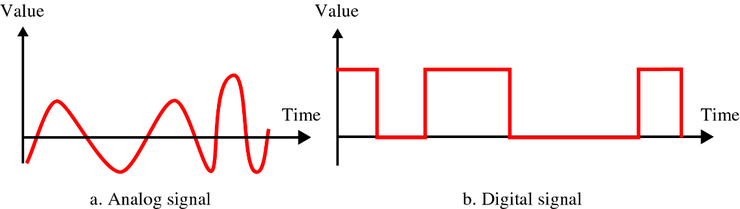
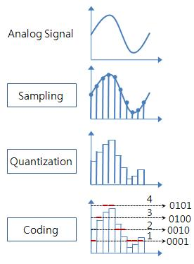

# 멀티미디어

**목차**

1. [정의](#정의)

2. [아날로그와 디지털](#아날로그와-디지털)

   * [정의](#정의)

   * [변환](#변환)

   * [압축](#압축)

3. [멀티미디어 데이터](#멀티미디어-데이터)
   * [오디오 데이터](#오디오-데이터)
   * [이미지 데이터](#이미지-데이터)
   * [동영상 데이터](#동영상 데이터)
   
4. [멀티미디어 지원 기기](#멀티미디어-지원-기기)

---

## 정의

**문자, 오디오, 이미지, 동영상 등 복합적으로 만든 데이터 (사용자에게 정보 제공)**

**파일 확장자**

파일의 형식이나 종류를 구분하는 데 사용

| 구분   | 확장자                        |
| ------ | ----------------------------- |
| 이미지 | jpg, gif, bmp, png, tiff, raw |
| 오디오 | mp3, wav, flac, ogg, aac      |
| 동영상 | avi, mov, mp4                 |

---

## 아날로그와 디지털

### 정의

**아날로그 (analogue)**

연속적으로 변하는 값

* 자동차 속도계, 바늘 달린 시계, 수은주 온도계, 레코드판에 녹음된 음악 등
* **장점**
  * 세밀한 표현 가능

**디지털 (digital)**

아날로그 상태의 연속적인 값을 숫자나 문자 등으로 끊어 불연속적으로 표현한 것

* 손가락을 뜻하는 라틴어인 디지트 (digit) 에서 유래된 단어로 끊어진 값을 가진다
* **장점**
  * 저장 공간을 적게 차지하며 수정, 변경, 복제 용이
  * 시간이 지나도 훼손되지 않는다

### 변환

**아날로그 신호 &rarr; 디지털 변환**

1. 샘플링 (sampling)

   * 일정 간격으로 아날로그 파형을 자른다

   * 이 때 아날로그 신호에 닿을 때까지 선을 그린다

2. 양자화 (quantization)
   * 각 막대의 높이를 수치 값으로 작성

**디지털 신호 &rarr; 아날로그 변환**

1. 샘플링한 숫자만큼 높이를 가진 막대를 일정한 간격으로 세운 후
2. 각 막대의 중심을 지나는 선을 그리면 아날로그 신호가 된다
   * 우리가 즐겨 듣는 모든 디지털 음악은 디지털 신호를 아날로그 신호로 복원 해 만든 것

### 압축

**반복되는 데이터를 요약하여 보관**

* 사진이나 동영상 파일처럼 크기가 큰 멀티미디어 파일을 저장할 때 압축 알고리즘 사용

* **비손실 압축**
  * 원본과 똑같이 복원이 가능한 방식 (10 ~ 30% 줄어듦)
  * 똑같은 데이터를 하나로 묶는다
  * 문서나 중요한 데이터 압축에 사용
  * ZIP, RAR
* **손실 압축**
  * 원본과 똑같이 복원되진 않지만 많이 압축할 수 있는 방식 (90% 까지 줄어듦) = 복원된 데이터는 원본과 다르다
  * 비슷한 데이터를 하나로 묶는다
  * 멀티미디어 데이터 압축에 사용
  * JPEG, MP3, MP4

---

## 멀티미디어 데이터

### 오디오 데이터

**목소리나 새소리처럼 자연 상태의 오디오는 아날로그 신호다**

* 저음 (낮은 소리) 과 고음 (높은 소리) (파형의 너비로 구분)
  * 저음 
    * 파형이 길고 느린 소리 (울린다, 가라앉은 소리, 파형의 너비가 넓다)
  * 고음
    * 파형이 짧고 빠르게 움직이는 소리 (날카롭다, 쨍쨍거린다, 파형의 너비가 좁다)
* 큰 소리와 작은 소리 (파형의 높낮이로 구분 (폭))

**헤르츠 (Hz)**

저음과 고음은 상대적인 값이기 때문에 이를 표현할 수 있는 수치 필요

* 고음과 저음의 값을 나타내는 데 헤르츠 사용
* 헤르츠는 1 초 동안의 변화를 나타내는 단위
  * 소리 파형이 1 초에 한 번만 변하면 1Hz 가 된다

**주파수**

* 인간이 들을 수 있는 소리 범위 : 20Hz ~ 20KHz (가청주파수)
  * 파형이 1 초 동안 발생하는 횟수 (20 ~ 2 만 번)

**샘플링 주기 (sampling rate)**

1 초 동안 샘플링 빈도를 나타낸 것

* 주기가 낮을 경우 원래 파형으로 복원은 어렵고 주기가 높을 경우 원래 음을 재현할 수 있으나 파일 크기는 커진다

**나이퀴스트 이론 (Nyquist Theorem)**

**`소리의 가장 높은 주파수보다 2 배 이상의 샘플링 주기를 사용하면 정확하게 디지털로 변환할 수 있다`**

* 가청주파수 대역폭 중 가장 높은 20KHz 보다 2 배 큰 40KHz 이상으로 샘플링 시 완벽히 디지털 변환 가능
* 음악 CD 는 대부분 44.1KHz 로 샘플링
* **양자화**
  * 눈금 (16 비트)을 사용해 디지털 값으로 변환하는 것
  * **양자화 비트**
    * 양자화를 위해 사용된 값으로 비트 깊이 (bit depth) 라고도 한다
    * 일반 음악 CD : 44.1KHz 로 샘플링하고 16 bit 로 양자화
    * 고음질 CD : 96KHz 로 샘플링하고 24 bit 의 양자화 (Super Audio CD, HDCD, XRCD)

**비트 전송률**

1 초 동안 전송하는 비트의 수

`샘플링 주기 x 양자화 비트 x 채널 수` 

* 단위는 Kbps (kilo bit per second)
* 비트 전송률은 음악 파일이 얼마나 많은 정보량을 가지는 지 나타낸다
* 같은 원음일 경우 비트 전송률이 클수록 음질이 더 좋다
* 채널은 변화 대상의 오디오 신호가 모노 (1) 혹은 스테레오 (2) 인지 나타낸다

| 종류 | 설명                                                         |
| ---- | ------------------------------------------------------------ |
| WAV  | CD 에 있는 음악 데이터를 추출해 만든 비압축 포맷 44.1KHz 로 샘플링, 16 비트로 양자화, 스테레오 파일 비트 전송률 (일반 CD) : 44.1 x 16 x 2 = 1411.2kbps / (고음질 CD) : 96 x 24 x 2 = 1608kbps |
| FLAC | 무손실 압축 사용해 WAV 와 음질은 같고 파일 크기는 작은 포맷 (Free Lossless Audio Codec) 유사한 비손실 압축 포맷으로 OGG, ALE 등이 있다 |
| MP3  | 일반적으로 가장 많이 사용하는 오디오 포맷으로 2000 년도 당시 네트워크 속도가 느려 파일 크기를 줄이고자 만듦 MPEG (Moving Picture Experts Group) 이라는 손실 압축 알고리즘 적용 유사한 손실 압축 포맷으로 AAC (Advanced Audio Coding) 이 있다 |

### 이미지 데이터

**2 차원 평면 위에 나타나는 시각적 표현물을 의미**

픽셀 (pixel) 과 화소 : 이미지를 구성하는 각각의 점

* 픽셀은 빛의 삼원색인 빨간색, 녹색, 파란색으로 구성

**픽셀**

* 컴퓨터에서 한 색상을 구성하는 RGB 각각의 농도를 나타내는 데 1 바이트 사용 (가장 어두울 때 0, 밝을 때 255)
* 흰색 (255, 255, 255) 검은색 (0, 0, 0)
* 하나의 픽셀이 표현할 수 있는 색 (true color) 은 256 x 256 x 256 가지
* RGB 각각이 1 바이트므로 픽셀 하나의 크기는 3 바이트
  * 예시
    * 가로 6,000 픽셀, 세로 4,000 픽셀인 해상도의 사진 파일 크기
    * 총 픽셀 수 : 24,000,000 픽셀 (24 Mega pixel)
    * 파일 크기 : 24 Mega pixel x 3 Byte = 72MB
* BMP (비트맵)
  * 이미지를 압축하지 않고 그대로 저장하는 파일 포맷

* **비손실 압축 포맷**
  * RAW 
    * 카메라가 받은 데이터 원본
    * 디지털 카메라 회사마다 확장자가 다르기 때문에 컴퓨터에서 호환이 가능한 표준 포맷으로 변환해야 한다
  * PNG, TIFF (표준 포맷)
    * PNG : 화질 손상 없지만 (웹 사용 포맷 중 가장 화질 좋음) 파일 크기가 크며 투명색 설정 가능
    * TIFF : 화질 손상 없지만 파일 크기가 크다
* **손실 압축 포맷**
  * JPEG (Joint Photographic Experts Group)
    * 가장 많이 사용하는 손실 압축 포맷으로 디지털 카메라 사진 저장, 웹 사용 가능
    * 압축률 조정 가능

GIF

* 압축을 사용하지는 않으나 파일 크기가 작은 특이한 포맷
* 전체 이미지에서 사용할 수 있는 색상이 1 바이트 (256 색) 로 제한
* PNG 처럼 투명한 배경색을 지원하며 움직이는 사진 가능하다

### 동영상 데이터

**잔상 효과**

이어지는 사진 여러 장을 빠른 속도로 보여 주기

* 사람의 눈은 한 번 본 것을 1/16 초 동안 잔상이 남는다
* 배경은 잔상으로 남아있고, 피사체의 이동으로 마치 움직이듯 보이는 것

**재생 빈도**

* 일반적으로 동영상은 1 초에 사진 60 장을 연속해서 보여 준다 (재생 빈도 60Hz)
* 모니터
  * 1 초에 60 번 씩 화면을 다시 그린다
* 영화관
  * 1 초에 24 장 재생
* TV
  * 1 초에 60 번 씩 화면을 다시 그린다

**압축 포맷**

MP4 

* 가장 많이 사용하는 동영상 압축 알고리즘으로 MPEG 에서 만든 동영상용 압축 알고리즘 네 번째 버전

***동영상 압축 원리***

* 움직이지 않는 부분은 한 장만 저장, 움직이는 부분만 저장하면 압축 된다
* 압축 많이 하면 갑자기 장면이 전환되는 부분에서 화면 깨지기도 한다

AVI, MKV, MOV

* 동영상, 소리, 자막을 담을 수 있는 컨테이너 이름
* 동영상을 MPEG 로 압축하고 소리와 자막을 함께 담을 때 AVI, MKV, MOV 라는 박스 사용

**컴퓨터 그래픽 (Computer Graphic, CG) 기술**

* 3 차원 물체를 프레임 형태로 만들고 표면을 입혀 입체로 보이게 하는 기술
  * 예시
    * 게임
      * 3 차원 컴퓨터 그래픽은 많은 양의 계산이 필요 &rarr; 그래픽 카드 필요
    * 언리얼
      * 와이어 프레임을 만들어 엔진에 넣으면 자동으로 영상 제작

---

## 멀티미디어 지원 기기

### 디스플레이

**화면에 이미지나 동영상을 나타내는 장치**

| 종류      | 설명                                                         |
| --------- | ------------------------------------------------------------ |
| 화면 크기 | 대각선 길이를 인치 (inch) 로 나타낸 것                       |
| 화면 비율 | 가로 대 세로 비율 디스플레이 **4 : 3** 비율, 고화질 디지털 TV 나 스마트폰 **16 : 9** 비율, 영화 **21 : 9** 비율 |
| 해상도    | 디스플레이가 아무리 커도 해상도가 나쁘면 화질이 떨어진다 화면 해상도는 세로의 픽셀 수가 기준 |

**LCD 디스플레이 (Liquid Crystal Display)**

액정 (liquid crystal) 특성을 이용한 방식

* 액정은 평상시 투명하다 전기가 흐르면 검게 변하는 성질
* 맨 뒷면의 LED 빛이 액정을 통과해 컬러 (RGB) 필터에 닿으면 색상이 만들어 지면서 이미지 생성
* 색상 재현 능력이 떨어지고 빛샘 현상 발생

**OLED 디스플레이**

전기가 통하면 빛을 만들어내는 OLED (Organic Light-Emitting Diode: 유기발광 다이오드) 소자를 이용

* 전구를 배열하는 방식에 따라 여러 종류의 OLED 가 있으며 현재는 아몰레드 (AMOLED) 방식을 많이 사용
* 스스로 빛을 내서 색상 재현 능력이 뛰어나다
* 화면이 타 버리는 번인 (burn in) 현상 발생
* 투명하거나 휘어지게 만들기 가능

### 카메라와 렌즈

**이미지 센서**

렌즈를 통해 들어온 빛을 RGB 값 3 개로 분리해 저장

**렌즈**

* 표준 렌즈
  * 사람이 평상시 보는 화면과 유사한 렌즈
* 광각 렌즈
  * 초점 거리가 40 mm 미만인 렌즈 (표준 렌즈보다 넓은 영역 보여 준다)
* 망원 렌즈
  * 시야가 좁은 대신 먼 거리에 있는 것을 가까이 볼 수 있음
* 줌 렌즈
  * 여러 초점 거리 사용 가능
* 단 렌즈
  * 초점 거리가 하나만 있는 렌즈

---

## 연습문제 (객관식)

| 문제   | 답      | 문제 | 답   |
| ------ | ------- | ---- | ---- |
| 1      | 1       | 19   | 4    |
| 2      | 4       | 20   | 3    |
| 3      | 2       | 21   | 2    |
| 4      | 4       | 22   | 3    |
| 5      | 3       | 23   | 2    |
| **6**  | ~~3~~ 1 | 24   | 1    |
| 7      | 1       | 25   | 3    |
| 8      | 2       | 26   | 4    |
| 9      | 4       | 27   | 1    |
| 10     | 3       | 28   | 4    |
| 11     | 4       | 29   | 2    |
| 12     | 4       | 30   | 1    |
| 13     | 2       | 31   | 3    |
| 14     | 4       | 32   | -    |
| **15** | ~~2~~ 1 | 33   | 4    |
| 16     | 4       | 34   | 1    |
| 17     | 1       | 35   | 4    |
| 18     | 4       |      |      |

## 연습문제 (주관식)

| 문제 | 답         | 문제 | 답     | 문제 | 답     | 문제 | 답        |
| ---- | ---------- | ---- | ------ | ---- | ------ | ---- | --------- |
| 36   | 멀티미디어 | 46   | 비손실 | 56   | 픽셀   | 66   | 편광 안경 |
| 37   | 확장자     | 47   | 손실   | 57   | RAW    | 67   | 가상현실  |
| 38   | 이미지     | 48   | 비손실 | 58   | BMP    | 68   | 증강현실  |
| 39   | 오디오     | 49   | 손실   | 59   | PNG    | 69   | LCD       |
| 40   | 동영상     | 50   | 가청   | 60   | GIF    | 70   | 베이어    |
| 41   | 아날로그   | 51   | 2      | 61   | JPG    | 71   | 표준 렌즈 |
| 42   | 디지털     | 52   | 400    | 62   | PNG    | 72   | 광각 렌즈 |
| 43   | 샘플링     | 53   | WAV    | 63   | GIF    | 73   | 망원 렌즈 |
| 44   | 양자화     | 54   | 비손실 | 64   | GIF    | 74   | 줌 렌즈   |
| 45   | 압축       | 55   | 손실   | 65   | 언리얼 |      |           |

