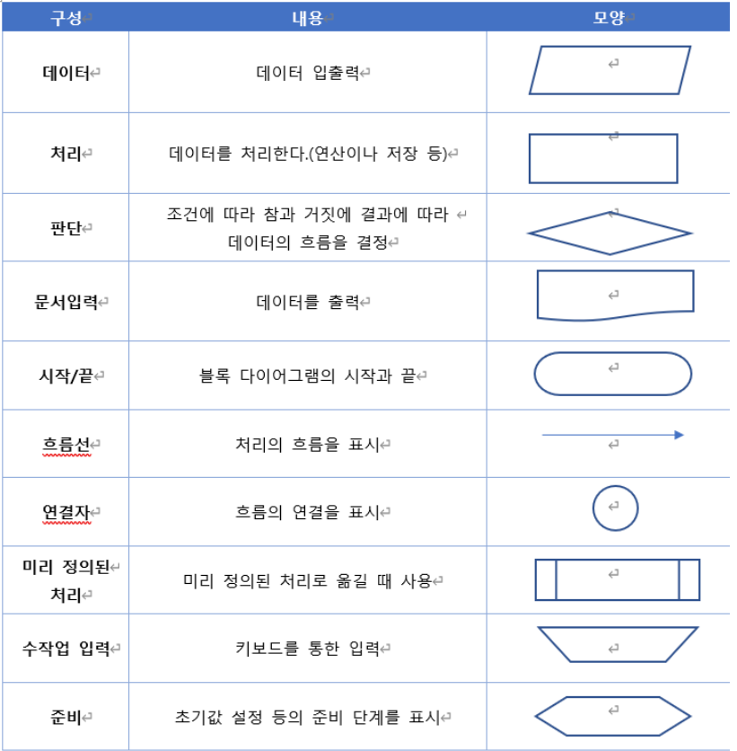

# 컴퓨팅 사고와 알고리즘

**목차**

1. [컴퓨팅 사고](#컴퓨팅-사고)
2. [알고리즘](#알고리즘)
3. [프로그래밍 언어](#프로그래밍-언어)

---

## 컴퓨팅 사고 (Computational Thinking, CT)

**논리적이고 창의적이지만 컴퓨터를 통해서 해결해야 하기 때문에 컴퓨터 입장에서 생각해야 한다**

### 구성

| 분류          | 설명                                                         |
| ------------- | ------------------------------------------------------------ |
| **추상화**    | 문제에서 중요하지 않은 부분을 제거하고 중요한 특징만으로 문제를 구성함으로서 문제 해결을 쉽게 하는 과정 |
| **분해**      | 추상화한 문제를 해결하기 쉬운 작은 단위의 문제로 나누는 과정 |
| **패턴 인식** | 추상화 및 분해 후 데이터를 특징 별로 나눠 유사한 문제 해결 방식이 있는지 찾아보는 과정 |
| **알고리즘**  | 어떤 문제를 해결하기 위해 정해진 일련의 절차나 방법을 공식화한 형태로 표현한 것 |

---

## 알고리즘

### 순서도

**장점** 알고리즘 흐름을 빠르게 파악 가능

**단점** 복잡한 프로그램을 순서도로 작성하기 까다롭다

### 의사 코드 (pseudo code)

**특정 프로그래밍에 사용하는 언어와 유사한 서술로 알고리즘을 표현한 것**

* 특정한 프로그래밍 언어의 문법을 따르지 않기 때문에 가짜 코드라는 의미로 의사 코드라고 한다

### 구성

**알고리즘의 조건**

* 입력, 출력, 유한성 (알고리즘은 종료돼야 한다), 명확성, 수행 가능성

**알고리즘의 설계**

* 문제를 해결하기 위해 가장 효율적인 방법을 찾아내는 과정
* **제어 구조**
  * 순차 구조 : 어떤 일을 처리하는 데 필요한 과정을 시간적인 순서에 따라 순차적으로 나타낸 구조
  * 선택 구조 : 특정 조건을 만족하는지 아닌 지에 따라 다음 명령을 선택적으로 실행
  * 반복 구조 : 동일한 동작 반복하는 구조

**알고리즘의 성능**

* 직접 실행하거나 실행 횟수 등 복잡도를 분석하는 방법
* **알고리즘의 복잡도**
  * 알고리즘이 특정 기준에 따라 얼마나 빠르게 혹은 느리게 실행되는지 나타내는 것
  * 시간 복잡도
    * 알고리즘이 실행돼 종료될 때까지 어느 정도의 시간이 필요한지 측정하는 방법
    * **빅오 표기법**
      * O(1) : 입력 데이터의 개수와 무관하게 일정 시간이 걸리는 경우
      * O(log(n)) : 데이터의 양을 매번 절반 분할해서 처리하는 알고리즘
      * O(n) : 알고리즘 작업량이 입력된 데이터 개수의 상수 배
      * O(n*log(n)) : 대부분의 알고리즘이 여기에 해당
      * O(n2) : 선택 정렬 같은 단순한 알고리즘 해당
  * 공간 복잡도
    * 알고리즘이 문제를 해결하는 데 어느 정도의 저장 공간이 필요한지 측정하는 방법
    * 기억 장치 내 공간을 얼마나 적게 사용하는 지가 중요
    * 저장 공간은 알고리즘이 사용하는 공간과 알고리즘에 입력돼 처리되는 자료 공간을 모두 포함

---

## 프로그래밍 언어

### 저급 언어 (low level language)

**사람이 이해하기 힘든 언어**

* 기계어 (machine language) 
  * 컴퓨터가 이해하는 언어로, 0 과 1 의 숫자로만 구성
* 어셈블리어 (assembly language) 
  * 기계어를 사람이 이해할 수 있는 문자 형태로 바꿔 놓은 것

### 고급 언어 (high level language)

**사람이 사용하는 단어로 이해하기 쉽게 만든 어어**

* 기계어와 어셈블리어 제외 거의 모든 언어 (C, Java, Python 등)
* 고급 언어로 짠 코드를 소스코드 라고 한다
  * 컴퓨터는 기계어만 인식, 소스코드를 기계어로 번역해야 한다
    * 컴파일러 (compiler)
      * 소스 코드를 기계어로 번역해 실행 파일을 만든 후 한꺼번에 실행 (C 언어, 자바 등)
    * 인터프리터 (interpretor)
      * 소스 코드를 한 번에 한 행 씩 번역해 실행 (자바스크립트, 파이썬 등)

---

## 연습문제 (객관식)

| 문제   | 답      | 문제 | 답   |
| ------ | ------- | ---- | ---- |
| **1**  | ~~1~~ 2 | 23   | 2    |
| 2      | 1       | 24   | 4    |
| 3      | 4       | 25   | 1    |
| 4      | 1       | 26   | 2    |
| 5      | 4       | 27   | 3    |
| 6      | 3       | 28   | 3    |
| 7      | 2       | 29   | 1    |
| 8      | 1       | 30   | 1    |
| **9**  | ~~3~~ 1 | 31   | 3    |
| **10** | ~~2~~ 1 | 32   | 2    |
| 11     | 3       | 33   | 3    |
| 12     | 3       | 34   | 4    |
| 13     | 3       | 35   | 4    |
| 14     | 4       | 36   | 2    |
| 15     | 4       | 37   | 4    |
| 16     | 4       | 38   | 1    |
| 17     | 2       | 39   | 2    |
| 18     | 3       | 40   | 2    |
| 19     | 2       | 41   | 4    |
| 20     | 4       | 42   | 1    |
| 21     | 2       | 43   | 3    |
| 22     | 2       | 44   | 3    |

## 연습문제 (주관식)

| 문제 | 답                | 문제 | 답        | 문제 | 답          | 문제 | 답         |
| ---- | ----------------- | ---- | --------- | ---- | ----------- | ---- | ---------- |
| 45   | 프로그래밍        | 55   | 패턴 인식 | 65   | 순서도      | 75   | 디버깅     |
| 46   | 컴퓨팅 사고       | 56   | 패턴 인식 | 66   | 의사코드    | 76   | 기계어     |
| 47   | 추상화, 패턴 인식 | 57   | 패턴 인식 | 67   | 입력, 출력  | 77   | 어셈블리어 |
| 48   | 분해              | 58   | 추상화    | 68   | 1           | 78   | 객체 지향  |
| 49   | 추상화            | 59   | 추상화    | 69   | 1           | 79   | 가상 머신  |
| 50   | 패턴 인식         | 60   | 추상화    | 70   | 순차 구조   | 80   | 컴파일러   |
| 51   | 알고리즘          | 61   | 알고리즘  | 71   | 선택 구조   | 81   | 인터프리터 |
| 52   | 분해              | 62   | 알고리즘  | 72   | 반복 구조   | 82   | 컴파일러   |
| 53   | 패턴 인식         | 63   | 순서도    | 73   | 시간 복잡도 |      |            |
| 54   | 알고리즘          | 64   | 의사코드  | 74   | 공간 복잡도 |      |            |

