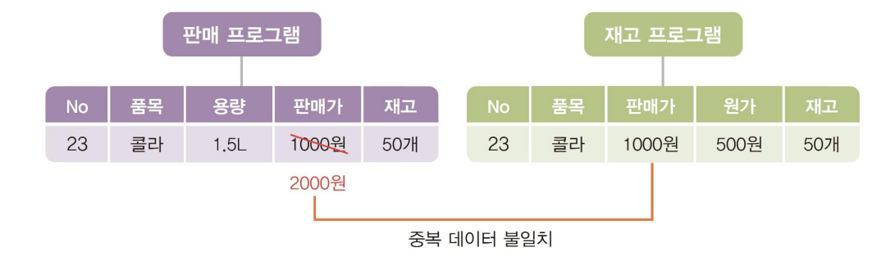
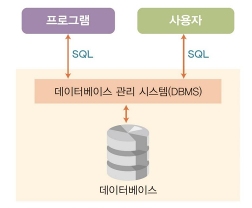
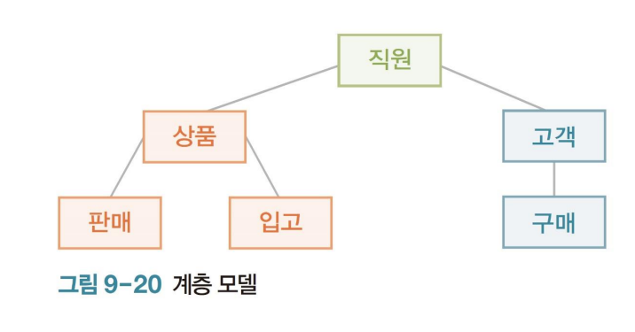
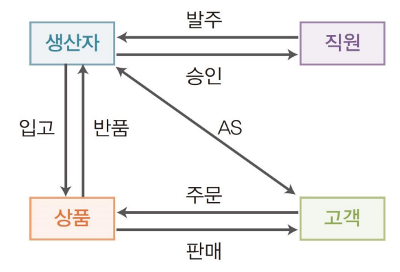

**목차**

1. [개념](#개념)
2. [특징](#특징)
3. [문제](#문제)
4. [관리](#관리)
   * [SQL](#sql)
5. [추상화](#추상화)
6. [모델](#모델)
7. [모델링](#모델링)

---

## 개념

**대용량의 데이터를 쌓아놓고 이를 관리할 수 있는 시스템을 데이터베이스라고 한다**

여러 사용자가 공유하고 통합해서 운영하는 데이터의 집합

**정형 데이터**

* 미리 정해진 구조에 따라 저장된 데이터
  * 스마트폰 전화번호부 등 형식이 있는 채로 저장된다

**비정형 데이터**

* 정해진 구조가 없는 데이터 
  * SNS 데이터, 언어, 음악, 사진 등 특별한 형식이 없다

**반정형 데이터**

* 정형과 비정형 사이로, 구조와 데이터를 함께 저장

* 구조 정보를 나타내는 태그 사용

  * XML 

    ```xml
    <이름>김철수</이름>
    <전화>010-1234-1234</전화>
    <직장>XX</직장>
    ```

---

## 특징

| 특징                 | 설명                                                |
| -------------------- | --------------------------------------------------- |
| **실시간 접근**      | 실시간으로 데이터에 접근 가능                       |
| **최신 데이터 유지** | 데이터의 삽입, 삭제, 수정으로 항상 최신 데이터 유지 |
| **동시 공유**        | 여러 사용자가 동시에 데이터 공유 가능               |
| **내용 참조**        | 내용을 참조해 데이터에 접근 가능                    |

---

## 문제

**데이터 중복성**

* 같은 데이터가 여러 프로그램에 중복돼 나타나는 문제

* 여러 프로그램이 같은 데이터 파일을 고유하면 중복성을 해소할 수 있지만 종속의 문제 발생

  

**데이터 종속성**

* 여러 프로그램이 같은 데이터 파일을 공유하는 경우 프로그램이 데이터 변화에 종속되는 문제 발생

**보안 문제**

* 허가 받은 응용 프로그램이나 사용자만이 접근할 수 있어야 한다

**백업 및 회복의 문제**

* 실수로 데이터를 지운 경우, 백업이 없으면 데이터가 사라진다
* 백업도 정책을 수립하기 어렵다 (백업 주기, 백업 정도 등)

---

## 관리

**데이터 베이스 관리 시스템 (DataBase Management System, DBMS)**

* 데이터베이스를 관리하고 작업을 통해 의미 있는 정보를 생성할 수 있는 시스템 
* 데이터베이스에 쌓인 데이터의 삽입, 삭제, 검색 등을 쉽게 할 수 있게 해줌 
* 파일을 사용할 때 발생하는 데이터 중복성, 종속성, 보안, 백업과 회복의 문제 모두 해결 가능 
* 자신을 통해서만 데이터베이스에 접근 가능하므로 데이터베이스를 보호함 
* DBMS로 인해 사용자는 데이터가 어떻게 저장되었는지 알 수도 없고,  알 필요도 없음
* **프로그램이나 사용자가 입력한 SQL을 해석하여 응답하고, 데이터베이스에 저장된 데이터가 훼손되지 않도록 관리하고 백업하는 역할을 함**



### SQL

* 데이터베이스에 저장된 데이터를 처리하려고 만든 언어 
* SQL은 스키마를 만들어 관리하는데, 스키마는 데이터의 삽입, 삭제, 갱신 등의 작업에 적합한 구조를 지님 
  * **스키마**
    * **데이터베이스에 저장되는 데이터 구조와 제약 조건을 정의한 것 **
    * 일종의 데이터베이스 설계도면 같은 것으로, 처음부터 잘 만들지 않으면 문제가 발생 
    * 하나의 데이터를 저장할 수 있는 영역이 필드 (column)로 하나의 스키마는 연관 있는 필드들의 집합
    * **레코드 (row)** 
      * 스키마에는 각 필드의 제약 사항이 명시되어 있음 (문자 열 글자, 용량은 정수(int)처럼 데이터의 형태 및 크기 명시) 
      * 스키마 구조에 맞추어 저장된 데이터 묶음 1개를 레코드(record)라고 함 
      * 레코드 여러 개가 채워지면 하나의 파일이 됨 
      * 데이터베이스는 관련 있는 파일을 묶어 하나의 데이터 묶음인 것처럼 관리
* 질문(query)을 하면 DBMS가 응답을 하는 구조이기 때문에 Structured  Query Language라고 함

---

## 추상화

| 외부 단계                                                    | 개념 단계                                                    | 내부 단계                                                    |
| ------------------------------------------------------------ | ------------------------------------------------------------ | ------------------------------------------------------------ |
| 사용자 관점에서 보이는 데이터베이스로 view 단계라고도 함     | 조직 전체의 관점에서 바라보는 데이터베이스                   | 데이터베이스를 실제로 저장하는 단계                          |
| 전체 데이터베이스를 모든 사람이 볼 수 있게 하는 것은 위험하여 전체 스키마 중에서 각 직원이나 팀에 필요하다고 생각되는 스키마를 새로 구성하여 보여 줌 | 전체 데이터베이스를 구현하는 단계로 모든 외부 스키마를 통합하여 하나의 스키마 즉, 개념 스키마(concept schema)로 구성한 것 | 레코드 구조, 필드의 종류와 크기, 접근을 할 수 있는 인덱스(index)처럼 저 장에 필요한 정보들을 결정하는 단계 |
| 외부 스키마(external schema) 또는 서브 스키마(sub-schema)라고 함 | 개념 스키마는 데이터베이스 내에 1개만 존재하며 각 데이터 간의 관계나 제약 사항, 접근 권한, 보안 정책 등이 정의되어 있음 | 내부 스키마(internal schema)라고도 함                        |
| 전체 스키마에서 외부 스키마를 여러 개 생성 가능              | 개념 스키마에는 데이터를 물리적으로 어떻게 저장할지를 정하는 정보는 없기 때문에 일반적으로 스키마라고 하면 개념 스키마를 가리킨다 |                                                              |

**데이터 독립성**

* 데이터베이스를 3단계로 추상화하고 단계별로 스키마를 만드는 것은 데이터의 독립성 때문 
* 외부 스키마-개념 스키마-내부 스키마의 변경이 서로에게 영향을 미치지 않고 독립적으로 움직인다는 의미

---

## 모델

**계층 모델**

* 데이터와 데이터 관계에 계층(structure) 구조를 사용 
* 구조적인 제약으로 데이터들의 관계를 표현하기가 어려움



**네트워크 모델**

* 데이터 관계를 선 여러 개로 연결한 구조 
* 데이터 관계를 표현하기에 적합하지만, 구조가 복잡하다는 단점이 있다



**관계 모델**

* 데이터는 테이블 형태로 구성하고, 각 테이블들은 서로 간의 키(key)를 중 심으로 관계를 형성하는 구조 
* 사용하기 쉽고 구조가 간단하여 대부분의 데이터베이스가 사용 
* 관계 데이터베이스 관리 시스템을 **RDBMS(Relation DataBase Management System)**라고 함

**객체 모델**

* 객체 언어처럼 데이터와 그 데이터를 처리하는 함수를 하나의 객체 형태로 구성한 데이터베이스 
* 데이터와 그 데이터를 처리하는 데 필요한 함수를 하나로 묶어 객체로 만듦 
* 객체 모델에서는 값을 입력할 때마다 문제가 있는지 자동으로 검사하기 때문에 따로 입력 값을 검사할 필요가 없음

**NoSQL 모델**

* 음악이나 사진처럼 비정형 데이터를 처리하려고 만든 데이터베이스 
* SQL이 아닌(No) 비정형 데이터 처리에 맞는 새로운 언어 구조를 사용

---

## 모델링

**현실의 데이터를 데이터베이스에 저장할 수 있는 데이터로 변환하는 과정** 

* 데이터를 모델링하여 만든 하나의 테이블을 개체(entity)라고 함

**관계 데이터베이스** 

* 개체와 개체의 관계(relationship)를 연결한 데이터베이스 
* 구조화된 데이터와 제약 조건을 그래프 형식으로 표현하는 방법으로 개체-관계 모델링(Entity-Relationship Modeling, ERM)을 사용 
* 개체-관계 모델링의 결과물을 개체-관계 다이어그램(Entity-Relationship  Diagram, ERD)이라고 한다

**개체-관계 모델링의 구성 요소** 

| 요소               | 설명                                                         |
| ------------------ | ------------------------------------------------------------ |
| 개체(entity)       | 현실 세계를 구성하는 사람이나 사물처럼 구별이 가능한 모든 것 |
| 속성(attribute)    | 개체가 가지는 고유의 특성                                    |
| 관계(relationship) | 개체와 개체가 맺고 있는 연관성                               |

