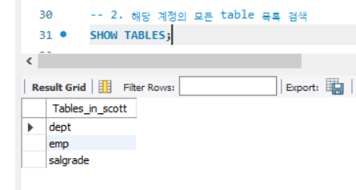
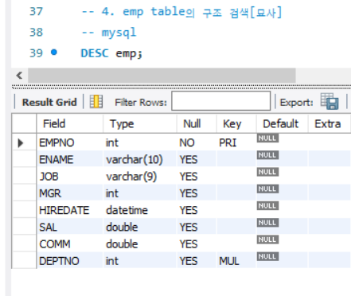
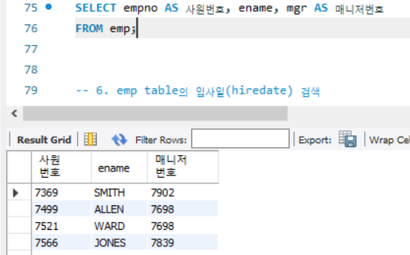
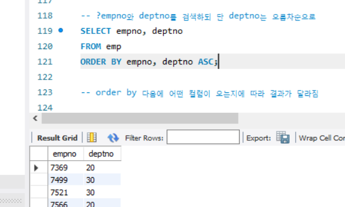
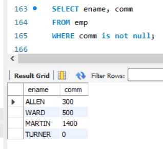
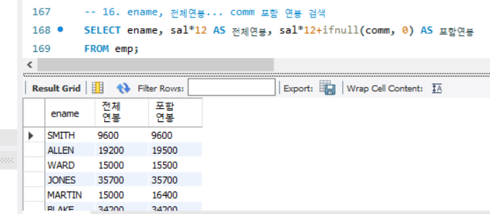

**목차**

1. [준비](#준비)
2. [실습](#실습)
   * [검색](#검색)
   * [조건 검색](#조건-검색)

---

## 준비

```sql
# Scott 이라는 Schema 생성
# 사용할 것이라는 명령어로 ; 기준으로 명령 구분하며 ctrl + Enter 로 실행한다
USE Scott; 
```

```sql
# 실습을 위한 Setting
# 활성화 된 Scott 에 옮긴 후 드래그해서 번개 모양 클릭
CREATE TABLE IF NOT EXISTS `DEPT` (
  `DEPTNO` int(11) NOT NULL,
  `DNAME` varchar(14) DEFAULT NULL,
  `LOC` varchar(13) DEFAULT NULL,
  PRIMARY KEY (`DEPTNO`)
) ENGINE=InnoDB DEFAULT CHARSET=utf8;


INSERT INTO `DEPT` (`DEPTNO`, `DNAME`, `LOC`) VALUES
(10, 'ACCOUNTING', 'NEW YORK'),
(20, 'RESEARCH', 'DALLAS'),
(30, 'SALES', 'CHICAGO'),
(40, 'OPERATIONS', 'BOSTON');


CREATE TABLE IF NOT EXISTS `EMP` (
  `EMPNO` int(11) NOT NULL,
  `ENAME` varchar(10) DEFAULT NULL,
  `JOB` varchar(9) DEFAULT NULL,
  `MGR` int(11) DEFAULT NULL,
  `HIREDATE` datetime DEFAULT NULL,
  `SAL` double DEFAULT NULL,
  `COMM` double DEFAULT NULL,
  `DEPTNO` int(11) DEFAULT NULL,
  PRIMARY KEY (`EMPNO`),
  KEY `PK_EMP` (`DEPTNO`)
) ENGINE=InnoDB DEFAULT CHARSET=utf8;


INSERT INTO `EMP` (`EMPNO`, `ENAME`, `JOB`, `MGR`, `HIREDATE`, `SAL`, `COMM`, `DEPTNO`) VALUES
(7369, 'SMITH', 'CLERK', 7902, '1980-12-17 00:00:00', 800, NULL, 20),
(7499, 'ALLEN', 'SALESMAN', 7698, '1981-02-20 00:00:00', 1600, 300, 30),
(7521, 'WARD', 'SALESMAN', 7698, '1981-02-22 00:00:00', 1250, 500, 30),
(7566, 'JONES', 'MANAGER', 7839, '1981-04-02 00:00:00', 2975, NULL, 20),
(7654, 'MARTIN', 'SALESMAN', 7698, '1981-09-28 00:00:00', 1250, 1400, 30),
(7698, 'BLAKE', 'MANAGER', 7839, '1981-05-01 00:00:00', 2850, NULL, 30),
(7782, 'CLARK', 'MANAGER', 7839, '1981-06-09 00:00:00', 2450, NULL, 10),
(7788, 'SCOTT', 'ANALYST', 7566, '1987-04-19 00:00:00', 3000, NULL, 20),
(7839, 'KING', 'PRESIDENT', NULL, '1981-11-17 00:00:00', 5000, NULL, 10),
(7844, 'TURNER', 'SALESMAN', 7698, '1981-09-08 00:00:00', 1500, 0, 30),
(7876, 'ADAMS', 'CLERK', 7788, '1987-05-23 00:00:00', 1100, NULL, 20),
(7900, 'JAMES', 'CLERK', 7698, '1981-12-03 00:00:00', 950, NULL, 30),
(7902, 'FORD', 'ANALYST', 7566, '1981-12-03 00:00:00', 3000, NULL, 20),
(7934, 'MILLER', 'CLERK', 7782, '1982-01-23 00:00:00', 1300, NULL, 10);

CREATE TABLE IF NOT EXISTS `SALGRADE` (
  `GRADE` double DEFAULT NULL,
  `LOSAL` double DEFAULT NULL,
  `HISAL` double DEFAULT NULL
) ENGINE=InnoDB DEFAULT CHARSET=utf8;


INSERT INTO `SALGRADE` (`GRADE`, `LOSAL`, `HISAL`) VALUES
(1, 700, 1200),
(2, 1201, 1400),
(3, 1401, 2000),
(4, 2001, 3000),
(5, 3001, 9999);


ALTER TABLE `EMP`
  ADD CONSTRAINT `PK_EMP` FOREIGN KEY (`DEPTNO`) REFERENCES `DEPT` (`DEPTNO`) ON DELETE SET NULL ON UPDATE CASCADE;
```

---

## 실습

### 검색

**해당 계정 (Scott) 의 모든 table 목록 검색**

```sql
SHOW TABLES;
```



**emp table 의 모든 정보 검색**

```sql
SELECT * 
FROM emp;
```

**Type**

* int
  * 정수, 4 바이트 ( -21억 ~ 21억 )

* double
  * 실수, 8 바이트 (소수점 아래 7 자리까지)

* varchar()
  * 가변 길이 문자형 (1 ~ 65535 바이트)
  * *- my.ini 혹은 my.cnf 설정에 utf-8
  * [mysql] &rarr; default-character-set=utf-8
  * [mysqld] &rarr; character-set-server=utf-8

datetime
	- 날짜, 8 바이트
	- 'YYYY-MM-DD HH:MM:SS' 형식으로 사용

**emp table 의 구조 검색**

```sql
DESC emp;

# empno : 사원번호
# ename : 사원이름, 사원명
# job : 업무
# mgr : 사원을 관리하는 매니저 번호
# hiredate : 입사일
# sal : 급여
# comm : 커미션, 보너스
# deptno : 부서 번호
```



**emp table 의 사번 (empno) 와 이름 (ename) 만 검색**

```sql
SELECT empno, ename
FROM emp;
```

* **별칭 지정**

  ```sql
  SELECT empno AS 사원번호, ename, mgr AS 매니저번호
  FROM emp;
  # AS 생략 가능
  ```

  

**emp table 의 입사일 (hiredate) 검색**

```sql
SELECT hiredate
FROM emp;
```

**emp table에서 부서 번호 검색 시 중복 데이터 제거 후 검색**

```sql
# 중복 데이터를 제거하고 검색 결과를 출력
SELECT DISTINCT deptno
FROM emp;
```

**데이터를 오름 / 내림차순으로 검색**

```sql
# 오름차순 (default)
SELECT empno 
FROM emp
ORDER BY empno;

# 내림차순
SELECT empno 
FROM emp
ORDER BY empno DESC;
```

* **ORDER BY 가 가장 마지막에 수행되는 이유**

  ```sql
  # FROM 에서 데이터를 가져오고 SELECT 에서 선택한 후 입력된 별칭을 가지고 정렬이 가능!
  # 이는 ORDER BY 가 가장 마지막에 수행되는 것과 같음
  SELECT empno AS 사번
  FROM emp
  ORDER BY 사번 DESC;
  ```

**emp table 에서 deptno 오름 / 내림차순 정렬 적용해서 ename과 deptno 검색하기**

```sql
# 내림차순
SELECT ename, deptno
FROM emp
ORDER BY deptno DESC;
```

**empno와 deptno를 검색하되 단 deptno는 오름차순으로**

* 지정하지 않아도 ASC 로 오름차순이 default

```sql
SELECT empno, deptno
FROM emp
ORDER BY deptno ASC;
# ORDER BY deptno, empno ASC 로 줄여서도 사용 가능
```

* ORDER BY 다음에 어떤 column 이 오는지에 따라 결과가 달라지므로, 순서 중요

  ```sql
  SELECT empno, deptno
  FROM emp
  ORDER BY empno, deptno ASC;
  ```

  

  * deptno 는 제대로 정렬이 안되는 것을 확인할 수 있다 (empno 기준)


### 조건 검색

**deptno 가 10 인 사원 검색**

```sql
SELECT ename, deptno
FROM emp
WHERE deptno = 10;
```

**comm 조건 검색을 할 때**

* 검색 하기 전에 데이터가 있는지, 어떤 형식인지 살펴봐야 한다

  ```sql
  # describe
  DESC emp;
  ```

  ```sql
  SELECT ename, comm
  FROM emp;
  # comm 은 int 값으로 출력 (Null 포함)
  ```

* null 값이 있으므로 comm 이 null 인 값을 출력

  ```sql
  SELECT ename, comm
  FROM emp
  WHERE comm = null;
  # 아무것도 나오지 않으며 제대로 수행되지 않는다
  ```

  &rarr; Null 값 검색 시에는 `is null`, `is not null` 을 사용해야 한다

  ```sql
  SELECT ename, comm
  FROM emp
  WHERE comm is null;
  ```

  * 그러나 이 때 0 값도 같이 나온다! (`null != 0`)

    

**연봉 구하기**

```sql
SELECT ename, sal*12 AS 전체연봉, sal*12+comm AS 포함연봉
FROM emp;
```

* 그러나 comm 에 null 값이 있어서, 실제 값과 연산 시 null 이 출력 된다는 문제 발생

  * not null 값과 null 값이 연산 되면 null 이 결과로 나온다

    ```sql
    # ifnull(col1, col2) 사용
    # col1 : null 값을 확인할 컬럼명, col2 : null 값을 치환할 값
    SELECT ename, sal*12 AS 전체연봉, sal*12+ifnull(comm, 0) AS 포함연봉
    FROM emp;
    ```

    

*mysql / mariaDB 에서는 대소문자 구분하지 않는다*

**sal가 900 이상(>=)인 직원들의 이름 (ename), sal 검색**

```sql
SELECT ename, sal
FROM emp
WHERE sal >= 900;
```

**deptno 가 10 이고 (and) job 이 매니저인 사람 검색**

**deptno 가 10 이거나 (or) job 이 매니저인 사람 검색**

```sql
# and
SELECT ename
FROM emp
WHERE deptno = 10 AND job = 'manager';

# or
SELECT ename
FROM emp
WHERE deptno = 10 OR job = 'manager';
```

**deptno가 10이 아닌 모든 사원 명(ename) 검색**

```sql
# 부정 연산자 !=, not, <>
SELECT ename
FROM emp
WHERE deptno != 10;
# WHERE NOT deptno = 10;
# WHERE deptno <> 10;
```

**comm이 300 or 500 or 1400인 사원명, comm 검색**

* in 연산자 활용
* or로 처리되는 모든 데이터를 in (값 1, 값 2, ...)

```sql
SELECT ename, comm
FROM emp
WHERE comm IN (300, 500, 1400);
```

**comm이 300 or 500 or 1400이 아닌(not) 사원명, comm 검색**

```sql
SELECT ename, comm
FROM emp
WHERE NOT comm IN (300, 500, 1400);
# null 값이 포함되지 않는 결과가 나온다

# null 값도 포함하는 SQL 문
SELECT ename, comm
FROM emp
WHERE NOT comm IN (300, 500, 1400) OR comm is Null;
# WHERE IFNULL(comm, 0) not in (300, 500, 1400)
```

**81 년도에 입사한 사원 이름 검색**

* 값 표현 시 ' ' 처리
* `'80/12/17'` 이나 `'80-12-17'` 로 표현

```sql
SELECT ename, hiredate
FROM emp
WHERE hiredate BETWEEN '81/1/1' AND '81/12/31'
# 사이값을 구할 때 BETWEEN AND 사용 가능
```

**ename이 M으로 시작되는 모든 사원 번호(empno), 이름(ename) 검색**

```sql
SELECT empno, ename
FROM emp
WHERE ename LIKE 'M%';
# M 이라 시작하는, 뒷 단어가 1 개 이상인 모든 단어를 검색하는 것
# 음절 개수 무관
```

* 음절 개수 관련 있을 때

  ```sql
  SELECT empno, ename
  FROM emp
  WHERE ename LIKE 'M_';
  # _ 는 음절 하나, 여기서 'M_' 는 M 으로 시작하는 두 음절 단어를 뜻함
  ```

  * 예시
    * 두 번째 음절 단어가 M : `'_M%`'
    * M 을 포함한 모든 단어 : `'%M%'`

**연산자 정리**

```sql
# EXISTS, NOT EXISTS 존재 여부 확인할 때 사용
# FORD 라는 사원명이 있다면 해당 사원의 이름과, comm 을 출력해보자
SELECT ename, comm
FROM emp
WHERE EXISTS (SELECT ename
             from emp
             WHERE ename = 'FORD');
# 존재 여부 확인하고 쿼리문 실행 시킨다
# 메인 쿼리가 실행되기 전에 실행되는 쿼리, 서브 쿼리라고 한다
```

