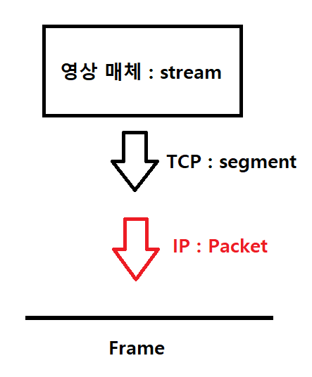

**목차**

1. [통신](#통신)
   * [발전 과정](#발전-과정)
2. [네트워크](#네트워크)
   * [LAN 과 WAN](#lan-과-wan)
   * [대역폭과 채널](#대역폭과-채널)
   * [인터넷](#인터넷)
   * [TCP / IP](#tcp-/-ip)
   * [클라이언트 / 서버 구조](#클라이언트-/-서버-구조)

---

## 통신

**Communication** 한쪽의 정보를 다른 쪽으로 전달하는 것

### 발전 과정

**모스 부호**

* 최초로 전기를 이용한 통신 수단

**전화기**

* 전기를 이용해 먼 거리까지 부호가 아닌 사람의 음성을 전달

**무전기**

* 무선으로 연결한 통신 기기
* 워키토키
  * 최초의 무전기로 양쪽 방향으로 통신이 가능하나 일정 시점에 한 방향으로만 통신 가능
  * 무전기로 대화할 때는 이야기가 끝날 때마다 `오버` 메시지 전달

**방송**

* 방송국에서 라디오나 TV 로 전송되는 단방향 통신 시스템
* 불특정 다수에게 전파를 보내는 방식

---

## 네트워크

**그물을 의미하는 net 과 작업을 의미하는 work 의 합성어로 여러 사람이나 기기를 연결한 것**

**탄생 배경**

* 데이터를 직접 들고 이동하는 불편함을 없애기 위해 컴퓨터끼리 전선으로 연결해 데이터를 실어 보냄

**프로토콜**

* 통신을 하기 위해서 서로 간에 규정한 약속
* 컴퓨터를 선으로 연결하는 것 만으로는 통신이 되지 않는다
  * 어느 속도로 데이터를 보낼지, 어떤 신호로 데이터 전송을 끝낼지 등을 약속한 것

| 프로토콜                                                     | 설명                                                         |
| ------------------------------------------------------------ | ------------------------------------------------------------ |
| **파일 전송 프로토콜 (File Transfer Protocol, FTP)**         | 컴퓨터와 컴퓨터 간에 파일을 전송할 때 사용하는 프로토콜      |
| **HTTP (Hyper Text Transmission Protocol)**                  | 웹 페이지를 볼 때 사용하는 프로토콜<br />클라이언트/서버 구조 기반으로 동작하는 Hyper Text 전달 프로토콜 |
| **TCP (Transmission Control Protocol) 과 IP (Internet Protocol)** | 인터넷을 이용할 때 사용하는 프로토콜                         |

**구성 조건**

```
하드웨어적 연결 + 프로토콜 (통신 규약)
```


### LAN 과 WAN

**근거리 네트워크 (Local Area Network, LAN)**

* 수 m ~ 수 km의 가까운 거리에 연결된 네트워크

**장거리 네트워크 (Wide Area Network, WAN)**

* 국가 전체를 연결하거나 국가 간에 연결되는 네트워크 (수백 km 이상)
* 공유기
  * 외부에서 들어온 WAN 을 집 안에 있는 LAN 기기에 나누어 주는 장치

**중거리 네트워크 (Metropolitan Area Network, MAN)**

* 근거리 네트워크인 LAN 과 장거리 네트워크인 WAN 사이의 네트워크
  * 대도시를 연결

**개인 네트워크 (Personal Area Network, PAN)**

* 블루투스나 RFID 처럼 가까운 거리에 있는 기기 연결
* 이어폰, 키보드, 마우스 등 가까운 거리에 있는 주변 장치 연결

**초 근거리 네트워크 (Near Field Communicaion, NFC)**

* RFID 처럼 수 cm 거리에서 통신하는 네트워크


### 대역폭과 채널

| 종류                      | 설명                                                         |
| ------------------------- | ------------------------------------------------------------ |
| **bps (bit per seconds)** | 컴퓨터 네트워크의 전송 속도로 1 초에 보낼 수 있는 데이터의 양 |
| **대역폭**                | 주파수가 가지는 범위로 가청 주파수는 20Hz ~ 20KHz 로 약 20 KHz (대역폭 20KHz) |
| **채널**                  | 전체 주파수 대역폭 중 특정 용도로 사용하는 통신 대역         |


### 인터넷

**네트워크를 하나로 묶는 기술**

*인터넷과 네트워크는 다른 개념!*

**토폴로지 (topology, 형태)**

* LAN 제조사 마다 규격 및 프로토콜이 달라서 호환이 되지 않았다

* LAN 구조의 종류

  | 스타형                                                       | 링형                      | 버스형                                                       |
  | ------------------------------------------------------------ | ------------------------- | ------------------------------------------------------------ |
  | 중간에 네트워크를 관장하는 시스템을 두고 방사형으로 기기를 연결 | 모든 기기를 원형으로 연결 | 중앙에 데이터가 흐르는 버스를 두고, 여기에 기기를 붙여 네트워크를 구성 |

  

### **TCP / IP**

* 인터넷에서 서로 다른 네트워크 끼리 어떻게 데이터를 주고 받을 것 인지에 대해 만든 통신 규약

  | TCP  (전송 제어 프로토콜)                                    | IP (인터넷 프로토콜)                                         |
  | ------------------------------------------------------------ | ------------------------------------------------------------ |
  | 인터넷으로 받은 데이터를 목적지 프로그램에 전달하는 창구 역할을 하는 프로토콜 | 네트워크와 네트워크 사이에서 데이터를 주고 받는 규칙을 정한 프로토콜 |
  | 데이터 전송 오류 및 순서를 바로 잡아 최종 목적지 프로그램까지 전달 | IP 를 처음 만들 당시 목적지까지 데이터 보내는 건 성공, 하지만 데이터가 사라지거나 순서나 일부가 훼손되는 일이 발생해 TCP 개발 |

* 전송 과정

  * 송신 측 (보낸 쪽)
    * TCP 가 **데이터를 전송하기 적당한 크기로 (segment) 잘라 (segmentation)** 번호표를 분인 후 IP 에 전달 
    * IP (packet) 는 LAN 여러 개를 지나 목적지까지 데이터 전달

  * 수신 측 (받는 쪽)

    * 전달된 데이터는 수신 측 TCP 에 전달됨
    * 데이터가 이상 없는 지 확인
      * 문제가 있으면 송신 측 TCP 에 재요청, 없으면 최종 데이터를 목적지 프로그램에 전달

    

**웹과 검색엔진**

* 인터넷 초기에는 텍스트로 정보를 주고 받았다
  * 웹 (World Wide Web, WWW)
    * 문자, 영상, 음성 등 정보를 한꺼번에 제공하는 멀티미디어 서비스
  * 웹 브라우저(web browser)
    * 인터넷을 이용하여 웹 형식(HTML)으로 만들어진 문서를 보여 주는 프로그램

* 검색엔진
  * 야후, 구글 


### 클라이언트 / 서버 구조

**서비스를 요청 (request) 하는 클라이언트가 서버에 연락하면 서버가 데이터를 클라이언트에 응답 (reply) 하는 구조**

* 서버 과부하
  * 몰리는 데이터 트래픽을 충분히 소화할 수 있는 네트워크와 서버를 확보하지 못해 웹 페이지가 열리지 않는 현상

**P2P 시스템**

* 서버는 사용자의 파일 목록만 가진다
  *  MP3 파일을 얻고자 하는 사용자는 서버에서 MP3 파일을 누가 가지고 있는지 위치 정보만 얻음
* 실제로 파일을 다운로드할 때는 서버를 거치지 않고 보유자에게 직접 받음
* 서버는 중재만 하고 파일을 가진 사용자 (peer) 한테 직접 다운로드하기 때문에 ‘Peer-to-Peer 시스템’, 약어로 P2P 시스템이라고 함

* **중앙 집중식 P2P**
  * 일부 기능을 서버에 구현해 놓은 P2P 시스템
* **순수한 P2P**
  * 서버가 없는 P2P 시스템