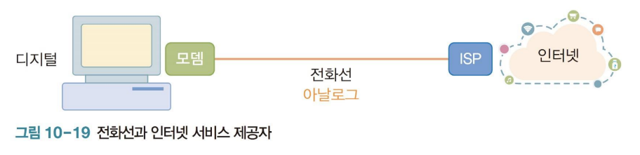
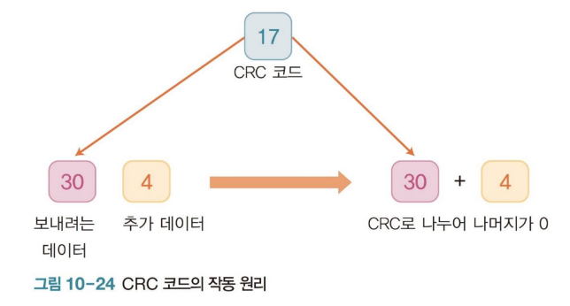

**목차**

1. [개요](#개요)
   * [OSI 참조 모델](#osi-참조-모델)
2. [물리 계층](#물리-계층)
3. [데이터 링크 계층](#데이터-링크-계층)
4. [네트워크 계층](#네트워크-계층)
   * [IP](#ip)
5. [전송 계층](#전송-계층)

---

## 개요

### OSI 참조 모델

**Open Systems Interconnection reference model**

* 국제 표준화 기구 (ISO) 에서 개발한 네트워크 모델로 네트워크 동작을 7 계층 으로 구성해 설명

---

## 물리 계층

**신호에 따른 네트워크 종류**

* 아날로그 신호 네트워크 : 일반 전화기
* 디지털 신호 네트워크 : 인터넷

**인터넷 서비스 제공자 (Internet Service Provider, ISP)**

* 전화선을 이용하여 인터넷에 접속하는 서비스를 제공하는 업체

**모뎀**

* 아날로그 신호를 디지털, 혹은 반대로 바꿔 주는 기기

* 모뎀을 사용하더라도 전화선으로 인터넷을 사용하면 전화와 인터넷 중 하나만 사용할 수 있었기 때문에 매우 불편했음

  

**초고속 인터넷 전용망**

* 전화선과 인터넷 선을 따로 사용, 모뎀 쓸 일이 없다

**팩스**

* 팩스는 여전히 모뎀을 사용

**전송 매체**

* 유선
  * 전선을 이용하여 데이터를 전송하는 방식
  * 꼬임선
    * 전선을 꼬면 일반 선보다 외부 영향을 덜 받고 데이터 전송 가능
    * 일반적인 LAN 선은 총 8 가닥을 2 가닥 씩 꼬아서 4 쌍으로 구성된다
    * 꼬임선의 데이터 전송 가능 거리 : 수백 m ~ 2 km
  * 동축선
    * 꼬임선 보다 외부 충격에 강하고 수십 km 까지 데이터를 보낼 수 있는 선
    * 가운데에 구리 선이 지나가고 피복으로 감싸고, 다른 선은 피복에 그물망 형태로 감싸고 맨 바깥쪽은 외부 피복으로 감싼다
  * 광섬유
    * 유선 매체 중 많은 양의 데이터를 멀리까지 보낼 수 있으며 머리카락보다 작은 선 하나가 기가의 데이터를 수백 km 까지 전송
      * 국가와 국가 간에 데이터를 전송, 해저 케이블에 광섬유 사용
    * 빛을 이용하기 때문에 도청이 어렵다
    * 유리 코어와 유리 코어를 감싸는 유리 피복, 외부 피복으로 돼있다
    * 끝에서 끝까지 완벽하게 하나로 이어져 있어야만 통신이 가능하다
* 무선
  * 공기 중에 전파를 보내 데이터를 전송하는 방식

---

## 데이터 링크 계층

**IP 주소와 MAC 주소**

| 종류     | 설명                                                         |
| -------- | ------------------------------------------------------------ |
| IP 주소  | 인터넷으로 연결된 각 컴퓨터마다 유일하게 부여된 주소로 데이터 링크 계층에서 사용, **4 byte 구성** (10 진수) |
| MAC 주소 | 제조사에서 통신 장비에 부여하는 고유한 주소 (물리적 주소) **6 byte 구성** (16 진수) |

* 모든 통신 기기는 MAC 주소와 IP 주소를 같이 가지고 있다

* 데이터가 LAN 내에서만 움직일 때는 MAC 주소를 사용, LAN 을 빠져나와 인터넷을 돌아다닐 때는 IP 주소 사용

* MAX 주소는 주민등록번호처럼 한 번 만들면 바꿀 수 없지만 IP 주소는 상황에 따라 변경 가능

* 오류 탐색 코드

  * 전송 데이터가 원래 데이터와 같다는 것을 확인하는 코드로 전송 데이터 중 원래 값이 아닌 것을 찾아낼 수 있다

  * **CRC 코드 (Cyclic Redundancy Check, 순환 중복 검사)**

    

    * 적은 오버헤드로도 많은 오류를 찾을 수 있음

    * 그림에서 CRC 코드로 17을 사용했으므로 나머지는 1~16까지 나올 수 있음,

      * 그러므로 찾을 수 있는 오류는 1~16까지 총 16 개

      | 코드   | 설명           |
      | ------ | -------------- |
      | CRC-16 | 2 진수 16 비트 |
      | CRC-32 | 2 진수 32 비트 |
      | CRC-64 | 2 진수 64 비트 |

---

## 네트워크 계층

**LAN 을 연결해 인터넷을 구성하는 계층**

* 네트워크 계층에서 사용하는 데이터 크기는 정해져 있음 **packet**
* 크기가 정해져 있기 때문에 큰 데이터를 보낼 경우 패킷을 여러 개로 나누어 전송해야 한다

**라우팅**

* 가장 빠르다고 생각되는 길로 패킷이 이동하는데, 이 때 어떤 경로로 패킷을 보낼 지 결정하는 것을 라우팅이라 한다

**라우터**

* 네트워크 계층에 위치해 LAN 과 LAN 을 연결하는 기계 (데이터를 한 쪽 네트워크에서 다른 쪽 네트워크로 전달)
* 라우터와 네트워크 상태는 수시로 바뀐다
  * 갑자기 먹통이 되거나 살아날 수도 있다

### **IP**

* 인터넷에서 패킷 전송을 담당하는 프로토콜은 IP
  * 주요 역할로 라우팅 (경로 배정) 이 있다
* 뒤바뀌거나 사라진 패킷을 원래대로 맞춰 주는 일을 전송 계층에 있는 TCP 가 한다
* **IP 주소**
  * 통신을 하려면 주소가 필요
  * LAN 에서 통신할 때는 6 byte 의 MAC 주소를 사용
  * **지역 코드를 반영한 4 byte 의 IP 주소**
    * 수억 대에 이르는 컴퓨터가 서로의 위치와 주소를 같이 기억하는 것은 불가능
  * 지역 코드를 반영한 4 byte 의 IP 주소를 새로 만들었다
* **IP V4 / IP V6**
  * **V4** 
    * 전체 4 byte 중 3 byte 는 지역 코드를 나타내고  마지막 1 byte 는 개별 컴퓨터를 나타낸다는 것
  * **V6**
    * 스마트폰처럼 움직이는 기기에서도 인터넷을 사용하면서 문제가 발생
    * 노트북이나 스마트폰도 움직이면 지역 코드가 바뀌어 IP 주소를 변경해야 하는 문제 발생
    * 과거에는 컴퓨터에만 IP 주소를 부여했기 때문에 4 byte 주소 체계로도 충분
      * 다양한 종류의 제품들을 인터넷에 연결하면서 4 byte 주소로는 모두 수용 할 수 없게 되면서 새로운 주소 체계를 만듦(IP V6 주소)

**도메인 이름**

* 인터넷에서 통신하려면 IP 주소가 필요하나 외워서 통신하기 ㅂ ㅜㄹ편 
  * IP 주소에 이름을 부여한 것이 도메인 이름

* 도메인 네임 서비스 (DNS)
  * 도메인 이름을 IP 주소로 바꿔 주는 것 (도메인 이름 &rarr; IP 주소 변환)
  * 도메인 이름과 IP 주소를 모아 놓은 컴퓨터를 DNS 서버라고 한다
    * 사용자가 웹 브라우저에서 도메인 이름을 쓰면 웹 브라우저는 DNS 서버에 접속해 IP 주소를 받아 온다
  * DNS 서버는 인터넷을 시작할 때 한 번만 접속

**자동 IP 주소 할당**

---

## 전송 계층

**패킷 재전송**

* 전송 계층은 네트워크 계층 위에서 작동하는 TCP 가 위치
* TCP 의 역할은 네트워크 계층에서 올라온 데이터를 정리, 프로그램에 데이터를 전달
* 패킷 전송 시 오류를 방지하기 위해 TCP 가 데이터를 보낼 때 일련번호를 매겨 전송 (CRC-16 오류 탐색 코드 사용)
* 받는 쪽의 TCP 는 도착한 패킷을 보고 순서를 정리, 도착하지 않는 패킷이 있을 경우 재요청

**포트 번호**

* 전송 계층은 데이터를 응용 프로그램에 나눠 주거나 반대로 응용 프로그램으로부터 데이터를 받아 목적지까지 전달
* IP 주소는 컴퓨터까지 오는 데 사용되며 아파트의 동번호와 같다
  * 아파트의 호수 역할을 하는 주소가 포트 번호 (port number)
* 잘 알려진 포트번호
  * 웹 서버는 80 (http), 443 (https)
  * ssh 는 22, FTP 서버는 21

**UDP (User Datagram Protocal)**

* UDP / IP 를 사용하면 IP 에서 올라온 데이터를 특별한 작업 없이 프로그램에 전달
* LAN 으로 연결해 게임 할 때 UDP 사용 가능
  * LAN 은 인접한 컴퓨터여서 데이터 손실이 거의 없어 UDP 로 충분
* 동영상 스트리밍, IPTV, 인터넷 전화는 UDP / IP 사용