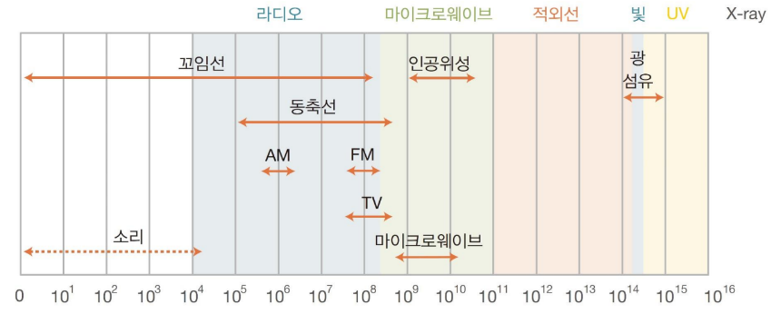
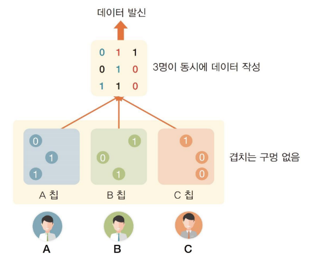
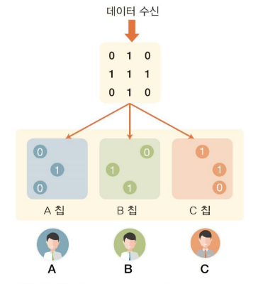

**목차**

1. [주파수](#주파수)
2. [무선 통신망](#무선-통신망)

---

## 주파수

| 구분        | 낮은 주파수                          | 높은 주파수                          |
| ----------- | ------------------------------------ | ------------------------------------ |
| 정의        | 단위 시간 당 파형 변화가 적은 주파수 | 단위 시간 당 파형 변화가 많은 주파수 |
| 방향성      | 방향성 없이 퍼져 나간다              | 한 방향으로 직진한다                 |
| 장애물      | 장애물을 뚫고 확산한다               | 장애물을 뚫지 못하고 반사한다        |
| 전송 정보량 | 전송할 수 있는 정보량이 적다         | 전송할 수 있는 정보량이 많다         |

**저음과 고음**

| 저음                                                         | 고음                                                      |
| ------------------------------------------------------------ | --------------------------------------------------------- |
| 퍼져 나가는 성질(확산)이 강하고 물체를 만나면 같이 진동하여 퍼짐 | 직진하는 성향이 강하고 물체를 만나면 반사하는 특징이 있음 |
| 정보량이 적음 (AM 라디오는 낮은 주파수를 사용하기 때문에 정보량이 작아 음질이 떨어지고 스테레오 방송이 안됨) | 장애물에 취약한 대신에 많은 양의 정보를 전달할 수 있음    |
| 멀리까지 데이터 전송 가능 (깊은 산속에서는 AM 라디오가 더 잘 잡힘) | 높은 주파수를 사용하는 FM은 음질도 좋고 스테레오 가능     |

**무선 통신 장비**

* 라디오, TV, 휴대전화, WiFi, RFID, GPS 등 다양한 종류
* 각 기기는 사용하는 주파수도 다르고 전송 방식도 다르다

**주파수 영역**

* 낮은 주파수부터 높은 주파수까지 다양한 주파수 대역이 있음

* 적외선과 같은 빛도 파형을 가지기 때문에 통신에 이용됨

  

  

| 영역                | 설명                                                         |
| ------------------- | ------------------------------------------------------------ |
| 소리 영역           | 소리 영역을 사용하는 무선 통신 시스템은 없음                 |
| 라디오 영역         | 라디오 영역에는 AM과 FM이 있음 (AM이 더 낮은 주파수를 사용)  |
| 마이크로웨이브 영역 | 국가는 자유롭게 통신 기기를 제작할 수 있는 영역을 만들어 줌 (한국은 2.4GHz, 5GHz), Wifi |

---

## 무선 통신망

유선 전화기 &rarr; 무선 호출기 &rarr; 초기 휴대전화 &rarr; 발신 전용 무선 전화기 씨티폰 &rarr; PCS 휴대전화

**1 세대 (1G) 무선 통신망**

* 사람의 음성을 아날로그 신호로 전달

**2 세대 (2G) 무선 통신망**

* 아날로그 신호는 디지털 신호로 바뀜

**3 세대 (3G) 무선 통신망**

* 휴대 전화에서 인터넷을 사용할 수 있게 지원하는 무선 통신망 개발
* 기존 전화 기능 (음성망) 에 데이터 통신 (데이터망) 기능을 추가

**4 세대 (4G) 무선 통신망**

* 음성망은 그대로 두고 데이터 통신을 고속으로 업그레이드
* LTE (Long Term Evolution)
  * 데이터를 최대 1 Gbps 속도로 전송할 수 있는 모바일 네트워크

**5 세대 (5G) 무선 통신망**

* 5 세대 무선 통신망은 최대 20Gbps 속도를 내며 4 세대보다 응답 지연 시간을 혁신적으로 낮춘다

### 개인 통신망(Personal Area Network, PAN)

개인의 작업 공간 장치들을 연결하는 컴퓨터 네트워크

LAN은 보통 100m 정도를 커버, PAN은 최대 10m 정도 거리를 커버

**블루투스**

* 대표적인 컴퓨터 주변 기기로 마우스와 키보드가 있으며 스마트폰은 블루투스 스피커나 블루투스 이어폰으로 음악을 들을 수 있음
* 블루투스에서 기기를 연결하려면 페어링(paring)을 해야 함

### 초 근거리 무선 통신(Near Field Communication, NFC)

**개인 통신망보다 더 짧은 거리에서 통신하는 시스템**

* NFC는 아주 가까운 거리의 무선 통신을 할 수 있는 기술로 교통 카드, 출입 카드, 신용 카드에서 사용 
* 바코드 (barcode)
  * RFID를 만들기 전에는 대량의 제품을 바코드(barcode)를 사용하여 관리
  * 자체적으로 데이터가 없기 때문에 서버가 연결되어 있을 때만 사용 가능
  * 리더기로 바코드를 읽을 때 위치와 방향이 어긋나면 데이터를 읽을 수 없음
    * 바코드를 개선하여 코드에 정보를 담을 수 있는 QR코드 개발
* **RFID (Radio Frequency IDentification)**
  - 초 근거리 무선 통신(NFC)에 사용하는 대표적인 기술

### 다중 접속

다중 접속 방식
- 주파수를 나누는 주파수 **분할 다중 접속(Frequency Division Multiple Access, FDMA)**
- 시간을 나누어 사용하는 **시간 분할 다중 접속(Time Division Multiple Access, TDMA)**
- 코드를 나누어 사용하는 **코드 분할 다중 접속(Code Division Multiple Access, CDMA)**

**코드 분할 다중 접속(CDMA)**

하나의 데이터 덩어리를 여러 명이 공유하여 보내는 방식

* 데이터 발신

  

  * A, B, C 각자의 칩에 구멍이 뚫려 있음 (칩에 있는 어떤 구멍도 다른 칩과 겹치지 않음)
  * A, B, C는 각자의 구멍 3 개에 데이터 작성(겹치는 구멍이 없기 때문에 같이 데이터를 작성해도 데이터가 겹칠 일이 없음)
  * 준비가 완료되면 데이터 전송

* 데이터 수신

  

  * 3 명 모두에게 같은 데이터가 전달
  * 전달된 데이터 중 자신의 데이터를 알고 싶으면 칩을 사용
  * 전달된 데이터에 칩을 겹쳐서 구멍으로 보이는 것이 자신의 데이터
    * 여러 사람이 동시에 데이터를 주고받는 방법이 코드 분할 다중 접속

* **장점**
  * 코드 분할 다중 접속 방식의 가장 큰 장점은 보안
  * 모든 사람에게 같은 데이터가 전달되지만 칩의 구멍 위치를 모르면 자신의 데이터를 알 수 없음
  * 칩의 구멍 위치만 노출되지 않는다면 도청이 불가능
  * 시간 분할 다중 접속(TDMA)보다 더 많은 사용자를 수용할 수 있음
* **칩 시퀀스 (chip sequence)**
  * 실제의 코드 분할 다중 접속에서 칩의 구멍 역할을 담당하는 코드를 칩 시퀀스(chip sequence)라고 함
  * 모두에게 전달된 데이터와 칩 시퀀스를 결합시키면 자신의 데이터만 보이도록 만든 특수한 2 진수가 됨
  * 유심 (Universal Subscriber Identity Module, USIM) 칩을 꽂으면 어떤 휴대전화든 자신의 휴대전화가 될 수 있음