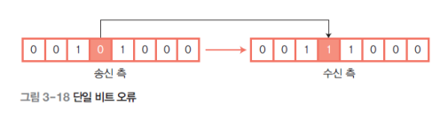

**목차**

1. [통신 방식](#통신-방식)
   * [LAN 에서 통신하는 방식](lan-에서-통신하는-방식)
   * [전송 방향에 따른 통신 방식](#전송-방향에-따른-통신-방식)
   * [직렬 전송과 병렬 전송](#직렬-전송과-병렬-전송)
2. [통신 오류 검출](#통신-오류-검출)
   * [오류](#오류)
   * [오류 검사](#오류-검사)
3. [근거리 네트워크](#근거리-네트워크)
   * [근거리 통신망](근거리-통신망)
   * [LAN 전송 방식](#lan-전송-방식)
   * [매체 접근 방식](#매체-접근-방식)
   * [이더넷](#이더넷)
4. [광역 네트워크](#광역-네트워크)
   * [회선 교환](#회선-교환)
   * [패킷 교환](#패킷-교환)
   * [기타 교환](#기타-교환)
5. [무선 네트워크](#무선-네트워크)
   * [무선 LAN의 표준](#무선-lan의-표준)

---

## 통신 방식

**클라이언트 / 서버 시스템**

| 종류       | 설명                                                |
| ---------- | --------------------------------------------------- |
| 서버       | 다른 컴퓨터에 데이터 전송 서비스를 제공하는 컴퓨터  |
| 클라이언트 | 서버에서 보내 주는 데이터 서비스를 수 신하는 컴퓨터 |

* 서버는 클라이언트(사용자) 한테 요청 받아 서비스를 제공

### LAN 에서 통신하는 방식


**유니 캐스트**

* 서버와 클라이언트 간의 일대일 (1:1) 통신 방식

* 가장 많이 사용하는 통신 방식으로 수신지 주소(MAC 주소)를 적어 특정 컴퓨터에만 전송

**브로드 캐스트**

* 로컬 LAN (라우터로 구분된 공간)에 있는 모든 네트워크 단말기에 데이터를 보내는 방식으로, 서버와 클라이언트 간에 일 대 多 (1 : 多)로 통신하는 데이터 전송 서비스
* 브로드 캐스트의 주소는 `FF-FF-FF-FF-FF-FF`로 미리 정해져 있다
* 불특정 다수에게 전송되는 서비스라 수신을 원치 않는 클라이언트도 수신하게 되므로 네트워크 성능 저하를 가져올 수 있다
* 데이터를 무조건 CPU로 전송하기 때문에 컴퓨터 자체의 성능을 떨어뜨린다

**멀티 캐스트**

* 브로드 캐스트의 문제를 해결하기 위해 등장
* 전송하려는 특정 그룹에게만 한 번에 전송할 수 있기 때문에 유니 캐스트처럼 반복해서 보낼 필요 가 없고, 브로드 캐스트처럼 전송 받을 필요가 없는 컴퓨터에 보내지 않아도 된다


### 전송 방향에 따른 통신 방식

**데이터 전송 방향에 따라 단방향 simplex 통신과 양방향 duplex 통신으로 나눌 수 있으며 양방향 통신은 정보를 주고받는 시점에 따라 다시 반이중 half-duplex 통신과 전이중 full-duplex 통 신으로 나뉜다**

**단방향 통신**

* 송신 측과 수신 측이 미리 고정되어 있고, 통신 채널을 통해 접속된 단말기 두 대 사이에서 데이터가 한쪽 방향 으로만 전송되는 통신 방식
* 단방향 통신에서 전기적으로 신호를 보내려면 송신 측과 수신 측을 연결하는 회로를 구성해야 하므로, 비록 단 방향 전송일지라도 전송로는 두 개가 필요하다
* 무선호출기나 라디오, 아날로그 TV 방송, 모니터, 키보드

**양방향 (Duplex) 통신**

* 통신 채널을 통해 접속된 두 대의 단말기 사이에서 데이터의 송수신이 모두 가능한 방식
  * **반이중 (Half-Duplex) 통신**
    * 통신 채널에 접속된 두 대의 단말기 중 어느 한쪽이 데이터를 송신하면 상대방은 수신만 할수 있는 통신 방식
    *  송신 측과 수신 측이 정해져 있지 않으며, 양쪽 단말기의 상호 협력에 따라 송수신 방향이 바뀐다
    * 휴대용 무전기, 모뎀
  * **전이중(Full-Duplex) 통신**
    * 통신 채널에 접속된 단말기 두 대가 동시에 데이터를 송수신할 수 있는 통신 방식
    * 전이중 통신은 통신 채널 두 개를 이용하여 한 번에 데이터를 송수신할 수 있다.


### 직렬 전송과 병렬 전송

데이터 전송은 2진 데이터를 전압이나 전류의 변화로 표현한 신호에 실어 보내는 것을 말하며, 데이터 비트를 전송하는 방법에 따라 직렬 전송과 병렬 전송으로 나눌 수 있다

**직렬 전송**

* 하나의 정보를 나타내는 각 데이터 비트를 직렬로 나열한 후 하나의 통신 회선을 사용하여 순차적으로 1 비트 씩 송신하는 방식
* 하나의 통신 회선을 사용하기 때문에 송신 측에서는 데이터를 1 비트 씩 송신하고, 수신 측에서는 수신되는 비트 를 일정한 단위로 모아서 사용
* 병렬 전송에 비해 데이터 전송 속도가 느린 반면, 원거리 데이터 전송에서는 통신 회선이 한 개만 필요하므로 경제적

**동기화**

* 두 시스템 간에 컴퓨터의 속도 차이(클록 오차)가 있기 때문에 송신 비트 시간 간격(TS)과 수신 비트 시간 간격 (TR)이 정확하게 일치하지 않는다

* 적절한 방법으로 송신 측에서 전송한 데이터의 각 비트를 수신 측에서 정확하게 수신할 수 있도록 해야 하는데, 이를 동기화 (Synchronization) 라고 한다.

* 동기식 전송은 미리 정해진 수만큼 문자열을 한 묶음으로 만들어 일시에 전송하는 방법으로, 비트와 데이터 간 에 간격 없이 차례대로 비트를 전송하기 때문에 데이터는 끊어지지 않는 0과 1의 문자열로 전송

* 수신 측은 차례대로 문자열을 수신한 후 문자나 바이트로 분리해서 의미 있는 데이터로 재구성

* **비트 지향 동기화 기법**

  * 데이터의 시작과 끝을 알리는 시작 플래그(Start Flag)로 시작해서 종료 플래그(Stop Flag)로 끝난다

  

  * 또한 플래그 등의 패턴을 구별하려고  0 비트를 삽입한다(Stuffing)

  * 플래그 패턴이 `0111110` 라고 가정했을 때 송신 측에서 데이터의 연속된 1 다섯 개 뒤에 0을 삽입하여 전송하면 `01111100` 수신 측에서는 수신된 데이터의 연속된 1 다섯 개 뒤에 있는 0을 제거한다 `0111110`

* **문자 지향 동기화 기법**

  * 모든 데이터의 단위를 문자 단위로 처리함으로써 동기화에 필요한 데이터까지 문자로 표현한다

  

  * 문자 지향 동기화 기법에서 사용하는 동기 문자에는 SYN, 문장의 시작을 알리는 STX(Start–of–TeXt), 문장의 끝 을 알리는 ETX(End-of-TeXt) 등이 있다

**비동기식 전송**

* 긴 데이터 비트열을 연속으로 전송하는 대신 한 번에 한 문자 씩 전송함으로써 수신기가 새로운 문자의 시작점 에서 재동기 하도록 하는 것
* 비동기 전송에서는 문자 단위로 재동기하려고 맨 앞에는 한 문자의 시작을 알리는 시작 비트(Start Bit)를 두고, 맨 뒤에는 한 문자의 종료를 표시하는 정지 비트(Stop Bit)를 둔다
* 보통 시작 비트는 1 비트를 사용하고, 정지 비트는 1~2 비트 정도를 사용
* 비동기식 전송은 하나의 문자를 전송한 후 휴지 상태(Idle)에 들어가는데, 이 시간이 바로 동기화 되는 시간이다
* 문자를 전송하지 않을 때 송수신 측은 휴지 상태에 있는데, 송신기는 다음 문자를 보낼 준비가 될 때까지 정지 비트를 계속 전송한다 `11111111`

| 동기식 전송      | 비동기식 전송                      |
| ---------------- | ---------------------------------- |
| 블록 단위 전송   | 문자 단위 전송                     |
| 정확한 비트 전송 | 정확한 비트 전송을 보장하지 않는다 |
| 고속 통신에 사용 | 저속 통신에 사용                   |

**병렬 전송**

* 부호를 구성하는 비트 수와 같은 양의 통신 회선을 사용하여 여러 데이터 비트를 동시에 병렬로 전송하는 방식 으로, 비트 n개를 전송하려고 회선 n개를 사용한다
* 병렬 전송은 거리에 비례해서 선로 비용이 많이 들기 때문에 전송 속도가 빨라야 하는 짧은 거리의 데이터 전송 에 주로 사용

---

## 통신 오류 검출

### 오류

**단일 비트 오류 (Single-bit Error)**



* 데이터 단위 중 하나의 비트만 변경하는 오류를 말한다

**다중-비트 오류(Multiple-bit Error)**


* 데이터 단위 중 두 개 이상의 비 연속적인 비트를 변경하는 오류를 말한다

**집단 오류 (Burst Error)**


* 데이터 단위 중 두 개 또는 그 이상의 연속적인 비트를 변경하는 오류를 말한다


### 오류 검사

오류를 검출하는 방식에는 패리티 비트 검사 (parity bit check), 블록 합 검사 (block sum check), **순환 중복 검사 (Cyclic Redundancy Check, CRC)** 등이 있다

**순환 중복 검사**

* 정확하게 오류를 검출하려고 다항식 코드를 사용하는 방법

* 오류가 없을 때는 계속 발생하지 않다가 오류가 발생하면 그 주위에 집중적으로 오류를 발생 시키는 집단 오류 를 검출하는 능력이 탁월하고, 구현이 단순

* **다항식**

  * CRC 발생기는 0과 1의 스트링 보다는 대수 다항식으로 표현하며, 하나의 다항식은 하나의 제수(Divisor)를 표현 한다

  

* **순환 중복 검사의 오류 검출 과정**

  ```
  1. 송신 측이 데이터를 전송하기 전에 송수신 측은 동일한 생성 다항식을 결정한다
  2. 송신 측에서는 K비트의 전송 데이터를 생성 다항식으로 나눈 n비트의 나머지 값을 구한다. K비트의 전송 데이터에 n비트의 나머지 값을 추가하여 K+n비트의 데이터를 수신 측으로 전송한다.
  3. 수신 측에서는 수신된 K+n비트의 데이터를 생성 다항식으로 나눈다. 나눈 나머지가 0이면 오류가 없는 것이고, 0이 아니면 오류가 발생한 것이다.
  ```

* ▪ CRC는 패리티 검사처럼 **데이터마다 추가 비트를 붙이지 않아도 되지만**, 프레임의 실제 내용으로 계산되는 프레임 검사 순서 (Frame Check Sequence, FCS)를 프레임 끝에 추가해서 전송해야 한다

---

## 근거리 네트워크

### 근거리 통신망

**근거리 통신망(LAN, Local Area Network)은 한 건물이나 학교 내 캠퍼스처럼 비교적 가까운 지역에 한정된 통신망을 말한다**

* 초기에는 주로 10~100Mbps의 이더넷을 사용 했으나 최근에는 빠른 전송이 필요하여 고속 이더넷 (fast ethernet), 기가비트 이더넷 (gigabit ethernet, ATMAsynchronous Transfer Mode, FDDIFiber Distributed Data Interface), 무선 LAN 등 다양한 네트워크 를 사용

* LAN 발전 과정

  


### LAN 전송 방식

**컴퓨터에서 나오는 디지털 신호를 그대로 전송하는 베이스 밴드 방식과 디지털 신호를 아날로그 신호로 변조해 서 보내는 브로드 밴드 방식**

* 베이스 밴드
  * 데이터를 전송할 때 디지털 데이터 신호를 변조하지 않고 직접 전송하는 방식으로, 이더넷이 대표적
  * 하나의 케이블에 단일 통신 채널을 형성하여 데이터를 전송한다. 채널 하나에 신호 하나만 전송하기 때문에 모뎀이 필요 없고 비용도 경제적
* 브로드 밴드
  *  부호화된 데이터를 아날로그로 변조하고 필터 등을 사용하여 제한된 주파수만 동축 케이블 등 전송 매체에 전송하는 방식
  * 하나의 케이블에 다수의 통신 채널을 형성하여 데이터를 동시에 전송하는 방식으로, 케이블 TV와 유사


### 매체 접근 방식

**데이터 충돌을 방지하려고 LAN에 연결된 모든 장치는 정의된 규칙에 따라 전송 매체에 접근하는데, 이를 매체 접근 제어(MAC, Media Access Control) 라고 한다**

* **CSMA/CD (Carrier Sense Multiple Access with Collision Detection)**

  * 버스형 통신망으로 알려진 이더넷에 주로 사용
  * 동축 케이블에 연결된 컴퓨터의 단말을 서로 접속 시키는 방식으로, 모든 컴퓨터는 버스(케이블)에 연결되어 있고 전송 매체는 컴퓨터로 공유할 수 있다

  ```
  1. 데이터를 송신하기 전에 반송파 여부를 감지하는데, 반송파가 감지되면 다른 컴퓨터 (스테이션) 에서 데이터 송신 중임을 판단하여 데이터를 전송하지 않는다
  2. 하지만 반송파가 감지되지 않으면 컴퓨터가 전송 매체를 사용하지 않는 것으로 판단하여 데이터 를 전송한다
  3. 반송파가 감지되면 동축 케이블에 접속된 다른 컴퓨터가 데이터를 전송 중인 것으로 인식하여 일정 시간 기다렸다가 전송을 시도
  4. 반송파가 감지되지 않으면 채널이 비어 있는 것으로 인식(동축 케이블에 정보 전송이 없음을 확인)하고 각 노드 중 어느 것이든 채널을 사용하여 데이터를 전송할 수 있다. 이를 ‘다중 액세스’라고 한다.
  5. 각 노드는 메시지를 보낸 직후 충돌 여부를 항상 확인하는데 이를 ‘충돌 검출’이라고 한다. 충돌 검출은 컴퓨터 두 대 이상이 동시에 패킷을 전송했을 때 충돌하는 것을 방지하기 위해 수행하는 작업이다. 충돌 현상이 일어나면 일정 시간 동안 기다린 후 재전송할 수 있으며, 대기 시간이 랜덤으로 처리되므로 특정 컴퓨터는 오랜 시간 계속 기다려야 하는 경우도 있다.
  6. 패킷을 수신한 컴퓨터는 패킷의 헤더 부분에 있는 수신 측 주소를 확인한 후 자신이 수신지이면 처리하여 사용자에게 전달하고, 자신이 수신지가 아니면 수신된 패킷을 무시한다.
  ```

  


### 이더넷

1977 년 제록스는 동축 케이블을 사용하여 10Mbps 전송 속도를 지원할 수 있는 이더넷을 개발하여 1985 년 표준화했는데, 빠르게 확산되어 1990 년에는 설치가 용이 하고 가격이 저렴한 UTP 기반 이더넷을 표준화함으로써 전 세계 시장을 장악했다.


* 동축 케이블 기반 이더넷과 UTP 케이블 기반 이더넷
* 고속 이더넷 (100Mbps)

* 기가비트 이더넷 (1Gbps)

* FDDI(Fiber Distributed Data Interface) (100Mbps)

---

## 광역 네트워크

**두 개 이상의 근거리 네트워크가 넓은 지역에 걸쳐 연결되어 있는 것**

* 교환 통신망

  * 통신망 노드의 전송 기능을 이용하여 데이터를 수신 측까지 전송하는 통신망

  * 교환 통신망은 데이터를 송신 측에서 수신 측으로 전송할 때 한 링크에서 다른 링크로 데이터를 교환하는 방법에 따라 회선 교환 circuit switching, 메시지 교환 message switching, 패킷 교환 packetswitching 등으로 나눌 수 있다.

### 회선 교환

두 스테이션 간에 전용의 통신 경로가 있음을 의미

* 데이터를 전송하기 전에 물리적인 하나의 경로가 설정되며, 설정된 경로는 통신을 종료할 때까지 독점한다.
* 경로를 설정할 때 지연이 발생하지만, 일단 경로를 설정하면 회선 교환망은 사용자에게 투명하게 전송할 수 있다 (전화 시스템)


* 회선 교환기는 회선 설정 및 해제, 데이터 전송 기능을 수행하며, 데이터를 전송하기 전에 장치 간에 회선을 설정해야 한다

* 회선은 전송 링크를 시분할이나 주파수 분할로 다중화 했을 때의 한 채널에 해당한다. 

  | 장점                                                         | 단점                                                         |
  | ------------------------------------------------------------ | ------------------------------------------------------------ |
  | 회선을 전용선 처럼 사용할 수 있어 많은 양의 데이터를 전송할 수 있다 | 오류 없는 데이터 전송이 요구되는 데이터 서비스에는 부적절하다. |
  | 경로가 설정되면 사용자에게는 고정적인 전송률로 정보를 전송할 수 있으며 교환 노드에서 처리 지연이 거의 없다 | 설정되면 데이터를 그대로 투과시키므로 오류 제어 기능이 없다. |
  | 음성이나 동영상 등 실시간 전송이 요구되는 미디어 전송에 적합하다 | 데이터를 전송하지 않는 기간에도 회선을 독점하므로 비효율적이다. |


### 패킷 교환

네트워크로 전송되는 모든 데이터는 송수신지 정보를 포함하는 패킷들로 구성되는데, 이 패킷들은 표준과 프로토콜을 사용하여 생성한다. 

| 종류             | 설명                                                         |
| ---------------- | ------------------------------------------------------------ |
| 헤더             | 패킷의 송신지와 수신지, 패킷 번호 등이 있다. 플래그 정보, 패킷 길이 등의 정보도 함께 들어 있다. |
| 데이터           | 미리 정의된 최대의 데이터 크기를 가지며, 데이터가 최대 길이보다 크면 작은 조각들로 쪼개져 여러 개 의 패킷으로 나뉘어 전송된다 |
| 순환 잉여도 검사 | 수신된 정보 내에 오류가 포함되어 있는지 검사하려고 송신 측에서 보내는 원래의 데이터에 별도로 데이터를 추가하여 보내는데, 이를 순환 잉여도 검사라고 한다. |

* **장점**

  * 네트워크가 일종의 버퍼 기능을 수행하므로 처리 속도가 다른 통신 기기 간에도 데이터를 전송할 수 있다.

  * 노드와 노드 간의 회선을 다수의 패킷이 공유하므로 전송이 없는 상태에서도 회선을 점유하는 회선 교환보다 전송 효율이 높다

  * 패킷 별로 우선순위를 적용하여 우선순위가 높은 패킷을 먼저 전송할 수 있다.

  * 데이터를 전송할 때 과부하가 일어나면 전송 지연이 발생하지만 패킷 송신은 가능하다.

  * 회선 교환은 많은 양의 데이터를 연속적으로 전송할 때 적합하며, 패킷 교환은 네트워크 통신과 같은 간헐적인 정보를 보내는 데 적합

    


### 기타 교환

메시지 교환, ATM 교환 등


---

## 무선 네트워크

유선 LAN에 비해 데이터 전송 속도가 느리지만 단말기를 자유롭게 옮길 수 있고 복잡하게 얽힌 선이 없어 작업 환경이 쾌적

### 무선 LAN의 표준

**IEEE 802.11 표준**


