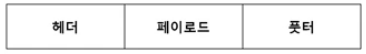
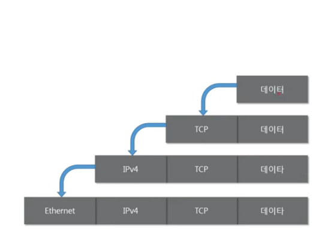
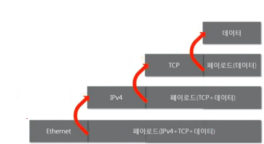
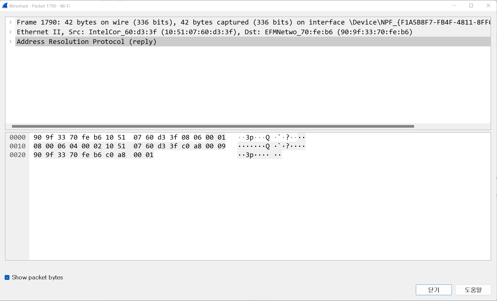

## 네트워크 모델

**목차**

1. [종류](#종류)
2. [두 모델 비교](#두-모델-비교)
3. [패킷](#패킷)
4. [실습](#실습)

---

### 종류

**TCP / IP 모델**

* 60년대 말 미국방성의 연구에서 시작돼 80년대 프로토콜 모델로 공개
* 현재의 인터넷에서 컴퓨터들이 서로 정보를 주고 받는데 쓰이는 통신 규약 (프로토콜) 의 모음
  * 1계층 **네트워크 인터페이스**
  * 2계층 **네트워크**
  * 3계층 **전송**
  * 4계층 **응용**

**OSI 7계층**

* 84년 네트워크 통신을 체계적으로 다루는 ISO 에서 표준으로 제정
* 데이터를 주고받을 때 데이터 자체의 흐름을 각 구간별로 나눠 놓은 것
  * 1계층 **물리** 
    * 전선, 전파, 광섬유 모뎀 등
  * 2계층 **데이터 링크**
    * **이더넷**, 무선랜 등
  * 3계층 **네트워크**
    * **IP, ICMP, ARP**, IPX 등
  * 4계층 **전송**
    * **TCP, UDP** 등
  * 5계층 **세션**
    * NetBIOS
  * 6계층 **표현**
    * SMB, AFP 등
  * 7계층 **응용**
    * **HTTP**, SSH 등

---

### 두 모델 비교

**공통점**

* 계층적 네트워크 모델이자 계층 간 역할 정의

**차이점**

* 계층의 수 차이
* OSI 는역할 기반, TCP / IP 는 프로토콜 기반
* OSI 는 통신 전반에 대한 표준이며 TCP / IP 는 데이터 전송기술 특화

---

### 패킷

**네트워크 상에서 전달되는 데이터를 통칭**

* 네트워크에서 전달하는 데이터의 형식화된 블록
* 제어 정보와 사용자 데이터 (페이로드) 로 이뤄져 있다
  * 예시 사진

* **캡슐화**

  * 여러 프로토콜을 이용해서 보낼 때 패킷을 만드는 과정

    

  * 상위 계층에서부터 하위 계층으로 내려가며 프로토콜 붙인다
    * 하위 계층 앞에 상위 계층 붙을 수 없다

* **디캡슐화**

  * 패킷을 받았을 때 프로토콜을 하나씩 확인하면서 데이터를 확인하는 과정
    * 화살표 방향만 반대

  

* **PDU**
  * 4계층의 PDU = 세그먼트
  * 3계층의 PDU = 패킷
  * 2계층의 PDU = 프레임

---

### 실습

* ARP 는 3계층
  * Ethernet | arp | footer 형식
  * footer 가 없을 수도 있다