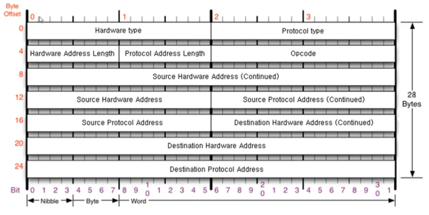
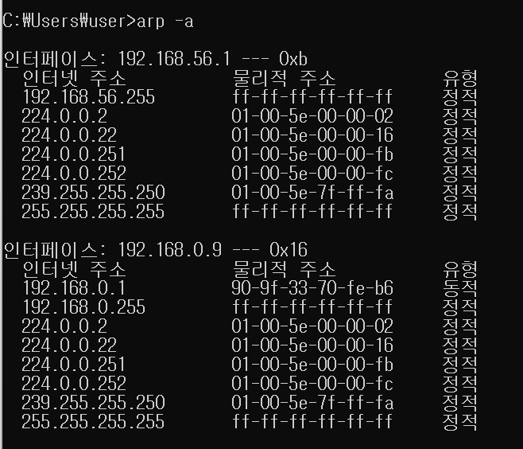

## ARP 프로토콜

**목차**

1. [하는 일](#하는-일)
2. [구조](#구조)
3. [통신 과정](#통신-과정)
4. [테이블](#테이블)

---

### 하는 일

**같은 네트워크 대역에서 통신을 하기 위해 필요한 MAC 주소를 IP 주소를 이용해 알아오는 프로토콜**

* 같은 네트워크 대역에서 통신을 해도 데이터를 보내기 위해서는 7 계층부터 캡슐화를 통해 데이터를 보내기 때문에 IP 주소와 MAC 주소 모두 필요
* IP 주소는 알고 MAC 주소는 모르더라도 ARP 를 통해 통신 가능

---

### 구조

**Ethernet 프로토콜만 목적지가 먼저 온다**

* 나머지 프로토콜은 출발지 먼저



* **Hardware type** | **Protocol type** | **Hardware Address length** | **Protocol Address length**
  * 0 0 0 1 | 0 8 0 0 |  0 6 |  0 4
* **Source Hardware Address **
  * 출발지 MAC 주소
* **Source Protocol Address**
  * IPv4 주소
* **Destination Hardware Address**
  * 목적지 MAC 주소
* **Destination Protocol Address**
  * 목적지 IP 주소

---

### 통신 과정

1. **ARP 요청**	

   * 요청 시에는 목적지 MAC 주소를 모르기 때문에 `00 00 00 00 00 00` 을 작성

2. **캡슐화**

3. 통신하고자 하는 PC 가 어디있는지 모르기 때문에 전 네트워크에 요청

   * Broadcast

   * 이 때 본인의 IP 주소와 목적지 IP 주소와 일치하지 않으면 패킷을 버린다

4. **ARP 응답**

   * 출발지 MAC 주소에 자신의 주소를 넣어서 전송

5. **MAC 주소 확인 가능**

   * ARP 캐시 테이블에 등록

---

### 테이블

**통신했던 컴퓨터들의 주소는 ARP 테이블에 남는다**

* 실습

  ```bash
  arp -a
  ```

  

