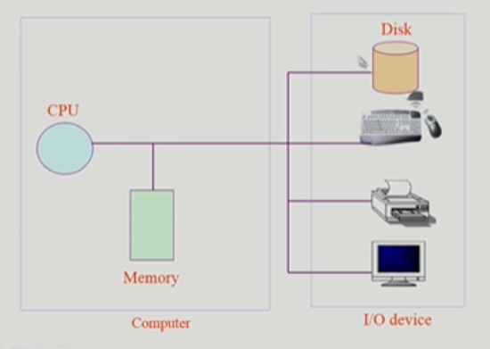
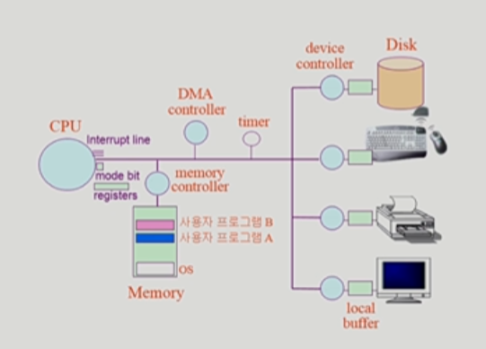

# 시스템 구조

**목차**

1. [컴퓨터 시스템 구조](#컴퓨터-시스템-구조)

   * [Mode bit](#mode-bit)

   * [Timer](#Timer)

   * [Device Controller](#device-controller)
   * [입출력 (I/O) 의 수행](#입출력-(i/o)-의-수행)
   * [Interrupt](#interrupt)

---

#### 컴퓨터 시스템 구조

* **mode bit** : CPU 실행되는 것이 운영체제인지 사용자 프로그램인지 구분해주는 것
* **register** : 메모리보다 빠르면서 정보를 저장할 수 있는 작은 공간

* **Interrupt line** : 주변 기기에 변화가 생겼을 때 CPU 에게 알려주는 것
  * 키보드에서 읽어오거나, 화면에 출력하거나 등 입출력이 발생했을 때 사용
  * **CPU 는 메모리하고만 상호작용**하고 I/O device 하고 작용하지 않는다
  * Disk Controller 에게 CPU 가 요청
    * 요청된 사항이 끝날 때까지 CPU 는 Instruction 실행
* **timer** : 특정 프로그램이 CPU 독점하는 것 막는 기능
  * timer 가 끝나면 CPU 에 interrupt, CPU 제어권이 사용자 프로그램부터 OS 로 넘어간다
* **DMA Controller** : 메모리에 접근할 수 있는 컨트롤러

---

#### Mode bit

* 사용자 프로그램의 잘못된 수행으로 다른 프로그램 및 운영체제에 피해가 가지 않도록 하기 위한 보호장치 필요
* 두 가지 모드의 Operation 지원
  * **1** 사용자 모드 : 사용자 프로그램 수행
  * **0** 모니터 모드 (커널 모드) : OS 코드 수행
    * 보안을 해칠 수 있는 중요한 명령어는 모니터 모드에서만 가능한 **'특권명령'**으로 규정
    * Interrupt 나 Exception 발생 시 하드웨어가 mode bit 을 0으로 바꿈
    * 사용자 프로그램에게 CPU 를 넘기기 전에 mode bit 을 1로 세팅

---

#### Timer

* 정해진 시간이 흐른 뒤 운영체제에게 제어권이 넘어가도록 interrupt 발생
* 타이머는 매 클럭 틱 때마다 1씩 감소
  * 타이머 값이 0이 될 때 타이머 interrupt 발생
* CPU를 특정 프로그램이 독점하는 것으로부터 보호
* **Time Sharing** 실행을 위해 사용, 현재 시간 알기 위해서도 사용

---

#### Device Controller

* I/O device controller
  * 해당 I/O 장치유형을 관리하는 일종의 작은 CPU
  * 제어 정보를 위해 control register, status register 를 가진다
  * 일종의 data register 인 local buffer 를 가진다
* I/O는 실제 device 와 local buffer 사이에서 일어난다
* Device controller 는 I/O 가 끝났을 경우 interrupt 로 CPU 에 그 사실을 알린다

**Device driver (장치구동기)**

[Software] OS 코드 중 각 장치별 처리 루틴

**Device controller (장치제어기)**

[Hardware] 각 장치를 통제하는 일종의 작은 CPU

---

#### 입출력 (I/O) 의 수행

* 모든 입출력 명령은 **특권 명령**
* 사용자 프로그램이 I/O를 수행하는 방법
  * System Call
    * 사용자 프로그램이 운영체제의 서비스를 받기 위해 커널 함수를 호출하는 것
    * 사용자 프로그램이 운영체제에게 I/O 요청
  * Trap 을 사용하여 Interrupt 벡터의 특정 위치로 이동
  * 제어권이 Interrupt 벡터가 가리키는 Interrupt 서비스 루틴으로 이동
  * 올바른 I/O 요청인지 확인 후 I/O 수행
  * I/O 완료 시 제어권을 System call 다음 명령으로 옮긴다

---

#### Interrupt

* Interupt 당한 시점의 register 와 program counter 을 save 한 후 CPU 의 제어를 Interrupt 처리 루틴에 넘긴다
* **광의**
  * **Hardware Interrupt**
  * **Software Interrupt (Trap)**
    * Exception : 프로그램이 오류를 범한 경우
    * System call : 프로그램이 커널 함수를 호출하는 경우
* 용어
  * Interrupt 벡터
    * 해당 Interrupt 의 처리 루틴 주소를 가지고 있음
  * Interrupt 처리 루틴 (Interrupt Handler, Interrupt Service Routine)
    * 해당 Interrupt 를 처리하는 커널 함수

**현대의 운영체제는 Interrupt 에 의해 구동**