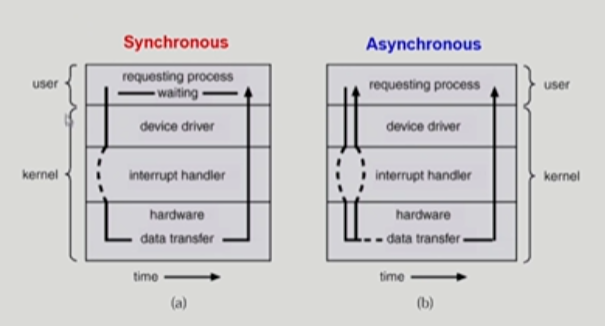
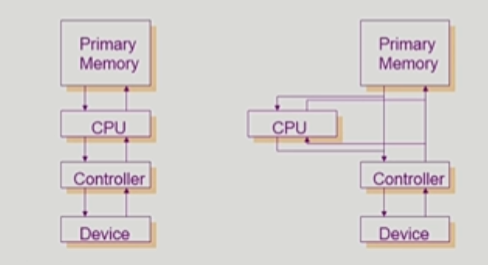
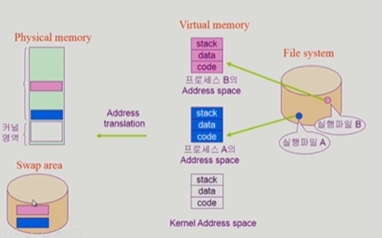
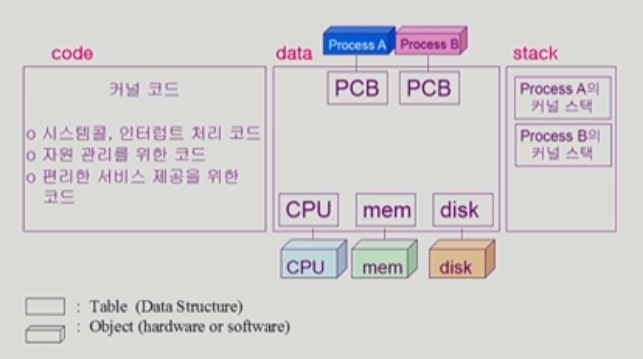
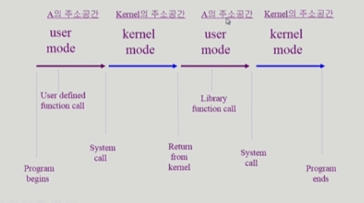

## 시스템 구조

**목차**

1. [동기식과 비동기식 입출력](#동기식과-비동기식-입출력)
2. [DMA (Direct Memory Access) Controller](#dma-(direct-memory-access)-controller)
3. [저장장치 계층 구조](#저장장치-계층-구조)
4. [프로그램의 실행](#프로그램의-실행)
5. [사용자 프로그램의 사용 함수](#사용자-프로그램의-사용-함수)

---

#### 동기식과 비동기식 입출력

**동기식 입출력 (synchronoud I/O)**

* I/O 요청 후 입출력 작업이 완료된 후에야 제어가 사용자 프로그램에 넘어감
* 구현 방법 1
  * I/O 가 끝날 때까지 CPU 를 낭비
  * 매시점 하나의 I/O 만 일어날 수 있다
* 구현 방법 2
  * I/O 가 완료될 때까지 해당 프로그램에게서 CPU 를 뺏는다
  * I/O 처리를 기다리는 줄에 해당 프로그램을 줄 세우기
  * 다른 프로그램에게 CPU 를 준다

**비동기식 입출력(asynchronoud I/O)**

* I/O 가 시작된 후 입출력 작업이 끝나기를 기다리지 않고 제어가 사용자 프로그램에 즉시 넘어간다

**두 경우 모두 I/O 완료는 Interrupt 로 알려준다**

---

#### DMA (Direct Memory Access) Controller

* 빠른 입출력 장치를 메모리에 가까운 속도로 처리하기 위해 사용
* CPU 의 중재 없이 Device Controller 가 Device 의 buffer storage 의 내용을 메모리에 block 단위로 직접 전송
* 바이트 단위가 아니라 block 단위로 interrupt 를 발생 

---

#### 저장장치 계층 구조

저장장치 구조

* Primary
  * 휘발성
  * CPU 가 직접 접근 가능 (byte 단위)
* Secondary
  * 비휘발성
  * CPU 직접 접근 불가능 (sector 단위)
* Caching : 재사용 목적으로 미리 데이터 읽어오는 것

---

#### 프로그램의 실행

**File system &rarr; Virtual memeory &rarr; Address translation &rarr; Physical memory**

**커널 주소 공간의 내용**

* **Process Control Block** 
* 함수를 호출하거나 이용할 때 Stack 필요

**실행 과정**

---

#### 사용자 프로그램의 사용 함수

**함수 (function)**

* 사용자 정의 함수
  * 자신의 프로그램에서 정의한 함수
* 라이브러리 함수
  * 자신의 프로그램에서 정의하지 않고 외부에서 가져다 쓴 함수
  * 자신의 프로그램의 실행 파일에 포함돼 있다

**&rarr; Process A의 Address space**

* 커널 함수
  * 운영체제 프로그램의 함수
  * 커널 함수의 호출 = System Call

**&rarr; Kernel Address space**