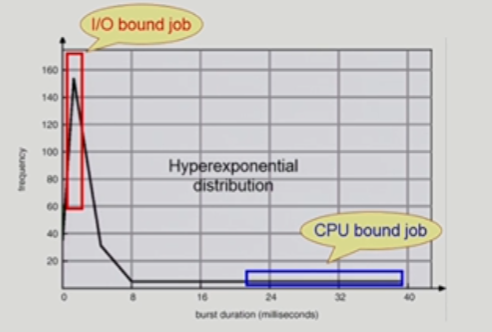
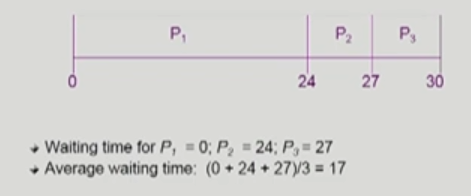
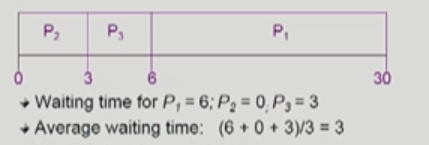
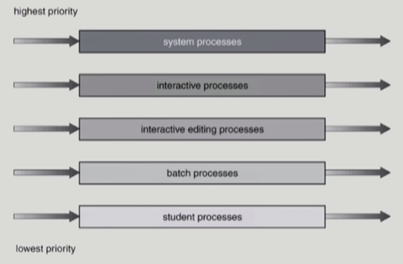
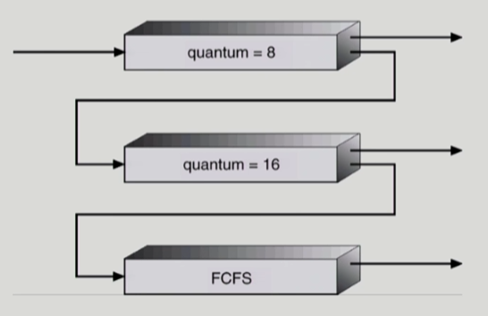

## CPU Scheduling

**목차**

1. [CPU-burst Time 의 분포](#cpu-burst-time-의-분포)
2. [프로세스의 특성 분류](#프로세스의-특성-분류)
3. [CPU Scheduler & Dispatcher](#cpu-scheduler-&-dispatcher)
4. [Scheduling Criteria](#scheduling-criteria)
5. [Scheduling Algorithm](#scheduling-algorithm)
6. [Multiple-Processor Scheduling](#multiple-processor-scheduling)
7. [Real-Time Scheduling](#real-time-scheduling)
8. [Thread Scheduling](#thread-scheduling)
9. [Algorithm Evaluation](#algorithm-evaluation)

---

### CPU-burst Time 의 분포

**여러 종류의 job (process) 가 섞여있기 때문에 CPU 스케쥴링이 필요**

* Interactive job 에게 적절한 response 제공 요망
* CPU 와 I/O 장치 등 시스템 자원을 골고루 효율적으로 사용

---

### 프로세스의 특성 분류

**I/O-bound process**

* CPU 를 잡고 계산하는 시간보다 I/O 에 많은 시간이 필요한 job

**CPU-bound process**

* 계산 위주의 job

---

### CPU Scheduler & Dispatcher

**CPU Scheduler**

* Ready 상태의 프로세스 중에서 이번에 CPU 를 줄 프로세스를 고른다
* 운영체제 내 CPU 스케쥴링을 하는 코드가 있다

**Dispatcher**

* CPU 의 제어권을 CPU scheduler 에 의해 선택된 프로세스에게 넘긴다
* 이 과정을 context switch (문맥 교환) 라고 한다

&rarr; **CPU 스케쥴링이 필요한 경우는 다음과 같은 상태 변화가 있을 때**

1. Running &rarr; Blocked (I/O 요청하는 시스템 콜 등)

2. Running &rarr; Ready (할당 시간만료로 timer interrupt)

3. Blocked &rarr; Ready (I/O 완료 후 인터럽트 등)

4. Terminate

   * 1, 4 에서의 스케쥴링은 **nonpreemptive (자진 반납) 비선점형**

   * All other scheduling is **preemptive (강제 반납) 선점형**

---

### Scheduling Criteria

**CPU utilization (이용률)**

* keep the CPU as busy as possible

**Throughput (처리량)**

* `#` of processes that complete their execution per time unit

**Turnaround time (소요시간, 반환시간)**

* amount of time to execute a particular process

**Waiting time (대기 시간)**

* amount of time a process has been waiting in the ready queue

**Response time (응답 시간)**

* amount of time it takes from when a request was submitted until the first response is produced, not output (for time-sharing environment)

---

### Scheduling Algorithm

**FCFS (First-Come First-Served)**

* 비선점형

* 처음으로 긴 프로세스가 오면 Waiting time 이 커지기 때문에 좋은 방법은 아니다
  * **Convoy Effect** 
    * short process behind long process 

* 반대일 경우

  

  * 훨씬 효율적이 된다

**SJF (Shortest-Job-First)**

* 각 프로세스의 다음번 CPU burst time 을 가지고 스케쥴링에 활용
* CPU burst time 이 가장 짧은 프로세스를 제일 먼저 스케쥴
* 2 Type
  * **Nonpreemptive**
    * 일단 CPU 를 잡으면 이번 CPU burst 가 완료될 때까지 CPU 를 선점 (preemption) 당하지 않는다
  * **Preemptive**
    * 현재 수행중인 프로세스의 남은 burst time 보다 더 짧은 CPU burst time 을 가지는 새로운 프로세스가 도착하면 CPU 를 빼앗긴다
      * 이 방법을 Shortest-Remaining-Time-First(SRTF) 라고도 부른다
* **SJF is optimal**
  * 주어진 프로세스들에 대해 minimum average waiting time 을 보장

* 2 problems
  * **Starvation**
    * 긴 프로세스가 계속해서 CPU 를 받을 수 없게 될 수도 있다
  * **CPU Burst Time 예측 문제**
    * CPU Burst Time 은 추정 (estimate) 만 가능하다
    * 과거의 CPU burst time 을 이용해 추정 (exponential averaging)
      * SJF 는 추정하기 어렵다

**Priority Scheduling**

* highest priority 를 가진 프로세스에게 CPU 할당
  * 작은 숫자가 우선 순위가 높다 (integer)
* 2 Type
  * **Preemptive**
  * **nonpreemptive**
* SJF 는 일종의 priority scheduling 이므로 같은 문제가 발생 (Starvation)
  * 해결책
    * **Aging** 
      * as time progresses increase the priority of the process

**Round Robin (RR)**

* 각 프로세스는 동일한 크기의 할당 시간 (time quantum) 을 가진다

  * 일반적으로 10 - 100 milliseconds

* 할당 시간이 지나면 프로세스는 선점 (preempted) 당하고 ready queue 의 제일 뒤에 가서 다시 줄을 선다

* n 개의 프로세스가 ready queue 에 있고 할당 시간이 q time unit 인 경우, 각 프로세스는 최대 q time unit 단위로 CPU 시간의 1 / n 을 얻는다

  **&rarr; 어떤 프로세스도 (n - 1) q time unit 이상 기다리지 않는다**

* Performance
  * q large &rarr; FCFS
  * q small &rarr; context switch 오버헤드가 커진다

**Multilevel Queue**

* Ready queue 를 여러 개로 분할
  * **foreground (interactive)**
  * **background (batch - no human interaction)**
* 각 큐는 독립적인 스케쥴링 알고리즘을 가진다
  * **foreground - RR**
  * **background - FCFS**
* 큐에 대한 스케쥴링이 필요
  * **Fixed priority scheduling**
    * serve all from foreground then from background
    * Possibility of starvation
  * **Time slice**
    * 각 큐에 CPU Time 을 적절한 비율로 할당
    * eg. 80% to foreground in RR, 20% to background in FCFS

**Multilevel Feedback Queue**

* 프로세스가 다른 큐로 이동 가능
* **aging** 을 이와 같은 방식으로 구현 가능
* Parameters
  * Queue 의 수
  * 각 큐의 Scheduling algorithm
  * Process 를 상위 / 하위 큐로 보내는 / 내쫓는 기준
  * 프로세스가 CPU 서비스를 받으려 할 때 들어갈 큐를 결정하는 기준

---

**이 때까지는 CPU 가 하나있을 때만 다뤘다**

### Multiple-Processor Scheduling

**Homogeneous processor**

* Queue 에 한 줄로 세워서 각 프로세서가 알아서 꺼내가도록
* 반드시 특정 프로세서에서 수행돼야 하는 프로세스가 있는 경우에는 문제 복잡해진다

**Load sharing**

* 일부 프로세서에 job 이 몰리지 않도록 부하를 적절히 공유하는 메커니즘 필요
* 별개의 큐를 두는 방법 vs 공동 큐를 사용하는 방법

**Symmetric Multiprocessing (SMP)**

* 각 프로세서가 각자 알아서 스케쥴링 결정

**Asymmetric multiprocessing**

* 하나의 프로세서가 시스템 데이터의 접근과 공유를 책임지고 나머지 프로세서는 거기에 따른다

---

### Real-Time Scheduling

**Hard real-time systems**

* Hard real-time task 는 정해진 시간 내에 반드시 끝내도록 스케쥴링

**Soft real-time computing**

* Soft real-time task 는 일반 프로세스에 비해 높은 priority 를 갖도록 해야 한다

---

### Thread Scheduling

**Local Scheduling**

* User level thread 의 경우 사용자 수준의 thread library 에 의해 어떤 thread 를 스케쥴할지 결정

**Global Scheduling**

* Kernel level thread 의 경우 일반 프로세스와 마찬가지로 커널의 단기 스케쥴러가 어떤 thread 를 스케쥴 할지 결정

---

### Algorithm Evaluation

**Queueing models**

* 확률 분포로 주어지는 arrival rate 와 service rate 등을 통해 각종 performance index 값을 계산

**Implementation (구현) & Measurement (성능 측정)**

* 실제 시스템에 알고리즘을 구현해 실제 작업 (workload) 에 대해서 성능을 측정

**Simulation (모의 실험)**

* 알고리즘을 모의 프로그램으로 작성 후 trace 를 입력으로 해 결과 비교
