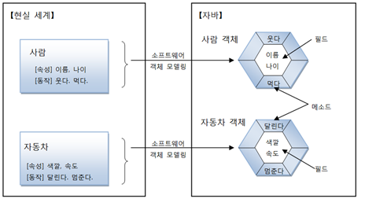
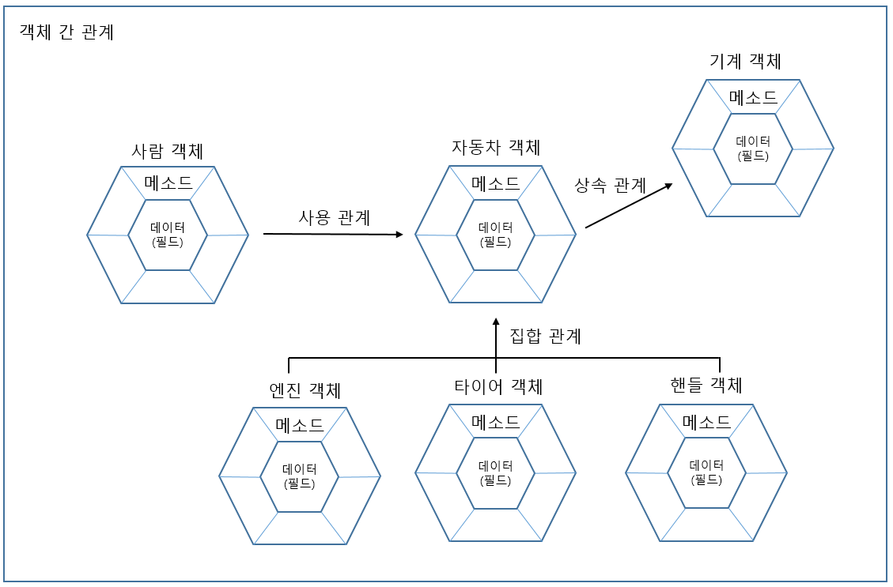
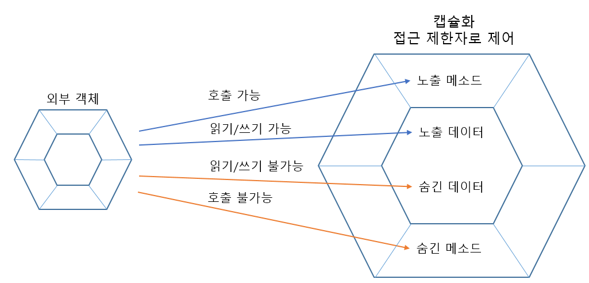
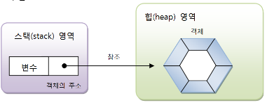
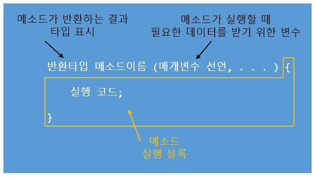

**목차**

1. [객체 지향 프로그래밍](#객체-지향-프로그래밍)
2. [객체와 클래스](#객체와-클래스)
3. [객체 생성과 클래스 변수](#객체-생성과-클래스-변수)
4. [클래스의 구성](#클래스의-구성)

---

### 객체 지향 프로그래밍

**객체**

* 물리적으로 존재하거나 개념적인 것 중에서 다른 것과 식별 가능한 것
* **필드** (field, 속성) 와 **메소드** (method, 동작) 으로 구분



**객체 모델링**

* 현실 세계의 객체를 소프트웨어 객체로 설계하는 것

**객체 상호작용**

* 객체들 사이의 상호작용 수단은 메소드다

  * 객체가 다른 객체의 기능을 이용할 때 메소드를 호출

  * 메소드 호출을 통해 객체들이 데이터 주고 받음

    * 메소드 이름과 함께 전달하고자 하는 데이터를 괄호 `()` 안에 기술

      * 이러한 데이터를 매개값이라고 한다

      * 리턴값은 메소드의 실행의 결과

      * 리턴값은 호출한 곳에서 변수로 대입 받아 사용

        ```java
        int result = add(10, 20); // 리턴한 값을 result 에 저장
        ```

**객체 간의 관계**



* 집합 관계
  * 완성품과 부품의 관계 

* 사용 관계
  * 다른 객체의 필드를 읽고 변경하거나 메소드를 호출하는 관계
* 상속 관계
  * 부모와 자식 관계
    * 특징을 물려받는 관계

**특징**

* 캡슐화
  * 객체의 데이터 (필드), 동작 (메소드) 을 하나로 묶고 실제 구현 내용을 외부에 감추는 것
    * 외부 객체는 객체 내부의 구조를 알지 못하며 객체가 노출해 제공하는 필드와 메소드만 이용 가능
  * 외부의 잘못된 사용으로 객체가 손상되지 않도록 캡슐화 하는 것
  * 캡슐화된 멤버를 노출 시킬 것인지 숨길 것인지 결정하기 위해 자바는 **접근 제한자** 사용

​		

* 상속
  * 부모 객체는 자신의 필드와 메소드를 자식 객체에게 물려줘 자식 객체가 사용할 수 있도록 한다
    * 코드의 재사용성을 높인다
      * 자식 객체에서 중복 코딩을 하지 않아도 된다
    * 유지 보수 시간을 최소화 시킨다
      * 부모 객체 필드와 메소드를 수정하면 모든 자식 객체는 수정된 것으로 사용할 수 있다

* 다형성
  * 사용 방법은 동일하지만 실행 결과가 다양하게 나오는 성질
  * 프로그램을 구성하는 객체를 바꾸면 프로그램 실행 성능이 다르게 나올 수 있다
    * 자동차 부품을 교환하면 성능이 다르듯

---

### 객체와 클래스

**객체를 생성하려면 설계도에 해당하는 클래스가 필요**

* 클래스로부터 생성된 객체를 해당 클래스의 인스턴스 (instance) 라고 부른다
* 클래스로부터 객체를 만드는 과정을 인스턴스화라고 한다
  * 동일한 클래스로부터 여러 개의 인스턴스 만들기 가능


**클래스 선언**

```java
// 클래스명.java

public class 클래스명 {
}
```

* `public class` 는 공개 클래스를 선언한다는 의미
  * **공개 클래스란 어느 위치에 있든지 패키지와 상관없이 사용할 수 있는 클래스**
  * 클래스명은 첫 문자를 대문자로, Camel case 로 작성하고 특수문자는 `$`, `_` 포함 가능
* 하나의 소스 파일은 복수의 클래스 선언을 포함할 수 있다
  * 이런 소스 파일을 컴파일하면 바이트 코드 파일 (.class) 은 클래스 선언 수만큼 생긴다
  * 주의점
    * **소스 파일명과 동일한 클래스만 공개 클래스 (public class) 로 선언할 수 있다**

**클래스 용도**

* 라이브러리 클래스
  * 실행할 수 없으며 다른 클래스에서 이용하는 클래스
* 실행 클래스
  * main() 메소드를 가지고 있는 실행 가능한 클래스

---

### 객체 생성과 클래스 변수

클래스로부터 객체를 생성하려면 객체 생성 연산자인 `new` 가 필요

* `new` 연산자는 객체를 생성 시킨 후 객체 주소를 리턴하기 때문에 클래스 변수에 대입 가능

```java
클래스 변수 = new 클래스();
```



---

### 클래스의 구성

```java
public class ClassName {
    // 필드 선언
    int fieldName;
    
    // 생성자 선언
    ClassName() { ... }
    
    // 메소드 선언
    int methodName() {...}
}
```

**필드**

* 객체의 데이터를 저장하는 역할

  * 고유 데이터
  * 현재 상태 데이터
  * 부품 데이터

  ```java
  public class Car {
      // 고유 데이터를 저장하는 필드 선언
      String company;
      String model;
      String color;
      int maxSpeed;
      
      // 상태 데이터를 저장하는 필드 선언
      int speed;
      int rpm;
      
      // 부품 데이터를 저장하는 필드 선언
      Body body;
      Engine engine;
      Tire tire;
  }
  ```

* 필드 선언하는 방법은 변수 선언과 동일하다

  * 반드시 클래스 블록에서 선언돼야 필드 선언이 된다

    ```
    타입 필드명 [ = 초기값 ];
    ```

    | 구분      | 필드                    | (로컬) 변수                         |
    | --------- | ----------------------- | ----------------------------------- |
    | 선언 위치 | 클래스 선언 블록        | 생성자, 메소드 선언 블록            |
    | 존재 위치 | 객체 내부에 존재        | 생성자, 메소드 호출 시에만 존재     |
    | 사용 위치 | 객체 내외부 어디든 사용 | 생성자, 메소드 블록 내부에서만 사용 |

  * 타입은 필드에 저장할 데이터의 종류를 가리키며

    * 기본 타입, 참조 타입 모두 가능

  ```java
  public class Car {
      String model = "그랜저"; // 고유 데이터 필드
      int speed = 300; // 상태 데이터 필드
      boolean start = true; // 상태 데이터 필드
      Tire tire = new Tire(); // 부품 데이터 필드
  }
  ```

* 필드 사용

  * 필드값을 읽고 변경하는 것을 의미
  * 필드는 객체의 데이터므로 객체가 존재하지 않으면 필드도 존재하지 않는다
    * 클래스로부터 객체가 생성된 후에 필드를 사용 가능
    * 객체 내부의 생성자와 메소드 내부에서 사용 가능하며 객체 외부에서도 접근해 사용 가능


**생성자**

* new 연산자로 객체를 생성할 때 객체의 초기화 역할 담당

* 리턴 타입이 없고 이름은 클래스 이름과 동일하다

* **기본 생성자**

  * 클래스에 생성자 선언이 없으면 컴파일러는 기본 생성자를 바이트코드 파일에 자동으로 추가한다

    * 개발자가 명시적으로 선언한 생성자가 있으면 컴파일러는 기본 생성자를 추가하지 않는다

    ```
    [public] 클래스() {}
    ```

  * public class 일 경우 기본 생성자도 public 이 붙는다 (public 이 없는 경우 기본 생성자도 public 이 없다)

* 생성자 선언

  ```
  클래스(매개변수, ...) {
  	// 객체의 초기화 코드로, 생성자 블록
  }
  ```

  ```java
  Car myCar = new Car("그랜저", "검정", 300);
  
  public class Car {
      Car(String model, String color, int maxSpeed) { ... }
  }
  ```

* 객체마다 다른 값을 가지고 있다면 생성자에서 필드를 초기화하는 것이 좋다

* 매개변수명이 필드명과 동일할 경우

  * this 로 구분

    * this 는 현재 객체를 말한다

    ```java
    public class Korean {
        // 필드 선언
        String nation = "대한민국";
        String name;
        String ssn;
        
        // 생성자 선언
        public Korean(String name, String ssn) {
            this.name = name; // 현재 객체의 데이터(필드)로서의 name 을 의미
            this.ssn = ssn;
        }
    }
    ```

* 생성자 오버로딩

  * 매개값으로 객체의 필드를 다양하게 초기화하는 것

    ```java
    public class Car {
        Car() { ... }
        Car(String model) { ... }
        Car(String model, String color) { ... }
    }
    ```

  * 오버로딩이 많아질 경우 생성자 간의 중복된 코드 발생

    * 한 생성자에 공통 코드를 집중하고 나머지 생성자는 this(...) 를 사용해 공통 코드의 생성자를 호출하는 방법으로 사용 가능

    ```java
    Car(String model) {
        this(model, "은색", 250); // 공통 코드 호출
    }
    
    Car(String model, String color) {
        this(model, color, 250);
    }
    
    Car(String model, String color, int maxSpeed) {
        this.model = model;
        this.color = color;
        this.maxSpeed = maxSpeed; // 공통 초기화 코드
    }
    ```

    

**메소드**

* 객체가 수행할 동작
* 객체와 객체 간의 상호 작용을 위해 호출된다

* 메소드 선언

  * 객체의 동작을 실행 블록으로 정의하는 것을 의미

    

  * 리턴 타입

    * 메소드가 실행한 후 호출한 곳으로 전달하는 결과값의 타입
    * 리턴값이 없는 메소드는 void 로 작성해야 한다 
    * 리턴 타입이 있는 메소드는 실행 블록 안에서 return 문으로 반드시 리턴값을 지정해야 한다

* 메소드명

  * 첫 문자는 소문자, Camel case 로 작성

* 메소드 호출

  * 실행 블록을 실제로 실행하는 것을 의미
  * 클래스로부터 객체가 생성된 후 메소드는 생성자와 다른 메소드 내부, 그리고 객체 외부에서 호출 가능
    * 외부 객체에서는 참조 변수와 도트 `.` 연산자를 이용해 호출

* 가변길이 매개변수

  * 메소드 호출 시 매개변수의 개수에 맞도록 매개값 제공

    * 가변길이 매개변수는 매개변수 개수와 상관없이 매개값 줄 수 있다

      ```java
      int sum(int ... values) {
      }
      ```

    * 메소드 호출 시 매개값을 쉼표로 구분해 개수와 상관없이 제공 가능

  * 매개값들은 자동으로 배열 항목으로 변환돼 메소드에서 사용

    * 메소드 호출 시 직접 배열을 매개값으로 제공해도 된다

      ```java
      // 방법 1
      int[] values = { 1, 2, 3 };
      int result = sum(values);
      
      // 방법 2
      int result = sum(new int[] { 1, 2, 3 });
      ```

* return 문

  * 메소드의 실행을 강제 종료하고 호출한 곳으로 돌아간다는 의미
  * 메소드 선언에 리턴 타입이 있을 경우, return 문 뒤에 리턴값을 추가로 지정해야 한다
    * return 문 이후에 실행문 작성할 시 Unreachable code 컴파일 에러 발생

* 메소드 오버로딩

  * 메소드 이름은 같되 매개변수의 타입, 개수, 순서가 다른 메소드를 여러 개 선언하는 것

    ```java
    public class Calculator {
        // 정사각형의 넓이
        double areaRectangle(double width) {
            return width * width;
        }
        // 직사각형의 넓이
        double areaRectangle(double width, double height) {
            return width * height;
        }
    }
    ```

