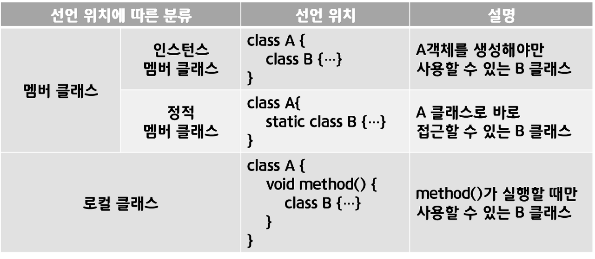

**목차**

1. [중첩 클래스](#중첩-클래스)
2. [인스턴스 멤버 클래스](#인스턴스-멤버-클래스)
3. [정적 멤버 클래스](#정적-멤버-클래스)
4. [로컬 클래스](#로컬-클래스)
5. [바깥 멤버 접근](#바깥-멤버-접근)
6. [중첩 인터페이스](#중첩-인터페이스)
7. [익명 객체](#익명-객체)

---

### 중첩 클래스

**특정 클래스만 관계를 맺을 경우, 중첩 클래스로 선언하는 것이 유지보수에 도움이 된다**

**클래스 내부에 선언한 클래스를 의미**



* 중첩 클래스도 하나의 클래스기 때문에 컴파일 시 바이트 코드 파일 `.class` 이 자동 생성

  * 멤버 클래스

    ```
    A $ B .class
    ```

  * 로컬 클래스

    ```
    A $1 B .class
    ```

---

### 인스턴스 멤버 클래스

**A 클래스의 멤버로 선언된 B 클래스를 의미**

```java
public class A {
	public | private class B {
    }
}
```

| 구분                | 접근 범위                                     |
| ------------------- | --------------------------------------------- |
| public class B { }  | 다른 패키지에서 B 클래스를 사용할 수 있다     |
| class B { }         | 같은 패키지에서만 B 클래스를 사용할 수 있다   |
| private class B { } | A 클래스 내부에서만 B 클래스를 사용할 수 있다 |

* 인스턴스 멤버 클래스 B 는 주로 A 클래스 내부에서 사용

  * private 접근 제한을 갖는 게 일반적

* A 객체가 있어야 B 객체도 생성 가능

  ```java
  A a = new A();
  A.B b = new B();
  ```

* 인스턴스 멤버 클래스 B 내부에는 일반 클래스와 같이 필드, 생성자, 메소드 선언이 올 수 있다

---

### 정적 멤버 클래스

**static 키워드와 함께 A 클래스 멤버로 선언된 B 클래스를 의미**

```java
public class A {
	public | private static class B {
    }
}
```

| 구분                       | 접근 범위                                     |
| -------------------------- | --------------------------------------------- |
| public static class B { }  | 다른 패키지에서 B 클래스를 사용할 수 있다     |
| static class B { }         | 같은 패키지에서만 B 클래스를 사용할 수 있다   |
| private static class B { } | A 클래스 내부에서만 B 클래스를 사용할 수 있다 |

* 정적 멤버 클래스 B 는 A 내부에서 사용되기도 하지만, A 클래스 외부에서 A 와 함께 사용되는 경우가 많음

  * 주로 default 또는 public 접근 제한을 가진다

* B 객체는 A 클래스 내부 어디든 객체 생성 가능

* A 클래스 외부에서 B 객체를 생성하려면 A 클래스로 접근해서 B 객체를 생성할 수 있다

  ```java
  A.B b = new A.B();
  ```

---

### 로컬 클래스

**생성자 또는 메소드 내부에서 선언된 클래스를 의미**

```java
public class A {
    // 생성자
    public A() {
        class B { }
    }
    
    // 메소드
    public void method() {
        class B { }
    }
}
```

* 생성자와 메소드가 실행되는 동안에만 객체 생성 가능
* 로컬 변수를 로컬 클래스에서 사용할 경우
  * 로컬 변수는 final 특성을 갖게 된다 &rarr; 값을 읽을 수만 있고 수정할 수 없게 된다

---

### 바깥 멤버 접근

**중첩 클래스는 바깥 클래스와 긴밀한 관계로, 바깥 클래스의 멤버 (필드, 메소드) 에 접근 가능하다**

하지만 제한이 있을 수 있다

| 구분                 | 바깥 클래스의 사용 가능한 멤버        |
| -------------------- | ------------------------------------- |
| 인스턴스 멤버 클래스 | 바깥 클래스의 모든 필드와 메소드      |
| 정적 멤버 클래스     | 바깥 클래스의 정적 필드와 정적 메소드 |

* 정적 멤버 클래스는 바깥 객체가 없어도 사용 가능해야 한다
  * 따라서, 바깥 클래스의 인스턴스 필드와 인스턴스 메소드는 사용하지 못한다


**바깥 클래스의 객체 접근**

* 중첩 클래스 내부에서 this 는 해당 중첩 클래스의 객체를 의미

  ```markdown
  바깥클래스이름.this -> 바깥객체
  ```

---

### 중첩 인터페이스

**클래스의 멤버로 선언된 인터페이스를 의미**

```java
class A {
	public | private [static] interface B {
        // 상수 필드
        // 추상 메소드
        // 디폴트 메소드
        // 정적 메소드
    }
}
```

---

### 익명 객체

**이름이 없는 객체로, 명시적으로 클래스를 선언하지 않는다**

클래스를 상속하거나 인터페이스를 구현해야만 생성 가능

* 클래스 상속의 경우, 익명 자식 객체라 하고 인터페이스의 경우, 익명 구현 객체라 한다


**익명 자식 객체**

```
new 부모생성자(매개값, ...) {
	// 필드
	// 메소드
}
```

* 중괄호 블록 내부에는 주로 부모 메소드를 재정의하는 코드
  * 중괄호 내부 필드, 메소드는 중괄호 블록 내부에서만 사용 가능


**익명 구현 객체**

```
new 인터페이스() {
	// 필드
	// 메소드
}
```

* 익명 자식 객체와 마찬가지로 중괄호 내부에서만 필드, 메소드 사용 가능