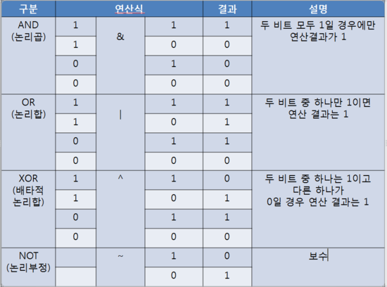
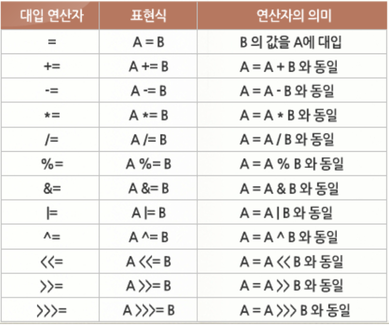
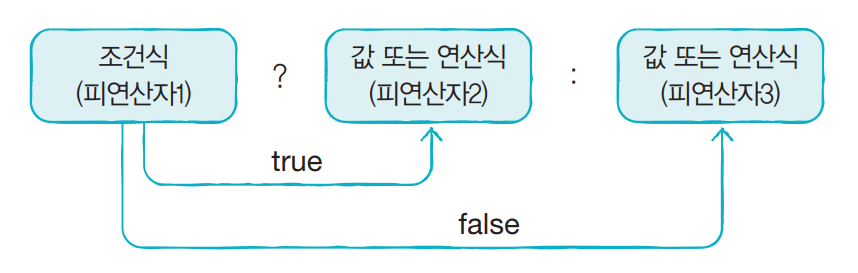
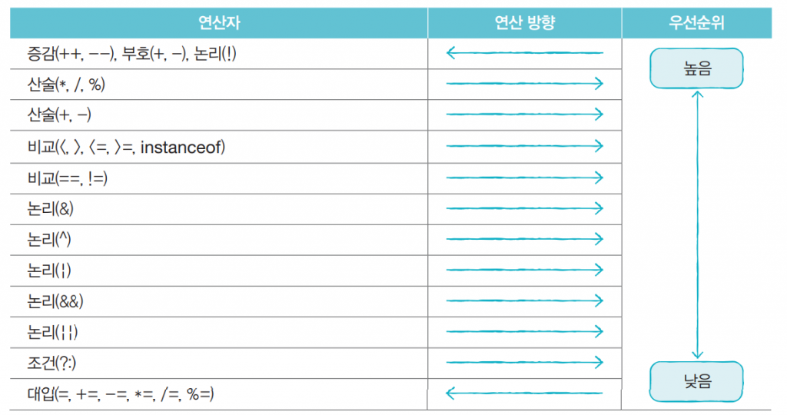

## 연산자

**목차**

1. [부호 / 증감 연산자](#부호-/-증감-연산자)
2. [산술 연산자](#산술-연산자)
3. [오버플로우와 언더플로우](#오버플로우와-언더플로우)
4. [NaN & Infinity](#NaN-&-Infinity)
5. [비교 연산자](#비교-연산자)
6. [논리 연산자](#논리-연산자)
7. [비트 연산자](#비트-연산자)
8. [대입 연산자](#대입-연산자)
9. [삼항 (조건) 연산자](#삼항-(조건)-연산자)
10. [연산의 방향과 우선순위](#연산의-방향과-우선순위)

---

### 부호 / 증감 연산자

#### 부호 연산자

| 연산식 | -        | 설명                 |
| ------ | -------- | -------------------- |
| `+`    | 피연산자 | 피연산자의 부호 유지 |
| `-`    | 피연산자 | 피연산자의 부호 변경 |

**부호 변경 후 Type 주의**

* 연산 후에는 `int` 로 형변환 되기 때문에 다음 result 는 `int` 가 돼야 한다
* 부호 연산자도 연산

```java
// 컴파일 에러
byte b = 100;
byte result = -b;

// 맞는 코드
byte b = 100;
int result = -b;
```


#### 증감 연산자

| 연산식   | -        | 설명                                                |
| -------- | -------- | --------------------------------------------------- |
| `++`     | 피연산자 | 피연산자의 값을 1 증가 시킨다                       |
| `--`     | 피연산자 | 피연산자의 값을 1 감소 시킨다                       |
| 피연산자 | `++`     | 다른 연산을 수행한 후에 피연산자 값을 1 증가 시킨다 |
| 피연산자 | `--`     | 다른 연산을 수행한 후에 피연산자 값을 1 감소 시킨다 |

* 변수 단독으로 증감 연산자 사용 경우에는 값이 동일하다

* 여러 개의 연산자가 있을 때 값 차이

  ```java
  int x = 1;
  int y = 1;
  int result1 = ++x + 10;
  int result2 = y++ + 10;
  
  // result1 은 x 먼저 증가, 2 + 10 = 12
  // result2 는 연산 후 y 증가, 1 + 10 = 11 이고 y 가 1 증가하므로 2
  ```

---

### 산술 연산자

| 연산식   | 부호 | -        | 설명                            |
| -------- | ---- | -------- | ------------------------------- |
| 피연산자 | `+`  | 피연산자 | 덧셈 연산                       |
| 피연산자 | `-`  | 피연산자 | 뺄셈 연산                       |
| 피연산자 | `*`  | 피연산자 | 곱셈 연산                       |
| 피연산자 | `/`  | 피연산자 | 나눗셈 연산                     |
| 피연산자 | `%`  | 피연산자 | 나눗셈의 나머지를 산출하는 연산 |

**특징**

* 피연산자가 정수 타입 (`byte`, `short`, `char`, `int`) 이면 연산의 결과는 `int` 타입이다
* 피연산자가 정수 타입이고 그 중 하나가 `long` 타입이면 연산의 결과는 `long` 타입이다
* 피연산자 중 하나가 실수 타입이면 연산의 결과는 실수 타입이다

---

### 오버플로우와 언더플로우

**오버플로우**

* 타입이 허용하는 최대값을 벗어나는 것

**언더플로우**

* 타입이 허용하는 최소값을 벗어나는 것

**오버 / 언더플로우가 발생할 시 해당 정수 타입의 최소값 / 최대값으로 되돌아 간다**

```java
byte value = 127;
value++;
// 128 은 byte 최대 허용 범위를 벗어나므로 (오버플로우) -128 이 출력
System.out.println(value); 
```

```java
byte value = - 128;
value--;
// - 129 는 byte 최소 허용 범위를 벗어나므로 (언더플로우) 127이 출력
System.out.println(value);
```

* `short`, `int`, `long` 타입도 정수 타입이므로 마찬가지로 최소 / 최대값으로 돌아간다

**항상 타입 범위 내에서 연산이 수행되도록 코딩에 신경써야 한다**

**산술 연산을 정확하게 계산하고 싶다면 실수 타입 사용하지 않는 게 좋다**

* 실수 타입에서는 부동 소수점 방식을 사용하기 때문

---

### NaN & Infinity

**`/` 또는 `%` 연산에서 좌측 피연산자가 정수이고 우측 피연산자가 0일 경우 예외 발생**

```java
int x = 5;
int y = 0;
int result = x / y; // 예외 발생
```

**그러나 좌측 피연산자가 실수이거나 우측 피연산자가 0.0 또는 0.0f 면 예외가 발생하지 않는다**

```java
5 / 0.0 // Infinity
5 % 0.0 // NaN
```

* 이러한 Infinity 와 NaN 상태에서는 연산을 계속해도 같은 결과가 나온다

* 결과값을 확인하고 연산 수행

  ```java
  // 맞으면 true 아니면 false 산출
  boolean result = Double.isInfinite(변수);
  boolean result = Double.isNaN(변수)
  ```

---

### 비교 연산자

| 구분      | 연산식    | -    | -         | 설명                             |
| --------- | --------- | ---- | --------- | -------------------------------- |
| 동등비교  | 피연산자1 | `==` | 피연산자2 | 두 피연산자의 값이 같은지를 검사 |
| -         | 피연산자1 | `!=` | 피연산자2 | 두 피연산자의 값이 다른지를 검사 |
| 크기 비교 | 피연산자1 | `>`  | 피연산자2 | 피연산자1이 더 큰지를 검사       |
| -         | 피연산자1 | `>=` | 피연산자2 | 피연산자1이 크거나 같은지를 검사 |
| -         | 피연산자1 | `<`  | 피연산자2 | 피연산자1이 작은지 검사          |
| -         | 피연산자1 | `<=` | 피연산자2 | 피연산자1이 작거나 같은지를 검사 |

* 피연산자 타입이 다를 경우 비교 연산을 수행하기 전 타입을 일치시킨다

  * 더 큰 범위를 가진 타입으로 일치 시킨다

  * **예외**

    ```java
    0.1f == 0.1 // false
    ```

    * 부동 소수점을 사용하는 실수 타입은 0.1 을 정확히 표현하지 못한다

    * `float` 와 `double` 의 정밀도 차이

      ```java
      0.1f == (float) 0.1 // true (강제 타입 변환)
      ```

* 문자열 비교 시에는 동등 연산자 대신 equals() 와  !equals() 사용

  ```java
  // 원본문자열.equals(비교문자열)
  boolean result = str1.equals(str2) // 같은지 검사 (대소문자 구분)
  boolean result = ! str1.equals(str2) // 다른지 검사
  ```

---

### 논리 연산자


* `&&` 는 앞의 피연산자가 false 라면 뒤의 피연산자를 평가하지 않고 바로 false 산출
  * `&` 는 두 피연산자 모두 평가해서 산출
* `||` 와 `|` 도 마찬가지 산출

---

### 비트 연산자

**비트 논리 연산자**



**비트 이동 연산자**


* `a << b` 는 a x 2<sup>b</sup> 와 같다
* `a >> b` 는 a / 2<sup>b</sup> 와 같다

---

### 대입 연산자



---

### 삼항 (조건) 연산자

* `?` 앞의 피연산자는 `boolean` 변수 또는 조건식이 온다 (조건 연산자)

  * 이 값이 true 면 콜론 `:` 앞의 피연산자가 선택, false 면 콜론 `:` 뒤의 피연산자가 선택된다

  

---

### 연산의 방향과 우선순위

