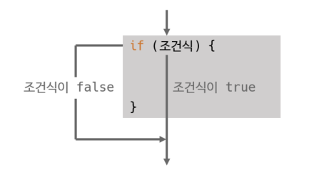
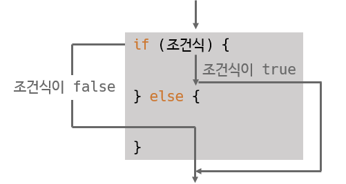
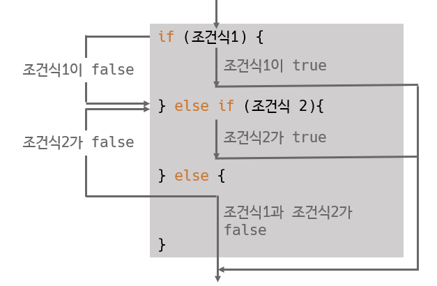
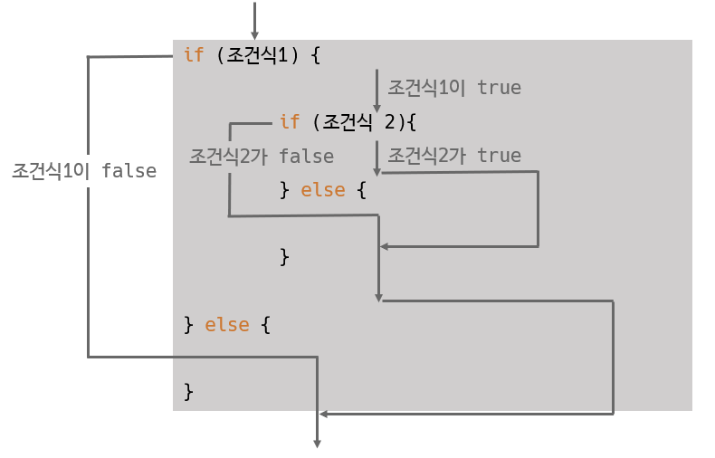
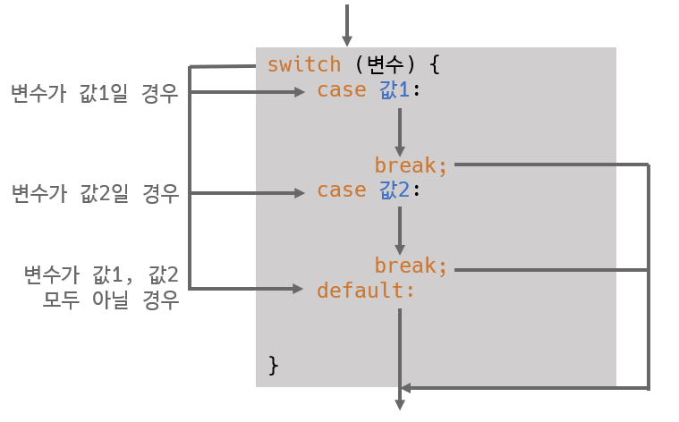

# 제어문

## 조건문

**목차**

1. [if 문](#if-문)
2. [Switch 문](#switch-문)

---

**코드 실행 흐름 제어**

* 자바 프로그램은 main() 메소드의 시작 중괄호 `{` 에서 끝 중괄호 `}` 까지 위에서부터 아래로 실행하는 흐름을 가지고 있다

  &rarr; 이 실행 흐름을 개발자가 원하는 방향으로 바꿀 수 있도록 해주는 것이 제어문

  &rarr; 제어문은 조건식과 중괄호 `{}` 블록으로 구성

| 조건문           | 반복문                        |
| ---------------- | ----------------------------- |
| if 문, switch 문 | for 문, while 문, do-while 문 |

---

### if 문

**조건식의 결과에 따라 블록 실행 여부 결정**



* 중괄호 `{}` 블록 내에 실행문이 하나밖에 없다면 중괄호를 생략 가능
  * 그래도 중괄호 작성하는 것이 가독성과 버그 발생 원인 제거에 좋다



* 조건문이 여러 개인 if 문도 존재
  * else if 는 상위 조건식이 false 일 경우 평가, else if 가 true 면 해당 블록 실행
  * else if 수 제한 없음



* 중첩된 if 문



---

### Switch 문

**변수의 값에 따라서 실행문이 결정되는 문**



* default 는 생략 가능
* break 는 다음 case 를 실행하지 않고 switch 문을 빠져나가기 위해 필요
  * break 가 없으면 다음 case 가 연달아 실행 (case 값과 상관 없다)
* switch 문 괄호에는 정수 타입, 문자열 타입 사용 가능

**Java 12 이후부터는 switch 문에서 표현식 (Expressions) 사용 가능**

```java
package ch04.sec03;

public class SwitchExpressionExample {
    public static void main(String[] args) {
        char grade = 'B'
            
            switch(grade) {
                    case 'A', 'a' -> {
                        System.out.println("우수 회원입니다.");
                    }
                    case 'B', 'b' -> {
                        System.out.println("일반 회원입니다.");
                    }
                    default -> {
                        System.out.println("손님입니다.");
                    }
            }
    }
}
```

* **Switch Expression** 

  * 스위치된 값을 바로 변수에 대입할 수도 있다

    * 단일 값의 경우, 화살표 오른쪽에 값을 기술하고 중괄호 사용의 경우 yield 키워드로 지정

    * yield 의 경우, default 가 반드시 존재해야 한다

      ```java
      타입 변수 = switch (grade) {
              case "값1" -> 변수값;
              case "값2" -> {
                  ...;
                  yield 변수값;
              }
              default -> 변수값;
      };
      ```

      