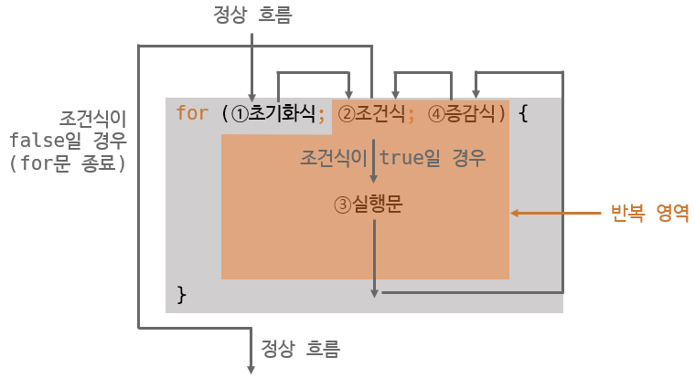
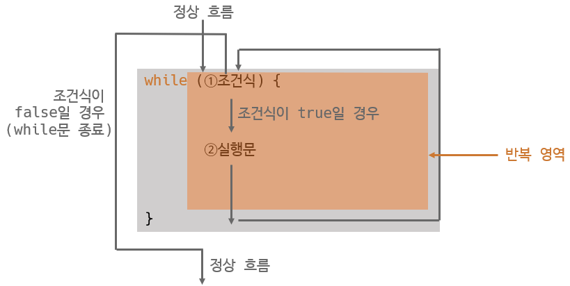
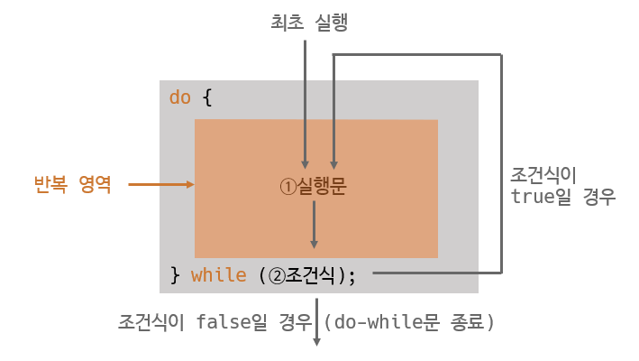

#  제어문

## 반복문

**목차**

1. [for 문](#for-문)
2. [while 문](#while-문)
3. [do-while 문](#do-while-문)
4. [break 문](#break-문)

---

### for 문



```java
// 1 부터 10 까지 출력하는 코드

package ch04.sec04;

public class PrintFrom1To10Example {
    public static void main(String[] args) {
        for (int i = 1; i <= 10; i++) {
            System.out.print(i + " ");
        }
    }
}
```

**초기화식**

* 조건식과 실행문, 증감식에서 사용할 변수를 초기화하는 역할

* 초기화 식이 둘 이상 있을 수 있고, 증감식도 둘 이상 있을 수 있다

  * 쉼표로 구분해서 작성

  ```java
  for (int i = 0, j = 100; i <= 50 && j >= 50; i++, j--;) { ... }
  ```

  * 초기화식에서 선언된 변수는 for 문 블록 내 로컬 변수
    * for 문 밖에서도 사용 시에는 for 문 이전에 선언할 것

**초기화식에서 부동 소수점을 쓰는 float 타입 사용하지 말것**

---

### While 문

**조건식이 true 일 경우 계속해서 반복 후 false 가 되면 반복을 멈추고 while 문 종료**



```java
// 1 부터 10 까지 출력하는 코드

package ch04.sec05;

public class PrintFrom1To10Example {
    public static void main(String[] args) {
        int i = 1;
        while (i <= 10) {
            System.out.print(i + " ")
                i++;
        }
    }
}
```

---

### do-while 문

**블록 내부를 먼저 실행시키고 실행 결과에 따라서 반복 실행을 계속할지 결정**



* while() 뒤에 반드시 세미 콜론 `;` 붙여야 한다

```java
// 키보드로 입력받은 내용을 조사해 반복할 것인지 판단하는 코드

package ch04.sec06;

import java.util.Scanner; // Scanner 사용하기 위해 필요

public class DoWhileExample {
    public static void main(String[] args) {
        System.out.println("메시지를 입력하세요.");
        System.out.println("프로그램을 종료하려면 q를 입력하세요.");
        
        Scanner scanner = new Scanner(System.in); // Scanner 생성
        String inputString;
        
        do {
            System.out.prnit(">");
            inputString = scanner.nextLine(); // 키보드로부터 읽기
            System.out.pringln(inputString);
        } while ( ! inputString.equals("q")); // 입력된 내용이 q 가 아니라면 계속 반복
        
        System.out.println();
        System.out.println("프로그램 종료");
    }
}
```

---

### break 문

**반복문 (for 문, while 문, do-while 문) 을 실행 중지하거나 조건문인 switch 문을 종료할 때 사용**

* 반복문이 중첩돼있는 경우, break 문은 가장 가까운 반복문만 종료
  * 바깥쪽까지 종료시키려면 바깥쪽 반복문에 이름 (레이블) 을 붙이고 `break 이름;` 사용하면 된다

```java
Label: for (...) {
	for (...) {
		break Label;
	}
}
```

---

### Continue 문

**반복문 (for 문, while 문, do-while 문) 에서만 사용된다**

* 블록 내부에서 continue 문이 실행되면 for 문의 증감식 또는 whild, do-while 문의 조건식으로 이동
* 반복문을 종료하지 않고 계속 반복을 수행