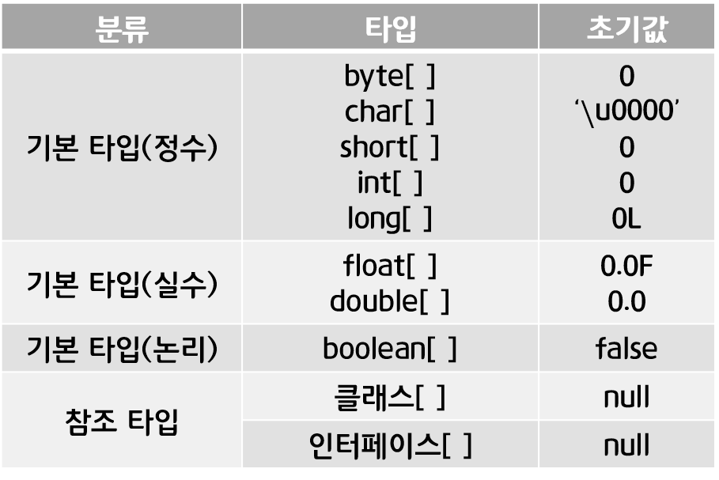
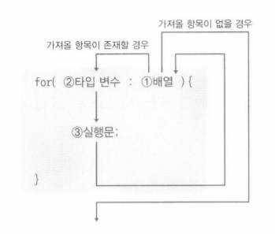

## 참조 타입 종류

**목차**

1. [문자열 (String) 타입](#문자열-(String)-타입)
2. [배열 (Array) 타입](#배열-(Array)-타입)
3. [다차원 배열](#다차원-배열)
4. [배열 복사](#배열-복사)
5. [main() 메소드의 String[] 매개변수 용도](#main()-메소드의-String[]-매개변수-용도)
6. [열거 (Enum) 타입](#열거-(Enum)-타입)

---

### 문자열 (String) 타입

**문자열 리터럴이 동일하다면 String 객체를 공유하도록 설계**

```java
String name1 = "홍길동";
String name2 = "홍길동"; // 동일한 String 객체의 번지가 저장된다
```

* String 변수에 문자열 리터럴을 대입하는 것이 일반적

  * new 연산자 (객체 생성 연산자) 로 직접 String 객체를 생성하고 대입할 수 있다

  ```java
  String name1 = new String("홍길동");
  String name2 = new String("홍길동"); // 이 경우 name1 과 name2 변수는 서로 다른 String 객체 번지를 갖게 된다
  ```

* 동일한 String 객체든 다른 String 객체든 상관없이 내부 문자열만 비교할 경우

  * equals() 메소드 이용

  ```java
  boolean result = str1.equals(str2) // 원본 문자열.equals(비교문자열), 대소문자 구분
  ```

* String 변수에 빈 문자열 ("") 을 대입할 수 있다

  * 빈 문자열도 String 객체로 생성
  * 변수가 빈 문자열을 참조하는지 조사하려면 equals() 메소드 이용해야 한다


**문자 추출**

* 문자열에서 특정 위치의 문자를 얻고 싶다면 charAt() 메소드 이용 가능
  * 매개값으로 주어진 인덱스의 문자를 리턴
  * 공백 포함

**문자열 길이**

* 문자의 개수를 얻고 싶다면 length() 메소드 이용
  * 공백 포함

**문자열 대체**

* 특정 문자열을 다른 문자열로 대체할 때 replace() 메소드 이용

* 기존 문자열은 극대로 두고 대체한 새로운 문자열을 리턴

  * String 객체의 문자열은 변경이 불가한 특성

  ```java
  String oldStr = "자바 프로그래밍";
  String newStr = oldStr.replace("자바", "JAVA")
  ```

  

**문자열 잘라내기**

* 특정 위치의 문자열을 잘라내어 가져오고 싶을 때 substring() 메소드 사용

  | 메소드                                  | 설명                                     |
  | --------------------------------------- | ---------------------------------------- |
  | substring(int beginIndex)               | beginIndex 에서 끝까지 잘라내기          |
  | substring(int beginIndex, int endIndex) | beginIndex 에서 endIndex 앞까지 잘라내기 |

  ```java
  // 예시
  String ssn = "880815-1234567";
  String firstNum = ssn.substring(0, 6); // 880815
  String secondNum = ssn.substring(7) // 1234567
  ```

**문자열 찾기**

* 특정 문자열의 위치를 찾고자 할 때에는 indexOf() 메소드 사용

  * 주어진 문자열이 시작되는 인덱스를 리턴

    ```java
    String subject = "자바 프로그래밍";
    int index = subject.indexOf("프로그래밍") // 프로그래밍 시작 인덱스인 3을 저장
    ```

    

  * 주어진 문자열이 포함돼 있지 않으면 - 1 을 리턴

* 주어진 문자열이 단순히 포함돼있는지 확인하고 싶을 땐 contains() 메소드 사용

  * 포함돼 있으면 true, 아니면 false 리턴

**문자열 분리**

* 구분자를 사용해서 여러 개의 문자열로 구성돼 있을 경우 split() 메소드 사용

  ```java
  String board = "번호,제목,내용,글쓴이";
  String[] arr = board.split(",");
  ```

  | arr[0] | arr[1] | arr[2] | arr[3]   |
  | ------ | ------ | ------ | -------- |
  | "번호" | "제목" | "내용" | "글쓴이" |

---

### 배열 (Array) 타입

**연속된 공간에 값을 나열시키고 각 값에 인덱스를 부여한 자료구조**

* 배열은 같은 타입의 값만 관리한다
* 배열의 길이는 늘리거나 줄일 수 없다
  * 생성과 동시에 길이가 결정된다


**배열 변수 선언**

* 관례적으로 방법 1을 주로 사용

  | 방법 1      | 방법 2      |
  | ----------- | ----------- |
  | 타입[] 변수 | 타입 변수[] |

  * 타입은 배열에 저장될 값의 타입을 말하는 것

* 배열 변수는 참조 변수

  * 배열도 객체이므로 힙 영역에 생성, 배열 변수는 힙 영역의 배열 주소를 저장
  * 참조할 배열이 없다면 배열 변수도 null 로 초기화 가능
    * 변수[인덱스]로 값을 읽거나 저장 시 NullPointerException 발생

**값 목록으로 배열 생성**

`타입[] 변수 = { 값 0, 값 1, 값 2, 값 3 ... };`

* 중괄호 `{}` 는 나열된 값들을 항목으로 가지는 배열을 힙에 생성하고 번지를 리턴

  * 배열 변수는 리턴 된 번지를 저장함으로써 참조가 이뤄진다

* **주의점**

  * 배열 변수를 미리 선언한 후에는 값 목록을 변수에 대입할 수 없다

    ```markdown
    타입[] 변수;
    변수 = { 값 0, 값 1, 값 2, 값 3, ... } // 컴파일 에러
    ```

    

  * 배열 변수를 선언한 시점과 값 목록이 대입되는 시점이 다르다면 new 타입[] 을 중괄호 앞에 붙여주기

    * 타입은 배열 변수를 선언할 때 사용한 타입과 동일하게 주기

    ```markdown
    변수 = new 타입[] { 값 0, 값 1, 값 2, 값 3 ...}
    ```

  * 메소드의 매개변수가 배열 타입일 경우에도 마찬가지

    ```java
    // 메소드 선언
    void printItem(int[] scores) { ... }
    
    // 잘못된 메소드 호출
    printItem( { 95, 85, 90 }); // 컴파일 에러
    ```

    * 매개변수가 이미 선언돼 있고, 호출 시 값 목록을 제공하므로 다음과 같이 호출

      ```java
      printItem( new int[] { 95, 85, 90 });
      ```

**new 연산자로 배열 생성**

* 값 목록은 없지만 향후 값들을 저장할 목적으로 배열을 미리 생성할 수 있다

  * 다음 코드는 배열 객체를 생성시킨다

  ```
  타입[] 변수 = new 타입[길이];
  ```

  * 해당 길이의 배열을 생성하고 배열의 번지를 리턴하기 때문에 배열 변수에 대입할 수 있다

  * 이미 배열 변수가 선언된 후에도 다음과 같이 대입이 가능하다

    ```
    타입[] 변수 = null;
    변수 = new 타입[길이];
    ```

* new 연산자로 배열을 처음 생성하면 배열 항목은 기본값으로 초기화

  

**배열 길이**

* 배열에 저장할 수 있는 항목 수로, 도트 `.` 연산자를 사용해 참조하는 배열의 length 필드를 읽으면 된다

  ```
  배열변수.length
  ```

  * 읽기만 가능하므로 값을 변경할 수는 없다

---

### 다차원 배열

**배열 내에 또 다른 배열이 대입되는 것**

```
변수[1차원 인덱스][2차원 인덱스]...[N차원 인덱스]
```

**값 목록으로 다차원 배열 생성**

* 배열 변수 선언 시 타입 뒤에 대괄호 `[]` 를 차원의 수만큼 붙이고, 값 목록도 마찬가지로 차원의 수만큼 중괄호를 중첩시킨다

  * 2 차원 배열의 경우

    ```
    타입[][] 변수 = {
    	{ 값 1, 값 2, ...},
    	{ 값 3, 값 4, ...},
    	...
    };
    ```

**new 연산자로 다차원 배열 생성**

* 배열 변수 선언 시 타입 뒤에 대괄호 `[]` 를 차원의 수만큼 붙이고, new 타입 뒤에도 마찬가지로 차원의 수만큼 대괄호를 중첩시킨다

  ```
  타입[][] 변수 = new 타입[1차원수][2차원수]
  ```

  * 예시

    * 2차원 배열의 길이가 다를 경우

      ```java
      int[][] scores = new int[2][];
      scores[0] = new int[3]; // 첫번째 2차원 배열의 길이가 3
      scores[1] = new int[2]; // 두번째 2차원 배열의 길이가 2
      ```

---

### 배열 복사

**배열은 한 번 생성하면 길이를 변경할 수 없기에 더 많은 저장 공간이 필요하다면 더 큰 길이의 배열을 새로 만들고 이전 배열로부터 항목들을 복사해야 한다**

* 가장 기본적인 복사 방법

  * for 문을 이용해 항목을 하나씩 읽고 새로운 배열에 저장

    ```java
    package ch05.sec09;
    
    public class ArrayCopyByForExample {
        public static void main(String[] args) {
            int[] oldIntArray = { 1, 2, 3 };
            int[] newIntArray = new int[5];
            
            // 배열 항목 복사
            for(int i=0; i<oldIntArray.length; i++) {
                newIntArray[i] = oldIntArray[i];
            }
            // 배열 항목 출력
            for(int i=0; i<newIntArray.length; i++) {
                System.out.print(newIntArray[i] + ", ");
            }
        }
    }
    ```

    ```
    출력값
    1, 2, 3, 0, 0
    ```

    

* 복사의 간단한 방법

  * System 의 arraycopy()  메소드 이용

    ```
    System.arraycopy(원본 배열, 원본 배열 시작 인덱스, 새 배열, 새 배열 붙여넣기 시작 인덱스, 복사 항목 수)
    ```

    * 원본 배열이 arr1 이고 새 배열이 arr2 인 경우, 모든 항목을 복사하려면 다음과 같이 작성

      ```java
      System.arraycopy(arr1, 0, arr2, 0, arr1.length)
      ```

* **배열 항목 반복을 위한 향상된 for 문**

  

  ```java
  package ch05.sec10;
  
  public class AdvancedForExample {
      public static void main(String[] args) {
          int[] scores = { 95, 71, 84, 93, 87 }; // 배열 변수 선언과 배열 생성
          
          int sum = 0; // 배열 전체 합 구하기
          for (int score : scores) {
              sum = sum + score;
          }
          System.out.println("점수 총합 = " + sum) // 총합 구하기
      }
  }
  ```

  ```
  출력값
  점수 총합 = 430
  ```

---

### main() 메소드의 String[] 매개변수 용도

**왜 main() 메소드에 String[] args 매개변수가 필요한지**

* 예시

  * 두 수를 입력받고 덧셈을 수행하는 Sum 프로그램

    * 다음과 같이 두 수를 요구

      ```java
      java Sum 10 20
      ```

      * 공백으로 구분된 10 과 20 은 문자열로 취급되며 String[] 배열의 항목 값으로 구성
      * main() 메소드 호출 시 매개값으로 전달된다

    * main() 메소드 중괄호 `{}` 내에서 문자열 "10" 과 "20" 은 다음과 같이 얻을 수 있다 

      ```java
      String x = args[0];
      String y = args[1];
      ```

    * 문자열 "10" 과 "20" 을 int 로 강제 타입 변환하려면 다음과 같이 한다

      ```java
      int x = Integer.parseInt(args[0]);
      int y = Integer.parseInt(args[1]);
      ```

---

### 열거 (Enum) 타입

**한정된 값을 갖는 타입**

* 열거 타입 이름으로 소스 파일(.java) 을 생성하고 한정된 값을 코드로 정의

  * 열거 타입 이름은 첫 문자를 대문자로 하고 다음과 같이 camel case 로 지어주기

    ```
    Week.java
    MemberGrade.java
    ProductKind.java
    ```

  * 예시

    * ch05.sec12 패키지 생성

    *  [New] - [Enum] 생성

      ```java
      package ch05.sec12;
      
      public enum Week {
          MONDAY,
          TUESDAY,
          WEDNESDAY,
          THURSDAY,
          FRIDAY,
          SATURDAY,
          SUNDAY
      }
      ```

*  열거 상수는 열거 타입으로 사용할 수 있는 한정된 값

  * 알파벳으로 정의하고 모두 대문자
  * 여러 단어일 경우 언더바 `_` 로 연결

* 열거 타입도 하나의 데이터 타입이므로 변수를 선언하고 사용

  ```java
  Week today;
  Week reservationDay;
  
  Week today = Week.SUNDAY; // 값 대입 방법
  ```

   

