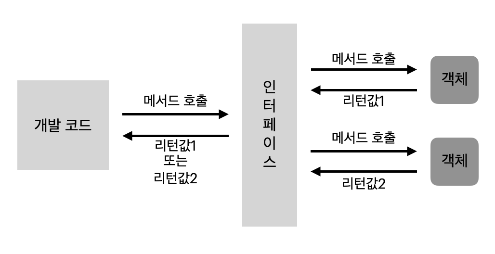

**목차**

1. [인터페이스 역할](#인터페이스-역할)
2. [인터페이스와 구현 클래스 선언](#인터페이스와-구현-클래스-선언)
3. [상수 필드](#상수-필드)
4. [메소드](#메소드)
   1. [추상 메소드](#추상-메소드)
   2. [디폴트 메소드](#디폴트-메소드)
   3. [정적 메소드](#정적-메소드)
   4. [private 메소드](#private-메소드)
5. [다중 인터페이스 구현과 상속](#다중-인터페이스-구현과-상속)
6. [타입 변환과 객체 타입 확인](#타입-변환과-객체-타입-확인)
7. [다형성](#다형성)
8. [봉인된 인터페이스](#봉인된-인터페이스)

---

## 인터페이스 역할

**인터페이스는 사전적 의미로 두 장치를 연결하는 접속기를 의미**

&rarr; 두 장치를 서로 다른 객체로 본다면, 인터페이스는 두 객체를 연결하는 역할



* 인터페이스는 주로 다형성 구현에 사용

---

## 인터페이스와 구현 클래스 선언

* 인터페이스는 `~.java` 형태의 소스 파일로 작성되고 `~.class` 형태로 컴파일
  * 물리적 형태는 클래스와 동일하나 소스 작성 시 선언 방법과 구성 멤버가 클래스와 다르다


**인터페이스 선언**

* class 키워드 대신 interface 키워드 사용

* 접근 제한자로는 같은 패키지 내에서만 사용 가능한 default 와 패키지와 상관없이 사용하는 public 가능

  ```java
  interface 인터페이스명 {
      // public 상수 필드
      // public 추상, 디폴트, 정적 메소드
      // public 메소드
      // private 메소드 
      // private 정적 메소드 등 중괄호 내부에 인터페이스가 가지는 멤버들 선언 가능
  }
  public interface 인터페이스명 { ... }
  ```


**구현 클래스 선언**

|            | &rarr;  메소드 호출 |                | &rarr;  메소드 호출 |            |
| ---------- | ------------------- | -------------- | ------------------- | ---------- |
| **객체 A** |                     | **인터페이스** |                     | **객체 B** |
|            | **리턴값  &larr;**  |                | **리턴값  &larr;**  |            |

* 객체 A 가 인터페이스의 추상 메소드를 호출하면 인터페이스는 객체 B 의 메소드를 실행

  * 객체 B 는 인터페이스에 선언된 추상 메소드와 동일한 선언부를 가진 (재정의된) 메소드를 가지고 있어야 한다

  * 객체 B 를 인터페이스를 구현 (implement) 한 객체라고 한다

    ```java
    public class B implements 인터페이스명 { ... }
    ```

```java
// 인터페이스 생성하며 추상 메소드 작성 (선언부만 있고 실행부인 중괄호가 없는 메소드)

public interface RemoteControl {
    // public 추상 메소드
    public void turnOn();
}
```

```java
// 객체 Television 에서 RemoteControl 의 추상 메소드인 turnOn() 재정의

public class Television implements RemoteControl {
    @Override
    public void turnOn() {
        System.out.println("TV 를 켭니다.");
    }
}
```


**변수 선언과 구현 객체 대입**

* 인터페이스도 하나의 타입이므로 변수의 타입으로 사용 가능

  * 참조 타입에 속하므로 객체를 참조하지 않다는 뜻으로 null 대입 가능

    ```java
    RemoteControl = rc;
    RemoteControl rc = null;
    ```

* 인터페이스를 통해 구현 객체를 사용하려면 인터페이스 변수에 구현 객체를 대입해야 한다 (구현 객체의 번지 대입)

  ```java
  rc = new Television();
  ```

  *  변수 선언과 동시에 구현 객체 대입 가능

    ```java
    RemoteControl rc = new Television();
    ```

  * 만약 Television 이 implements RemoteControl 로 선언되지 않았다면 RemoteControl 타입의 변수 rc 에 대입 불가능

  * 구현 객체가 대입되면 변수를 통해 인터페이스의 추상 메소드를 호출 가능

    ```java
    rc.turnOn();
    ```

---

## 상수 필드

**인터페이스는 public static final 특성을 갖는 불변의 상수 필드를 멤버로 가질 수 있다**

* 인터페이스에서 선언된 필드는 무조건 public static final 특성, 생략하더라도 컴파일 과정에서 자동 생성
* 상수명은 대문자로 작성, 다른 단어로 구성돼있을 경우 언더바 `_` 로 연결

```java
public interface RemoteControl {
    int MAX_VOLUME = 10;
    int MIN_VOLUME = 0;
}
```

* 상수는 구현 객체와 관련 없는 인터페이스 소속 멤버

  * 따라서 인터페이스로 바로 접근해서 상수값 읽기 가능

    ```java
    public class RemoteControlExample {
        public static void main(String[] args) {
            // 인터페이스로 바로 접근
            System.out.println(RemoteControl.MAX_VOLUME);
            System.out.println(RemoteControl.MIN_VOLUME);
        }
    }
    ```

---

## 메소드

### 추상 메소드

**인터페이스는 구현 클래스가 재정의 해야 하는 public 추상 메소드를 멤버로 가질 수 있다**

* 추상 메소드는 리턴 타입, 메소드명, 매개변수만 기술되고 중괄호 `{}` 를 붙이지 않는 메소드

  * public abstract 생략해도 컴파일 과정에서 자동 생성

  ```java
  public interface RemoteControl {
      // 상수 필드
      int MAX_VOLUME = 10;
      int MIN_VOLUME = 0;
      
      // 추상 메소드
      void turnOn();
      void turnOff();
      void setVolume(int volume);
  }
  ```

  * RemoteControl 인터페이스를 통해 구현 객체인 Television 과 Audio 를 사용한다고 가정해보자

    ```java
    // Television.java
    
    public class Television implements RemoteControl {
        // 필드
        private int volume;
        
        // turnOn() 추상 메소드 오버라이딩
        @Override
        public void turnOn() {
            System.out.println("TV 를 켭니다");
        }
        
        // turnOff() 추상 메소드 오버라이딩
        @Override
        public void turnOff() {
            System.out.pringln("TV 를 끕니다");
        }
        
        // setVolume() 추상 메소드 오버라이딩
        public void setVolume(int volume) {
            if(volume > RemoteControl.MAX_VOLUME) {
                this.volume = RemoteControl.MAX_VOLUME;
            } else if(volume < RemoteControl.MIN_VOLUME) {
                this.volume = RemoteControl.MIN_VOLUME;
            } else {
                this.volume = volume;
            }
            System.out.println("현재 Audio 볼륩" + volume);
        }
    }
    ```

    * 구현 클래스에서 추상 메소드 재정의 시
      * 인터페이스 추상 메소드는 기본적으로 public 접근 제한, public 보다 더 낮은 접근 제한으로 재정의 불가능
      * 재정의 되는 메소드는 전부 public 이 추가돼 있다

* 인터페이스 변수 선언 후 구현 객체 대입 시

  * 구현 객체에 따라 실행 내용 달라진다

    ```java
    public class RemoteControlExample {
        public static void main(String[] args) {
            // 인터페이스 변수 선언
            RemoteControl = rc;
            
            // Television 객체 생성 후 인터페이스 변수에 대입
            rc = new Television();
            // 인터페이스로 Television 객체 사용 
            rc.turnOn();
            ...
                
            // Audio 객체 생성 후 인터페이스 변수에 대입
            rc = new Audio();
            rc.turnOn();
            ...
        }
    }
    ```


### 디폴트 메소드

**완전한 실행 코드를 가지는 메소드로, 실행부가 존재하며 default 키워드가 리턴 타입 앞에 붙는다**

```java
// 디폴트 인스턴스 메소드

public interface RemoteControl {
    int MAX_VOLUME = 10;
    int MIN_VOLUME = 0;
    
    void turnOn();
    void turnOff();
    void setVolume(int volume);
    
    default void setMute(boolean mute) {
        if(mute) {
            System.out.println("무음 처리합니다");
            // 추상 메소드 호출하면서 상수 필드 사용
            setVolume(MIN_VOLUME);
        } else {
            System.out.println("무음 해제합니다");
        }
    }
}
```

* 디폴트 메소드는 구현 객체가 필요한 메소드

  ```java
  ...
  rc = new Television();
  
  // 디폴트 메소드 호출
  rc.setMute(true);
  rc.setMute(false);
  ```

* 구현 클래스는 디폴트 메소드를 재정의 할 수 있다

  * public 접근 제한자를 반드시 붙여야 하고 default 를 생략해야 한다

    ```java
    ...
    // 추가 필드 선언
    private int memoryVolume;
    
    // 디폴트 메소드 재정의
    @Override
    public void setMute(boolean mute) { ... }
    ...
    ```


### 정적 메소드

**구현 객체 없이 인터페이스만으로 호출 가능하며 선언 방법은 클래스 정적 메소드와 동일**

* public 생략하더라도 자동으로 컴파일 과정에서 생성

```java
...
static void changeBattery() {
    System.out.println("리모콘 건전지를 교환합니다");
}
```

* 구현 객체 없이 인터페이스명으로 접근해서 호출 가능
  * `RemoteControl.changeBattery()` 로 호출 가능


### private 메소드

**인터페이스에 외부에서 접근할 수 없는 private 메소드 선언도 가능**

| 구분                | 설명                                                         |
| ------------------- | ------------------------------------------------------------ |
| private 메소드      | 구현 객체가 필요한 메소드로 디폴트 메소드 안에서만 호출 가능 |
| private 정적 메소드 | 구현 객체가 필요 없는 메소드로 디폴트, 정적 메소드 안에서 호출 가능 |

---

## 다중 인터페이스 구현과 상속

### 구현

**구현 객체는 여러 개의 인터페이스를 implements 할 수 있다**

```java
public class 구현클래스명 implements 인터페이스 A, 인터페이스 B {
    // 모든 추상 메소드 재정의
}
```

```
인터페이스 A 변수 = new 구현클래스명( ... );
인터페이스 B 변수 = new 구현클래스명( ... );
```


### 상속

**클래스와 달리 인터페이스는 다중 상속을 허용**

```java
public interface 자식인터페이스 extends 부모 인터페이스 1, 부모 인터페이스 2 { ... }
```

* 자식 인터페이스의 구현 클래스는 자식 인터페이스의 메소드 뿐만 아니라 부모 인터페이스의 모든 추상 메소드 재정의 필수

  ```
  자식 인터페이스 변수 = new 구현클래스( ... );
  부모 인터페이스 1 변수 = new 구현클래스( ... );
  부모 인터페이스 2 변수 = new 구현클래스( ... );
  ```

* 구현 객체가 자식 인터페이스 변수에 대입 됐을 때
  * 자식 및 부모 인터페이스 추상 메소드 모두 호출 가능
* 구현 객체가 부모 인터페이스 변수에 대입 됐을 때
  * 부모 인터페이스에 선언된 추상 메소드만 호출 가능

---

## 타입 변환과 객체 타입 확인

### 타입 변환

**인터페이스의 타입 변환은 인터페이스와 구현 클래스 간 발생**

&rarr; 인터페이스 변수에 구현 객체를 대입하면 구현 객체는 인터페이스 타입으로 자동 타입 변환

* 자동 변환 시, 구현 객체는 인터페이스에 선언된 메소드만 사용 가능

&rarr; 반대로 인터페이스 타입을 구현 클래스 타입으로 변환 시에는 강제 타입 변환 필요

* 캐스팅 기호를 사용해 강제 타입 변환

  ```java
  RemoteControl rc = new Television();
  
  // 강제 타입 변환할 시, Television 의 메소드 호출 가능해진다
  Television tv = (Television) rc;
  ```


### 객체 타입 확인

**상속에서는 instanceof 연산자 사용하듯이 인터페이스에서도 사용 가능**

```java
if(vehicle instanceof Bus) {
    // vehicle 에 대입된 객체가 Bus 일 때 실행
}
```

---

## 다형성

**상속보다는 인터페이스를 통해서 다형성 구현하는 경우가 더 많다**

**다형성이란 사용 방법은 동일하지만 다양한 결과가 나오는 성질을 의미한다**

---

## 봉인된 인터페이스

* Java 15 부터

**InterfaceA 의 자식 인터페이스는 InterfaceB 만 가능하고, 그 이외는 자식 인터페이스가 될 수 없도록 봉인된 인터페이스로 선언 가능**

```java
public sealed interface InterfaceA permits InterfaceB { ... }
```

* 봉인된 InterfaceA 를 상속하는 InterfaceB 는 non-sealed 혹은 sealed 키워드로 또 다른 봉인 해제 혹은 봉인 인터페이스로 선언해야 한다
