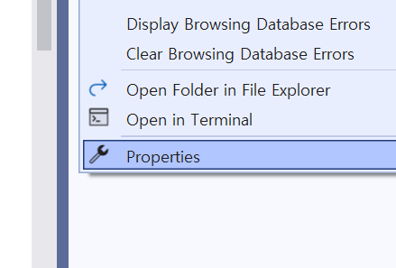
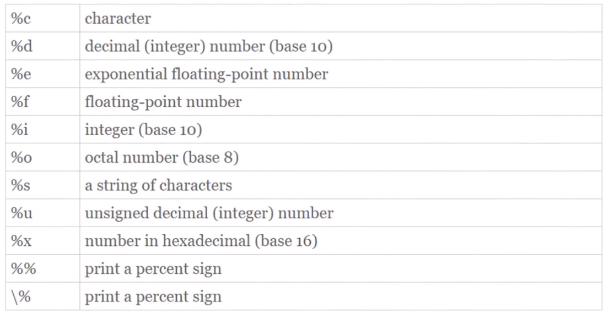
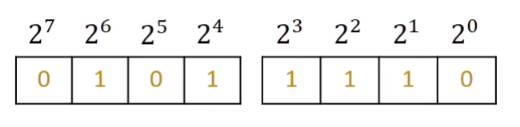
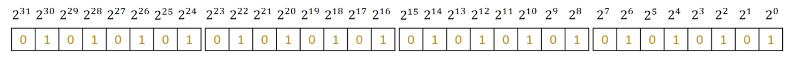
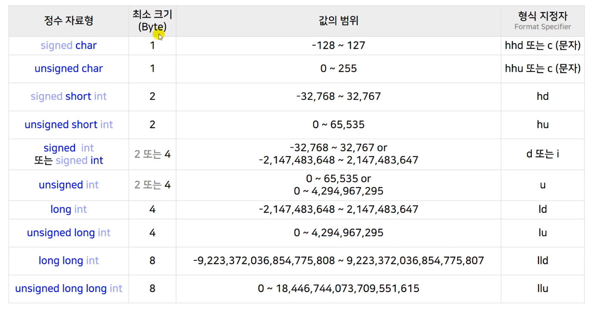
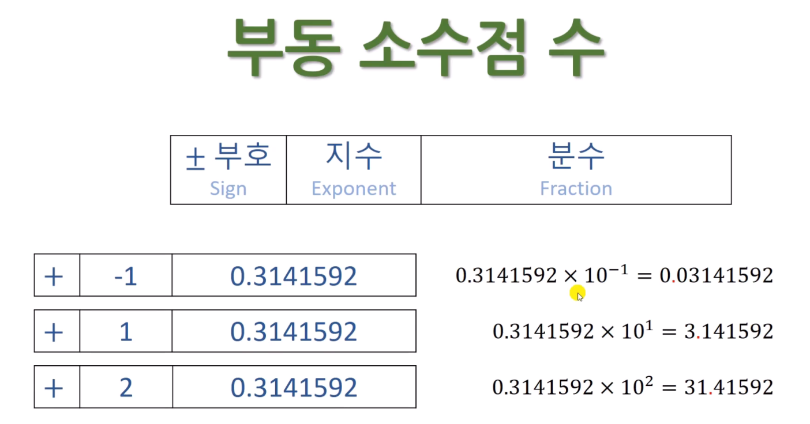
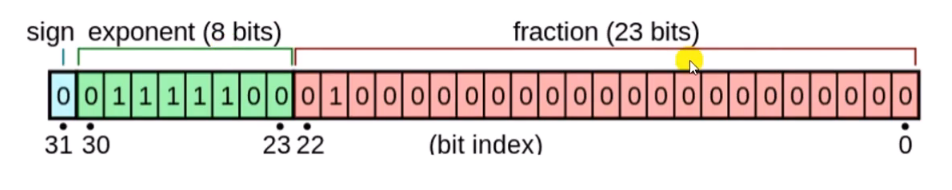
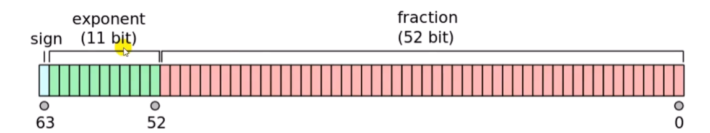
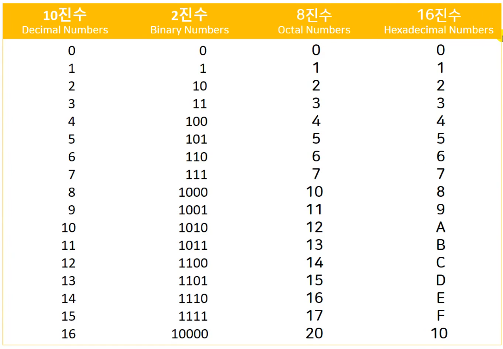

**목차**

1. [변수와 상수](#변수와-상수)
2. [scanf()](#scanf())
3. [정수와 실수](#정수와-실수)
   * [정수](#정수)
   * [정수의 오버플로우](#정수의-오버플로우)
   * [다양한 정수형](#다양한-정수형)
   * [부동 소수점형](#부동-소수점형)
4. [8 진수와 16 진수](#8-진수와-16-진수)

---

## 변수와 상수

```c
// 자료형 변수 = 리터럴 상수
int angel = 1004;
```

**변수** 어떤 수를 저장할 수 있는 메모리 공간

**리터럴 상수** 문자 그대로 써 있는 (리터럴) 의미, 값이 변할 수 없다

```c
// 한정자, 제한자 자료형 기호적 상수 = 리터럴 상수
const int angel = 1004;
```

**기호적 상수** 한정자 (const) 를 써서 지정하면 기호적 상수가 되고, 변수처럼 이름으로 사용 가능

---

## scanf()

**콘솔창으로부터 입력을 받아 출력하는 함수**

```c
#define _CRT_SECURE_NO_WARNINGS
#include <stdio.h>


int main()
{
	int i = 0;

	scanf("%d", &i); // & ampersand

	printf("Value is %d\n", i);

	return 0;
}
// ctrl + f5 를 누르면 콘솔창이 뜨고, 값을 입력하면 scanf 에서 읽어들인 후 printf 에서 출력
```

**`&` 가 붙는 이유**

* scanf() 로 입력을 받겠다는 함수 호출, `&` 를 붙이면 **변수의 주소**를 넘겨준다
* 사용자가 콘솔창에 값을 입력하면 주소에 메모리를 덮어 쓴다
  * 즉, 위 예시에서는 i 변수의 주소를 알게 되고 주소에 접근해 할당된 메모리에 값을 넣는 것


[참고]

* `# define _CRT_SECURE_NO_WARNINGS` 없이 build 하는 법

  

  * 오른쪽 solution explorer 에서 오른쪽 클릭 후 properties 선택

  

  * C/C++ Preprocessor 선택 후 왼편 Preprocessor Definitions 편집

    ```
    # 사이에 ; 넣고 define 된 정의 넣기
    _DEBUG;_CONSOLE;_CRT_SECURE_NO_WARNINGS;%(PreprocessorDefinitions)
    ```

  * 현재 위에 보면 Active(Debug) 모드이기 때문에 추후 release 모드에서 설정 다시 변경해줘야 한다


[실습]

**덧셈 연산으로 합을 출력하는 프로그램**

```c
#include <stdio.h>


int main()
{
	// 변수는 초기화하는 것이 좋다
	int i = 0, j = 0;
	int sum = 0;

	printf("Input two integers\n");

	// scanf()는 여러 개 변수를 입력받을 수 있다
	scanf("%d%d", &i, &j); 

	sum = i + j;

	// printf 에 지정한 숫자의 개수와 변수의 개수가 맞아야 한다
	printf("%d plus %d = %d\n", i, j, sum);

	return 0;
}
```

* 다양한 코딩 스타일이 있으니 적절히 활용해서 코드 작성하면 된다


**환율에 맞춰서 값을 바꾸는 계산기**

```c
#include <stdio.h>


int main()
{
	int won = 0;
	int dollar = 0;

	printf("Input won\n");
	scanf("%d", &won);

	dollar = won * 0.00089;

	printf("Dollar = %d\n", dollar);
	
	// won 에 1000 을 넣으면 달러가 0이 나온다
	// 이는 자료형 때문으로, int 에 float 를 곱해서 생긴 문제
	return 0;
}
```

* 변수의 자료형을 float 로 바꾸고, printf 와 scanf 도 %f 로 바꾸면 정확히 출력 된다



---

## 정수와 실수

### 정수

* 음의 정수, 0, 양의 정수

* 내부적으로 2 진수

* **8 비트 부호 없는 (Unsigned) 정수**

  

* **32 비트 부호 없는 (Unsigned) 정수**

  

* **8 비트, 32 비트 부호 있는 (Signed) 정수**

  * 한 비트를 `+-` 부호 표현에 사용

  * `0` 양수, `1` 음수

  * `2의 보수` 표현법이 일반적

  * 부호 있는 정수와 범위가 다르다


### 정수의 오버플로우

[참고]

```c
#include <stdio.h>

int main()
{
	unsigned int i = 0;
    // unsigned 를 출력할 때는 %u 를 사용해야 한다
    // 각 자료형마다 출력 printf 가 다르다
    // sizeof 로 메모리 크기를 알 수 있다
	printf("%u", sizeof(unsigned int));
}
```

**변수가 가지는 최대 최소 값 범위 사이에서 사용해야 하고, 이를 지키지 않을 시 오버플로우 발생한다**

[실습]

* 2 진수를 사용하려면 `0b` 입력 후 뒷 부분에 2 진수를 입력한다

  * C 표준은 아니지만 많이 사용하기 때문에 컴파일러에서 지원은 해준다

  ```c
  #include <stdio.h>
  // UINT_MAX 를 사용하기 위해 include
  #include <limits.h>
  
  int main()
  {
  	// unsigned int 가 가질 수 있는 가장 큰 값 (32 bit)
  	unsigned int i = 0b11111111111111111111111111111111;
  	// unsigned int 가 가질 수 있는 가장 큰 값을 구하는 두 번째 방법
  	unsigned int u = UINT_MAX;
  
  	printf("최대값1 %u\n최대값2 %u\n", i, u);
  }
  
  // 4294967295 출력 된다
  ```

  * Signed int 로 착각해서 `%d` 로 쓰게 되면 다른 값이 나온다 &rarr; `-1`

    * Unsigned 와 Signed 가 갖는 범위는 다르기 때문에!

      ```c
      signed int u = INT_MAX;
      
      // 출력 시 2147483647 가 결과값으로 나온다
      ```

* 오버플로우 구현

  ```c
  #include <stdio.h>
  // UINT_MAX 를 사용하기 위해 include
  #include <limits.h>
  
  int main()
  {
  	// 오버플로우 나오도록 최대값에 1 더하기
  	signed int u = UINT_MAX + 1;
  	printf("오버플로우 %u\n", u);
  }
  
  // 0 이라고 결과값이 나오고 overflow 가 뜬다
  // 1 을 더해버리면 0000 + 1 해서 10000이 되는데 비트 수는 0000 까지므로 이를 넘어가서 0000, 오히려 최소값이 돼버린다
  // 최소값에서 1 을 빼면 0000 - 1 해서 10000 - 1로 인식해 오히려 1111, 최대값이 돼버린다 
  ```


### 다양한 정수형



* 옅은 파란색은 생략 가능한 선언 문자다
* **최소 크기**이지 성능에 따라 더 커질 수도 있지만 대부분 표준을 따른다
* 형식 지정자를 잘못 지정하면 오버플로우 발생할 수도 있다

**[참고] 고정 너비 정수형**

* 이식성이 높다

  ```c
  // #include <stdint.h> // included in inttypes.h
  #include <inttypes.h>
  #include <stdio.h>
  
  int main()
  {
      int i;
      int32_t i32; // 32 bit integer
      int_least8_t i8; // smallest 8 bit
      int_fast8_t f8; // fastest minimum
      intmax_t imax; // biggest signed integers
      uintmax_t uimax; // biggest unsigned integers
      
      i32 = 1004;
      
      printf("me32 = %d\n", i32);
      printf("me32 = %" "d" "\n", i32);
      printf("me32 = %" PRId32 "\n", i32);
      
      return 0;
  }
  ```

* 기존 시스템에서 조건에 가장 맞는 자료형들의 이름만 바꿔서 쓸 수 있도록 한 것


### 실수

* 내부적으로 `부동 소수점 floating point` 표현법 사용

  ```
  3.14E123 = 3.14 * 10^123
  0.314E - 1 = 0.3314 * 10^-1
  0.314E1 = 0.314 * 10^1
  ```

  * E (지수) 를 기준으로 뒤 수가 10 의 승이 된다


### 부동 소수점 수



* 내부적으로 2 진수


**과학적 표기법**
$$
m * 10^n
$$

* m 은 Significand (가수), n 은 exponent
  * m 이 1 이상 10 이하면 Modified normalized form
  * m 이 0.1 이상 1.0 이하면 True normalized form
  * **1.xxxx * 2 의 승으로 표현되면 Normalized significand**
  * 0.xxxx 는 Normed significand

* **32 비트 Single Precision**

  * 실수에서는 Unsigned 가 없어서 항상 Signed 

    ```c
    float a = 1.234f;
    ```

    

    * fraction 은 Significand 중에서 소수점 아래 부분

* **64 비트 Double Precision**

  ```c
  double pi = 3.141592;
  ```

  

* 한계

  * round-off errors

  ```c
  #include <stdio.h>
  #include <float.h>
  
  int main()
  {
  	float a, b;
  	a = 1.0E20f + 1.0f;
  	b = a - 1.0E20f;
  
  	printf("%f\n", b);
  	// 1.0f 가 나와야하지만 범위가 너무 크게 차이나는 바람에 0.00.. 이 나온다
  	return 0;
  }
  ```

  ```c
  a = a + 0.01f; 
  // 이 수식을 100 번 더해도 0.9999.. 가 나온다 
  // 완벽히 0.01 을 나타낼 수 없기 때문에
  ```

  * overflow, underflow

  ```c
  // overflow, 너무 큰 값을 표현할 수 없다
  int main()
  {
      // float 가 가질 수 있는 가장 큰 숫자에 100을 곱해서 출력
      float max = 3.402823466e+38F;
      max = max * 100.0f;
      
      // inf 가 출력된다
      printf("%f\n", max);
      return 0;
  }
  ```

  ```c
  // underflow, 너무 작은 값을 표현할 수 없다
  int main()
  {
      float f = 1.401298464e-45F;
      f = f / 100.0f;
      
      // 0 이 출력된다
      printf("%e\n", f);
      return 0;
  }
  ```

  * 0 으로 나누면 inf 가 나오며 컴파일러에 에러가 표시된다
  * asin 이 2.0f 값을 가질 때도 `-nan(ind)` 값이 나오며 에러 표시, 수학적으로 없는 값을 넣으면 에러가 나온다

---

## 8 진수와 16 진수



```c
// 8 진수, 앞에 0을 붙인다 (현재 최대값 입력해 둔 것)
// %o, %O
unsigned int oct = 037777777777;
// 16 진수, 0x 를 붙인다 (현재 최대값 입력해 둔 것)
// %x, %X
unsigned int hex = 0xffffffff;

// 출력값은 4294967295 로, unsigned int 가 가질 수 있는 최대값이 나온다
```

