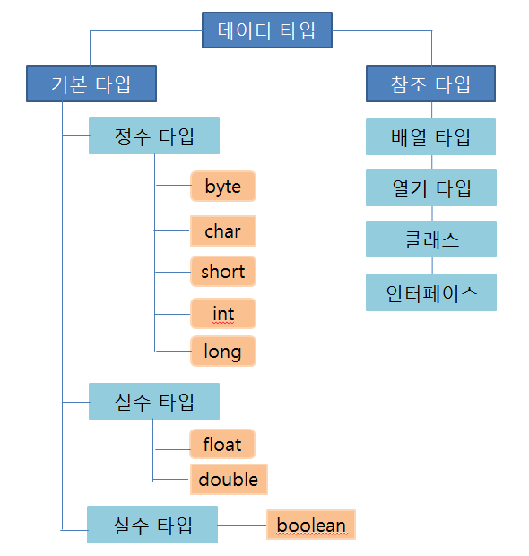
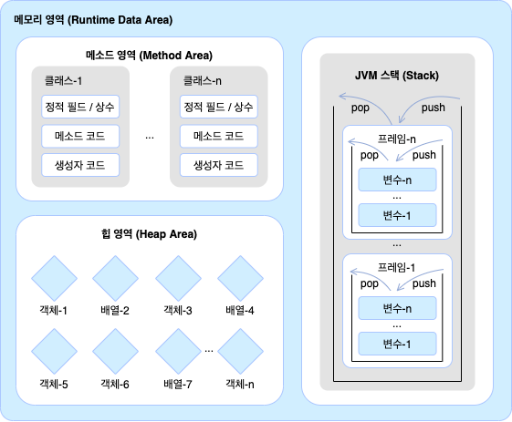

## 참조타입

**목차**

1. [데이터 타입 분류](#데이터-타입-분류)
2. [메모리 사용 영역](#메모리-사용-영역)
3. [참조 타입 변수의 `==` `!=` 연산](#참조-타입-변수의-`==`-`!=`-연산)
4. [null 과 NullPointerException](#null-과-nullpointerexception)

---

**자바의 데이터 타입은 기본 타입 (primitive) 와 참조 타입 (reference) 으로 분류**

### 데이터 타입 분류

**참조 타입 : 객체 (object) 의 번지를 참조하는 타입**

* **객체**
  * 데이터와 메소드로 구성된 덩어리

* 참조 타입은 배열, 열거, 클래스, 인터페이스 등이 있다



* 기본 타입과 참조 타입의 차이점
  * 기본 타입은 값 자체를 저장하지만 참조 타입 선언 변수는 객체가 생성된 메모리 번지를 저장

```java
// 참조 타입 변수
String name = "신용권";
String hobby = "독서"
```

* 변수들은 모두 스택 (stack) 이라는 메모리 영역에 생성
  *  name 과 hobby 는 힙 메모리 영역의 String 객체 번지를 저장하고 이 번지를 통해 String 객체를 참조

---

### 메모리 사용 영역

**JVM 구동 시**



**메소드 영역**

* 바이트 코드 파일을 읽은 내용이 저장되는 영역
* 클래스별로 상수, 정적 필드, 메소드 코드, 생성자 코드 등이 저장 된다

**힙 영역**

* 객체가 생성되는 영역
* 객체의 번지는 메소드 영역과 스택 영역의 상수와 변수에서 참조 가능

**스택 영역**

* 메소드를 호출할 때마다 생성되는 프레임이 저장되는 영역
  * 메소드 호출이 끝나면 프레임은 자동 제거
  * 프레임 내부에는 로컬 변수 스택이 있어서 기본 타입 변수와 참조 타입 변수가 생성되고 제거된다

---

### 참조 타입 변수의 `==` `!=` 연산

**번지를 비교하는 것**

* 번지가 같다면 동일한 객체 참조하는 것이고 다르다면 다른 객체를 참조하는 것

* 예시

  * 배열은 여러 개의 값을 저장하는 객체므로 배열 변수는 참조 타입

  ```java
  package ch05.sec03;
  
  public class ReferenceVariableCompareExample {
      public static void main(String[] args) {
          int[] = arr1;
          int[] = arr2;
          int[] = arr3; // 배열 변수 arr1, arr2, arr3 선언
          
          arr1 = new int[] { 1, 2, 3 }; // 배열 { 1, 2, 3 } 을 생성하고 arr1 변수에 대입
          arr2 = new int[] { 1, 2, 3 };
          arr3 = arr2;
          
          System.out.println(arr1 == arr2);
          System.out.println(arr2 == arr3); // 서로 같은 배열을 참조하는 지 검사
      }
  }
  ```

  ```java
  // 결과값
  false
  true
  ```

---

### null 과 NullPointerException

**참조 타입 변수는 아직 값을 저장하고 있지 않다는 뜻으로 null 값을 가질 수 있다**

* null 도 초기값으로 사용 가능하기 때문에 null 로 초기화된 참조 변수는 스택 영역에 생성된다

* 변수가 null 인 상태에서 객체의 데이터나 메소드를 사용하려 하면 **NullPointerException** 이 발생

  * 자바는 프로그램 실행 도중에 발생하는 오류를 예외라 부른다

  ```java
  // 예시
  int[] intArray = null;
  intArray[0] = 10; // NullPointerException
  ```

* 경우에 따라서 참조 타입 변수에 일부러 null 을 대입

  ```java
  // 예시
  String hobby = "여행";
  hobby = null;
  ```

  * 힙 메모리에 "여행" 은 저장돼있지만 위치 정보를 모르기 때문에 사용할 수 없게 된다
    * 자바는 이러한 객체를 쓰레기로 취급
    * 쓰레기 수집기 (Garbage Collector) 를 실행시켜 자동으로 제거
  * 자바는 코드를 이용해 객체를 직접 제거하는 방법은 제공하지 않는다
    * 객체를 제거하는 유일한 방법은 객체의 모든 참조를 없애는 것

