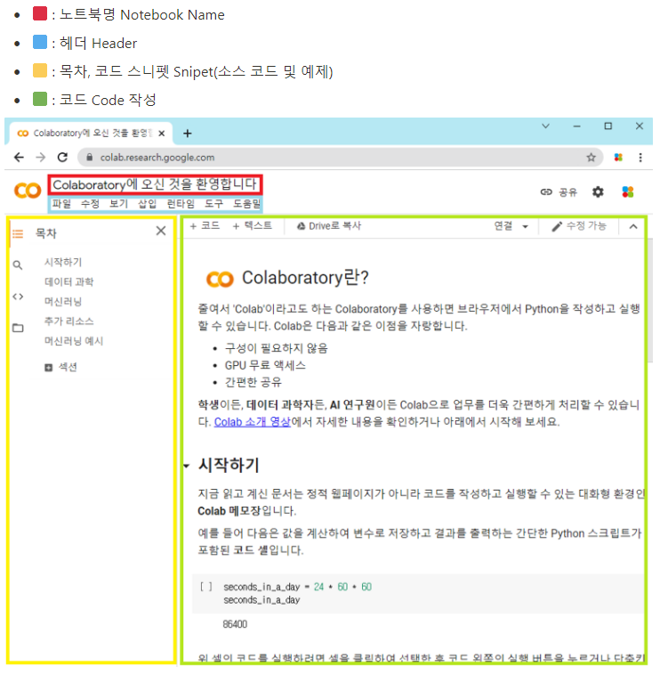
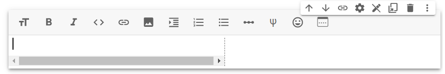

**목차**

1. [Python](#python)
2. [구글 코랩](#구글-코랩)
   * [Github 연동](#github-연동)

## Python

**네덜란드의 귀도 반 로섬이 개발한 인터프리터 Interpreter 프로그래밍 언어**

* 인터프리터 언어는 프로그램이 언어로 작성된 프로그램을 **한 줄 단위로 번역 및 실행** 시키는 언어
* 특징
  * 특정 기능을 모아놓은 개발 도구 모음인 패키지 존재
  * 소스코드 (프로그래밍 언어로 작성된 명령어) 가 공개된 소프트웨어인 오픈 소스

* 설치

  * https://www.python.org/downloads/
  * 버전에 맞게 다운로드 (`Windows - v3.x.x Windows installer (xx-bit)`)

  * 리눅스 운영체제에서는 기본적으로 설치 돼 있다
  * 주의
    * 설치 경로는 기본 값 그대로 두기
    * `PATH` 에 등록하기 체크 박스가 있다면 체크
    * `Disable path length limit` 클릭
  * 설치 확인
    * cmd 창에서 `python --version` 확인

---

## 구글 코랩

**구글 내부에서 사용하던 주피터 노트북 Jupyter Notebook 을 교육과 연구 목적으로 커스터마이징 하여 제공하는 오픈 클라우드 기반 개발 환경**

* 라이브 코드 입력 및 결과 출력을 비롯해 방정식, 시각화 및 텍스트 등을 포함하는 문서를 만들고 다양한 공유 기능 제공하는 **오픈소스 웹 어플리케이션**
  * 파이썬 코드 작성하고 실행한 결과 확인 가능

* 특징
  * **모든 개발 환경 통일**
    * 인터넷 연결 시 어느 컴퓨터, 어느 환경이든지 같은 개발 환경 제공
  * 다양한 라이브러리 제공
    * 머신러닝 / 딥러닝에 필요한 `Pandas` , `TensorFlow` , `Keras` 등의 라이브러리 제공
  * 연산 작업에 필요한 환경 제공
    * 구글의 `GPU` 사용 가능
      * 그래픽 처리 장치로 컴퓨터 시스템에서 그래픽 연산을 빠르게 처리해 결과 값을 모니터에 출력하는 연산 장치

* 구조

  

* 사용

  * **셀 cell**

    * Colab 노트북에서 문자 혹은 소스코드의 결과를 확인할 수 있는 실행 창

    * **코드 셀**

      

      * 소스 코드를 작성 후 실행할 수 있는 셀
      * 셀 실행 방법
        * `Play` 아이콘 클릭
        * `Cmd/Ctrl + Enter` 해당 셀 실행
        * `Shift + Enter` 해당 셀 실행 후 다음 셀로 이동
        * `Alt + Enter` 해당 셀 실행 후 하단에 새로운 셀 생성

    * **텍스트 셀**

      

      * 텍스트를 작성할 수 있는 셀로 일반 텍스트 / 마크다운 문법으로 작성 가능

    * 단축키 Shortcuts

      * `Google Colab 노트북 상단 헤더 - 도구 - 단축키`
      * `Ctrl + M, H`

* ***주의***

  * **일정 시간 (90 분) 동안 행위 미발생 시 정지 또는 총 12 시간 이후 자동으로 세션 종료**


### Github 연동

* 좌측 하단 폴더 아이콘 클릭 : 현재 사용 중인 디렉터리 구조

  * OS 정보 확인

    ```shell
    # OS info
    !cat /etc/issue.net
    
    # CPU info
    !cat /proc/cpuinfo
    
    # Memory info
    
    !cat /proc/meminfo
    
    # GPU info
    !nvidia-smi
    ```

  * Google Colab - Google Drive 연동

    ```shell
    # mount 
    from google.colab import drive
    drive.mount('/content/drive')
    
    # unmount
    drive.flush_and_unmount()
    ```

  * Google Drive - Github 연동

    ```shell
    # pwd(print working directory) : 현재 위치, /content
    pwd
    
    # git clone
    !git clone [깃 주소]
    
    # cd(change directory) : 작업 디렉터리 이동 혹은 변경
    cd /content/drive/MyDrive/
    
    # git clone
    !git clone [깃 주소]
    
    # cd
    cd /content/drive/MyDrive/[깃 이름]
    
    # git pull
    !git pull [깃 주소]
    ```

    