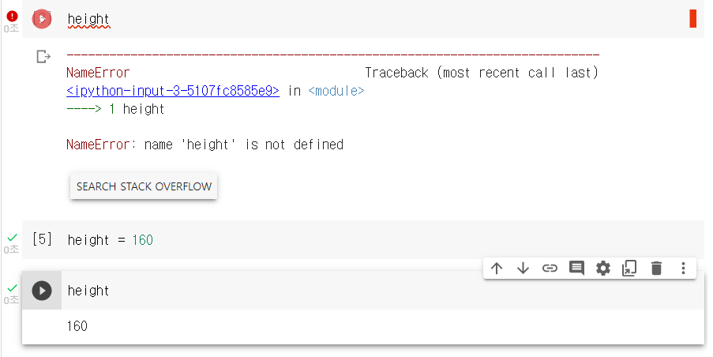

**목차**

1. [변수](#변수)
2. [자료형](#자료형)
3. [연산자](#연산자)
4. [제어 흐름](#제어-흐름)

---

## 변수

**프로그래밍에서 데이터를 담는 그릇**

* 명명 규칙

  * 숫자, 대 / 소 영문자 사용 가능
  * 변수명은 **영소문자로 시작**
  * 단어 간 연결 시 `_` 로 연결
    * `snake_case` 라고 부른다

* 변수 초기화

  ```python
  변수명 = 데이터 (자료)
  ```

  * 초기화 돼있지 않으면 사용 불가능

    

* 결과 출력

  ```python
  print(데이터 or 변수명)
  ```

---

## 자료형

프로그래밍 언어에서 데이터를 식별하는 분류 기준

* **숫자형 Numeric Types**

  * 정수형 int
    * 0, 양의 정수, 음의 정수
  * 실수형 float
    * 소수점으로 나타낼 수 있는 실수

* **Boolean**

  * 참 True
  * 거짓 False

* **문자 시퀀스 형 Text Sequence Type**

  * 문자열 String 
    * 따옴표 내부 숫자, 기호 등의 문자 집합

  * 연산

    * `+` 덧셈 연산 : 연결된 문자열 반환
    * `*` 곱셈 연산 : 횟수만큼 반복된 문자열 반환

  * 활용

    * `len()` 문자열 길이 반환

    * `[idx1 : idx2]` idx1 부터 **idx2 - 1** 까지 인덱스 요소들을 문자열로 반환

      * 인덱스

        | 0       | 1           | 2           | ...  | n       |
        | ------- | ----------- | ----------- | ---- | ------- |
        | **- n** | **- n + 1** | **- n + 2** | ...  | **- 1** |

    * `replace()` 지정 문자열을 새로운 문자열로 치환하는 함수

      ```python
      programming_lang = "I can use python"
      programming_lang.replace("python", "Java")
      # I can use Java
      ```

    * `upper()` `lower()`  대문자, 소문자 변환 함수

      ```python
      programming_lang.upper()
      programming_lang.lower()
      ```

    * `count()` 입력 받은 문자열 반복 횟수를 반환하는 함수

      ```python
      programming_lang.count("입력 받을 문자열")
      ```

    * `split()` 지정 문자 혹은 기호를 기준으로 문자열을 나누는 함수

      * 지정 문자나 기호가 없어도 Error 반환하지 않는다

      ```python
      title = 'Hello Python Programming Basic'
      
      # 기본 split() 은 공백을 기준으로 나뉜다
      title.split()
      # ['Hello', 'Python', 'Programming', 'Basic']
      
      # 잘라주고자 하는 문자나 기호를 넣으면 된다
      title.split("P")
      # ['Hello ', 'ython ', 'rogramming Basic']
      ```

      

  * 출력

    * `%s` 문자열, `%d` 정수, `%f` 실수

      ```python
      # 예시
      lecture = "python programming"
      # 문자열이므로 %s 로 포맷팅
      print("지금은 %s 을 학습하고 있습니다." % lecture)
      ```

      ```python
      # 예시 2
      exchange_rate = 1242.00
      # %.2f 라 적으면 소수점 2자리만 출력
      print("금일 미국 달러 환율은 1달러 = %.2f 원입니다" % exchange_rate)
      ```

    * `format()` 

      * 괄호 내부에 데이터 출력으로 형식 상관 없이 출력 가능

      ```python
      # type 무관하게 데이터 출력 가능
      lecture = "python programming"
      year = 2023
      # 각각 인덱스를 활용해 0, 1 로 출력 가능
      print("{0} 활용하여 데이터 출력합니다." .format(lecture, year))
      # python programming 활용하여 데이터 출력합니다.
      ```

    * **`f-string` 표현 방식**

      * 형식 상관없이 출력 가능

      ```python
      skill = "python"
      print(f"학습하고 있는 프로그래밍 언어는 {skill} 입니다.")
      # 학습하고 있는 프로그래밍 언어는 python 입니다.
      ```

    * 여러 라인을 출력할 경우 `'''` triple_quoted 활용

* **시퀀스 자료형**

  * 리스트 List

    * 일반적으로 동일한 자료형 데이터의 집합 객체로 사용
  
  
    ```python
    리스트 변수명 = [ 데이터 1, 데이터 2, ... ]
    리스트 변수명 = list([데이터 1, 데이터 2, ...])
    ```
  
    * 데이터 나열 순서 존재, 수정 가능
  
    * 활용
  
      * `len()` 리스트 길이 구하기
  
      * `리스트[인덱스 번호]` 인덱스 번호에 따른 값 추출 가능
  
        * `리스트[시작 인덱스 번호 : 끝 인덱스 번호]` 범위 추출 가능
  
      * 요소 직접 수정 및 삭제
  
        ```python
        programming_lang = ['python', 'java', 'javascript']
        
        # 인덱스로 요소 직접 수정
        programming_lang[0] = "python3"
        # ['python3', 'java', 'javascript']
        
        # 요소 삭제
        del programming_lang[2] # javascript 삭제
        # ['python3', 'java']
        
        # 삭제 시 인덱싱 가능
        del programming_lang[0:3] # 전부 삭제
        # []
        ```
  
      * 요소 추가
        * `append(data)` 리스트 맨 뒤에 지정한 요소 추가
        * `insert(idx, data)` 리스트 idx 위치에 지정한 요소 추가
      * 요소 삭제
        * `remove(data)` 리스트 내 지정한 요소와 같은 **첫 번째 내용**을 삭제
          * 지정한 요소가 없는 경우 Error!
        * `pop(idx)` 인덱스 지정 시 리스트 내 지정 인덱스 요소 반환 후 리스트에서 삭제하며, 인덱스 미지정 시 리스트 내 맨 뒤 요소 반환 후 리스트에서 삭제
          *  빈 리스트의 경우 Error!
  
  * 레인지 Range
  
    ```python
    # 끝나는 값 - 1 까지만 범위 한정
    range(끝나는 값)
    range(시작 값, 끝나는 값[, 간격]) # 간격은 생략 가능
    ```
  
    * 숫자 집합 시퀀스로, 집합 내부 숫자 값은 외부에서 변경 불가능하며 주로 반복문에서 사용

---

## 연산자 

**연산**

* 데이터를 처리해 결과를 산출하는 행위

**연산자**

* 연산을 수행하기 위해 사용되는 문자 혹은 기호


**산술 연산자**

| +    | -    | *    | /      | //        | %             | **        |
| ---- | ---- | ---- | ------ | --------- | ------------- | --------- |
| 덧셈 | 뺄셈 | 곱셈 | 나누기 | 몫 구하기 | 나머지 구하기 | 제곱 연산 |

**할당 연산자**

| 기호                                 | 설명                                                         |
| ------------------------------------ | ------------------------------------------------------------ |
| `=`                                  | 대입 연산자를 기준으로 우측 데이터 값을 좌측 변수에 대입할 때 사용 |
| `+=` `-=` `*=` `/=` `//=` `%=` `**=` | 좌측 변수에 우측 데이터 값에 대한 **지정 연산 결과를 다시 할당** |

**비교 연산자**

| 기호      | 설명                                                         |
| --------- | ------------------------------------------------------------ |
| `<` `<=`  | 좌측 데이터가 우측 데이터의 값보다 작은지 혹은 작거나 같은지 비교할 때 사용 |
| `>` `>=`  | 좌측 데이터가 우측 데이터의 값보다 큰지 혹은 크거나 같은지 비교할 때 사용 |
| `==` `!=` | 좌측 데이터와 우측 데이터의 값이 같은지 혹은 같지 않은지 비교할 때 사용 |

**논리 연산자**

| 연산자 | 설명                                      |
| ------ | ----------------------------------------- |
| `and`  | 하나라도 거짓인 값이 존재할 때 결과 False |
| `or`   | 둘 다 모두 거짓 값일 때 결과 False        |
| `not`  | 기존 논리 값의 반대                       |

* 예시

  ```python
  t = True
  f = False
  
  print(t and f) # False
  print(t or f) # True
  print(not t) # false
  ```

---

## 제어 흐름

**조건문 Condition**

특정 조건에 부합할 때 지정 명령어를 수행하는 구문

```python
# 조건과 콜론은 붙여 사용
# 조건 구문마다 실행되는 명령어 구문은 들여쓰기로 구분
if 조건 1:
    조건 1이 참일 때, 실행되는 코드
elif 조건 2:
    조건 2가 참일 때, 실행되는 코드
else:
    지금까지 어떤 조건도 참이 아니면 실행되는 코드
```

* `input()` input 값은 언제나 문자열 (문자열 &rarr; 숫자는 `int()` 사용)

  ```python
  input('값을 입력하시오 : ')
  # 값을 입력하시오 : [입력된 값]
  
  # 숫자로 입력받고 싶을 때
  int(input())
  # 다시 문자로 바꾸고 싶을 때
  str([바꿀 숫자])
  ```

  

**반복문 Iteration**

```python
for 변수 in 시퀀스 자료형:
	수행코드
```

* `range(i)` 지정 횟수만큼 반복 가능한 객체 생성

```python
while 조건:
    수행코드
```

