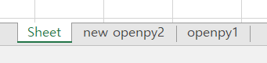
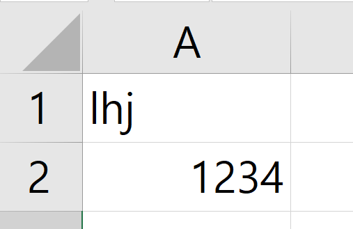

**목차**

1. [Excel 파일 생성](#excel-파일-생성)
   * [파일 생성](#파일-생성)
   * [시트 생성](#시트-생성)
   * [값 입력](#값-입력)
2. [기존 Excel 파일 수정](#기존-excel-파일-수정)
   * [값 입력](#값-입력)
   * [값 출력](#값-출력)
   * [값 확인](#값-확인)
   * [반복 작업](#반복-작업)

---

## Excel 파일 생성

### 파일 생성

```python
from openpyxl import Workbook

# 엑셀 객체 생성
wb = Workbook()
# 첫 번째 시트를 활성화 시킨다 (active 는 활성화 시킬 시트를 지정하는 것)
ws = wb.active
# 시트 이름 지정
ws.title = 'openpy'
# 엑셀 파일 저장
wb.save('openpy01.xlsx')
# 자원 close
wb.close()
```

### 시트 생성

```python
from openpyxl import Workbook

# 엑셀 객체 생성
wb = Workbook()
# 시트 생성
ws = wb.create_sheet()
ws.title = 'openpy2'

# openpy1 으로 바로 시트 생성
ws1 = wb.create_sheet('openpy1')
# openpy2 시트를 new openpy2 로 수정
wb['openpy2'].title = 'new openpy2'

wb.save('openpy01.xlsx')
```



### 값 입력

```python
from openpyxl import Workbook

# 엑셀 객체 생성
wb = Workbook()
# 시트 생성
ws = wb.create_sheet()
# openpy2, openpy3 시트 생성
ws.title = 'openpy2'
ws3 = wb.create_sheet('openpy3')

wb['openpy2'].title = 'new openpy2'

# 값 입력할 시트 지정
ws2 = wb['new openpy2']
ws2['A3'] = 'coke'

wb.save('openpy02.xlsx')
```

---


## 기존 Excel 파일 수정

### 값 입력

```python
from openpyxl import Workbook
# import openpyxl 필수
import openpyxl

# 읽고 싶은 엑셀 파일을 load 한다
wb = openpyxl.load_workbook(filename='openpy01.xlsx')
# 액셀 객체 활성화
ws = wb.active

# 활성화 된 액셀 객체의 원하는 위치에 원하는 데이터를 넣는다
ws['A1'] = 'lhj'
ws['A2'] = 1234

# 저장
wb.save('openpy01.xlsx')
```



### 값 출력

```python
# Cell 위치를 출력
print(ws['A1'])

# 실제 데이터 값 출력
print(ws['A1'].value)
```

```python
# ws 셀로 행 row, 열 column 으로 지정해도 출력된다
print(ws.cell(1, 1).value)
```

**예시**

* 구구단

  ```python
  from openpyxl import Workbook
  import openpyxl
  
  wb = openpyxl.load_workbook('openpy01.xlsx')
  ws = wb.active
  
  for n in range(1, 10):
      for m in range(1, 10):
          ws.cell(n, m).value = n * m
  
  wb.save('openpy01.xlsx')
  ```

  


### 값 확인

* 행이 얼마나 있는지 확인 (최대 행 개수)

  ```python
  print(ws.max_row)
  ```

* 열이 얼마나 있는지 확인 (최대 열 개수)

  ```python
  print(ws.max_column)
  ```

* 최소 행, 최소 열

  * 시작 지점에 관한 것도 지정 가능 (위치 확인 가능)

  ```python
  print(ws.min_row)
  print(ws.min_column)
  ```

* Slicing 활용 가능 &rarr; 보통은 column 기준으로 Slicing

  ```python
  ws['A:B']
  ```


### 반복 작업

```python
ws.iter_rows
ws.iter_columns
```

* `iter_rows()` 반복문으로 범위를 지정해서 출력할 수 있다

  * `min_row`, `max_row` 인자로 가질 수 있다 (column 도 가능 : `max_col`, `min_col`)

    ```python
    
    wb = openpyxl.load_workbook('openpy01.xlsx')
    ws = wb.active
    
    for row in ws.iter_rows(min_row=1, max_row=4):
        print(row)
    ```

    * 1 부터 4 행 까지의 값만 튜플 형태로 출력 된다