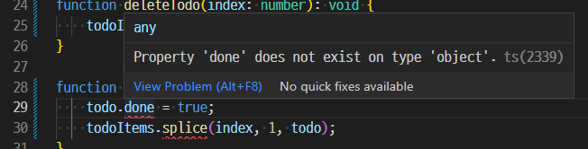

## 함수

**기본적인 함수 타입 선언**

매개변수와 함수의 반환값에 타입 추가

```tsx
function sum(a: number, b: number): number {
    return a + b;
}
```


**함수의 인자**

타입스크립트에서는 함수의 인자를 모두 필수 값으로 인식한다

&rarr; 따라서, 함수의 매개변수 설정 시 `undefined` `null` 이라도 인자로 넘겨받아야 한다

&rarr; 즉, 정의된 매개변수 값만 받을 수 있고 추가로 인자를 받을 수 없다는 의미

```tsx
function sum(a: number, b: number): number {
    return a + b;
}
sum(10, 20, 30); // error, too many parameters
sum(10); // error, too few parameters
```

* 매개변수 개수만큼 인자를 넘기지 않아도 되는 JS 특성과 반대

  * `?` 를 이용해서 구현 가능

    ```tsx
    function sum(a: number, b?: number): number {
      return a + b;
    }
    
    sum(10, 20); // 30
    sum(10, 20, 30); // error, too many parameters
    sum(10); // 타입 에러 없음, ? 는 추가 파라미터를 의미하기 때문
    ```

**예시**

```tsx
// object 형식의 배열을 todoItems 로 선언
let todoItems: object[];

// api 함수 선언
function fetchTodoItems(): object[] {
  const todos = [
    { id: 1, title: '안녕', done: false },
    { id: 2, title: '타입', done: false },
    { id: 3, title: '스크립트', done: false },
  ];
  return todos;
}
```

* 여기서 함수 하나 더 추가

  ```tsx
  // todo 를 done 처리로 변경하는 것
  // 리턴이 없는 경우 (void 는 반환타입)
  function completeTodo(index: number, todo: object): void {
      todo.done = true;
      todoItems.splice(index, 1, todo);
  }
  ```

  * 이 경우, `done` 에 에러가 생성 된다

    

    * todo라는 오브젝트에 done 속성이 없어서 뜨는 에러

      ```tsx
      function completeTodo(index: number,
          // todo 에 내부 type 을 일일이 지정해주면 에러 제거 가능
          todo: { id: number; title: string; done: boolean; }): void {
          todo.done = true;
          todoItems.splice(index, 1, todo);
      }
      ```

      

    * `splice` 에러의 경우

      * TSLint 버전에 따라 `type[]` 으로 array 타입을 지정하는 것을 disable 한다

        `Array type using 'T[]' is forbidden for non-simple types. Use 'Array<T>' instead`

        ```tsx
        // 바꾼 선언 형식
        let todoItems: Array<{
            id: number;
            title: string;
            done: boolean;
        }>
        ```

      * object 로 인식해서 splice property 가 없다고 에러 생성되는 것
