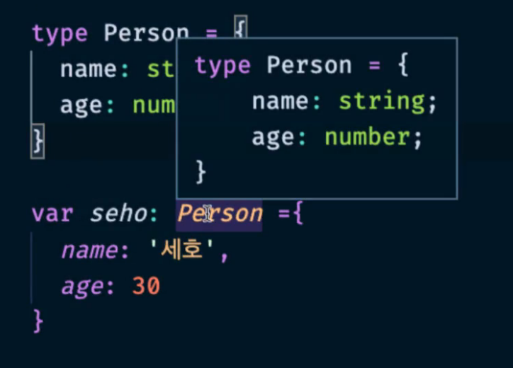

## 타입 별칭

**특정 타입이나 인터페이스를 참조할 수 있는 타입 변수를 의미**

```tsx
// 타입 별칭을 사용할 때
type MyName = string;
const name: MyName = 'capt';

// interface 레벨의 복잡한 타입에도 지정 가능
type Developer = {
    name: string;
    skill: string;
}

// 제네릭도 사용 가능
type User<T> = {
    name: T
}
```


* **활용**

  ```tsx
  type Person = {
      name: string;
      age: number;
  }
  
  const seho: Person = {
      name: '세호',
      age: 30
  }
  ```

  

  * Person 이 type 이라는 문구가 프리뷰로 표시 된다
    * interface 의 경우, `Interface Person` 이라고 프리뷰에 표시 된다


### type vs interface

**type 은 확장 불가능 interface 는 확장 가능!**

따라서 가급적 확장 가능한 interface 로 선언하는 것이 좋다