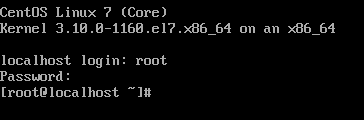
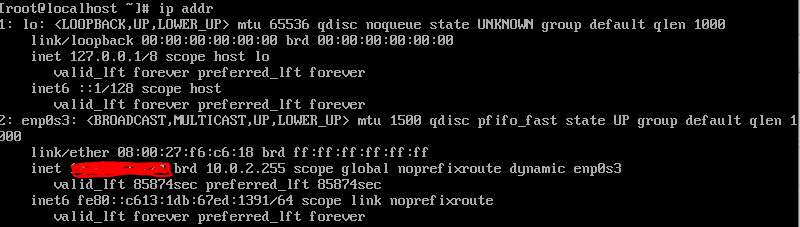
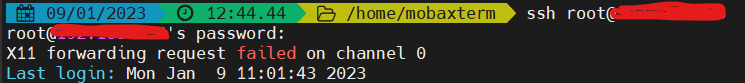

# 리눅스 환경 설정

## 가상 머신 프로그램

**실존하는 컴퓨터가 아닌 가상으로 존재하는 머신**

* Vmware Plyer, Virtual PC, Hyper-V, Virtual Box 등

윈도우에서 리눅스를 사용하기 위해선 가상 환경에서 리눅스 OS 를 실행시켜야 한다

* OS 는 컴퓨터 내에 단 하나만 존재해야 하기 때문에

*가상 머신 프로그램 설치 (Virtual Box) 후 CentOS 설치*


### Linux 배포판

**리눅스 커널을 바탕으로 한 공개 소프트웨어의 집합**

* centOS, redhat, debian, ubuntu 등

---

### Virtual Box 가상 머신 시작

1. 새로 만들기
2. `Centos7` 이름 설정 &rarr; 자유롭게 설정, 첫 문자 대문자 유의
3. 메모리 크기 설정
   * 실제 가상 머신 내에서 운영되는 리눅스 OS 의 메모리 설정
4. 하드 디스크 설정 &rarr; 새 하드 디스크 만들기
5. `VDI` 설치 
6. 물리적 하드 드라이브에 저장
   * `동적 할당`선택 (빈 자원, 메모리를 효율적으로 사용 가능)
   * `고정 크기` 
7. `저장소` &rarr; `비어 있음` 클릭 &rarr; `디스크 이미지` 선택 &rarr; 이미지 파일 선택
8. 시작
9. `잡기` 옵션 시 마우스 커서 사라짐 (오른쪽 클릭 시 재생성 &rarr; 호스트 (base OS) 로 돌리는 것)
   * 운영체제가 일하기 위해선 하드웨어 자원 필요
   * 가상 머신은 실재하지 않기 때문에 하드웨어 자원에 직접 접근 불가능
     * 마우스에 대한 권한은 로컬 (윈도우) 가 갖고 있다
     * 마우스 자유로이 쓸 수 없음
   * **설정**
     * 오른쪽 하단 `Right Click` 오른쪽 클릭
     * 키보드 설정 &rarr; 호스트 키 조합`ctrl + alt`
10. `Install CentOS7` 엔터
11. 한국어 선택
12. **설치 대상**
    * 첫 생성시 8GB 설정 그대로 돼 있음
    * 완료
13. 네트워크 &rarr; 이더넷 `켬`
14. 설치 시작
15. 사용자 생성 &rarr; **Root 암호**
    * `root` 등 간단한 비밀번호로 설정
16. 재부팅

---

**재부팅 후**

1. 로그인 (localhost) &rarr; 현재 루트 (root) 계정 밖에 없다

   

2. 리눅스 환경 (가상 머신) 매우 불편하기 때문에
   * **SSH (Secure Shell)** 사용
     * 다른 컴퓨터에 로그인 하거나 명령을 실행할 수 있게 하는 원격 지원 프로그램
     * **MobaXterm** (mcaOS 는 지원하지 않는다)
       * `portable` 이라 실행할 때 파일 필요 (`.exe` 같은 설치 파일 아님)

---

### MobaXterm 실행

1. Virtual Box 를 접속해야 한다

   * `start local terminal`
   * IP 주소를 통해 접근 가능 (host &rarr; guest 로 접근하기 위해선 주소 반드시 필요)

2. Virtual Box 에서 `ip addr` 로 주소 확인

   

   * host 에서 guest 주소 입력
   * guest 주소 : 2 번에서 inet 주소
   * host 주소 : cmd 에서 ipconfig &rarr; 이더넷 어댑터 (랜선일 경우)

3. ```bash
   ssh root@IP주소
   ```

4. `connection timed out`

   *  네트워크 재설정 필요 (Virtual Box)
     * 파일 &rarr; 환경 설정 &rarr; 네트워크
     * 오른쪽에서 `새 NAT 네트워크 추가합니다` 클릭
       * 네트워크 이름 : `first` (자유롭게 설정)
       * 포트포워딩 설정
         * 오른쪽에서 `새 규칙 추가`
         * 호스트 IP 와 게스트 IP 입력
         * 게스트 포트 : 각각 장치마다 사용하는 고유한 포트 有, SSH 를 통해 진입하려 할 때 장치 번호를 매기는데 이를 `22`로 한다
           * 호스트 포트도 22 로 해둬야 연결 가능
       * 좌편에 실행 중인 Centos7 우클릭
         * 설정 &rarr; 네트워크 &rarr; NAT 네트워크 클릭 후 만들어둔 `first` 네트워크 설정

5. 포트포워딩 했기 때문에 이제 host ip 입력하면 접속 가능 (3 번과 동일)

   * host ip 로 연결해서 guest ip 로 이동 

   * 설정해 둔 비밀번호 입력

     

---

**주의 : 정보 다 지우고 싶다**

* 단순히 삭제만으로는 안된다
  * `.VirtualBox\만든 가상 운영체제 이름` 삭제 해야 한다