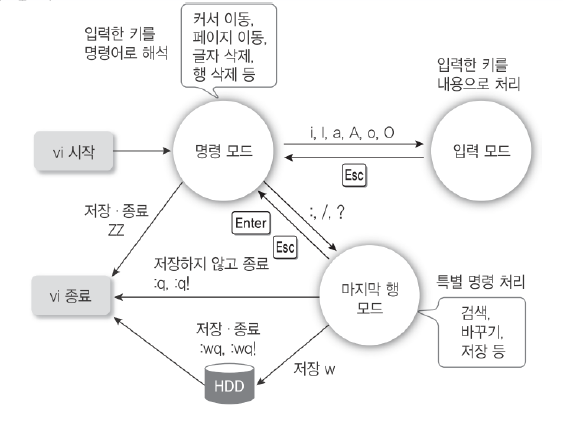
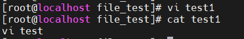

# 리눅스 에디터

**목차**

1. [gedit](#gedit)
2. [vi](#vi)

---

## gedit

* MS 윈도우에서 제공하는 메모장과 같은 기능을 수행, UTF-8 과의 호환성을 제공
* 설치 필요
  * 그러나 실제로 사용할 때는 vi 에디터 더 많이 쓴다

---

## vi

* **명령 모드, 입력 모드, 라인 모드**로 구분돼 모드를 전환하면서 사용

  

* **명령 모드**

  * 한 글자 또는 두 글자 명령을 사용
  * 문자열을 검색하는 등 다양하게 문서를 편집할 수 있는 기능
  * 명령이 아닌 키보드 입력은 모두 에러로 간주

* **입력 모드**

  * 입력을 원하는 글자를 입력하고 화면은 입력한 상태 그대로 제공하는 모드

* **라인 모드**

  * `Esc` 키를 누르고 `:` 프롬프트에서 명령을 입력하여 편집, 검색, 저장 등 다양한 기능을 제공하는 모드

    | 모드     | 명령키        | 기능                                              |
    | -------- | ------------- | ------------------------------------------------- |
    | 라인모드 | q             | vi 에디터에서 작업한 내용 없으면 그냥 종료        |
    |          | q!            | 작업한 내용을 저장하지 않고 종료                  |
    |          | :w[파일명]    | 파일명을 지정하면 새 파일로 저장 아니면 그냥 저장 |
    |          | :wq 또는 :wq! | 작업한 내용을 저장하고 vi 에디터를 종료           |
    | 명령모드 | (shift +) ZZ  | 작업한 내용을 저장하고 vi 에디터를 종료           |

* 예시

  ```bash
  # vi [파일명] 으로 파일을 수정하는 에디터로 들어간다
  # test1 파일을 수정하고자 하는 것
  vi test1
  
  # 그 후, i 로 입력모드 진입 후 수정
  # Esc 누른 후 :w 는 저장, :q 는 종료
  # vi test 입력 후 저장, 종료하고 cat 으로 파일 내용을 읽으면 그대로 나온다
  cat test1
  # vi test
  ```

  

  

### 명령어

**입력 모드 전환키**

| 명령키 | 기능                                       | 동일한 키   |
| ------ | ------------------------------------------ | ----------- |
| i      | 현재 커서의 위치부터 입력                  | `I`         |
| a      | 현재 커서의 위치 다음 칸부터 입력          | `A`         |
| o      | 현재 커서의 다음 행에 입력                 | `O`         |
| s      | 현재 커서 위치에서 한 글자를 지우고 입력   | `S`         |
| I      | 현재 커서가 위치한 행의 맨 앞부터 입력     | `shift + I` |
| A      | 현재 커서가 위치한 행의 맨 마지막부터 입력 | `shift + A` |
| O      | 현재 커서가 위치한 이전 행에 입력          | `shift + O` |
| S      | 현재 커서의 한 행을 지우고 입력            | `shift + S` |

**커서 이동하기**

| 명령키       | 기능                                | 동일한 키    |
| ------------ | ----------------------------------- | ------------ |
| ^            | 현재 행의 처음으로 커서 이동        | `Home`       |
| s            | 현재 행의 마지막으로 커서 이동      | `End`        |
| h            | 커서의 위치를 왼쪽으로 한 칸 이동   | &larr;       |
| l            | 커서의 위치를 오른쪽으로 한 칸 이동 | &rarr;       |
| k            | 커서의 위치를 위쪽으로 한 칸 이동   | &uarr;       |
| j            | 커서의 위치를 아래쪽으로 한 칸 이동 | &darr;       |
| gg           | 제일 앞에 있는 첫 행으로 커서 이동  | `G G`        |
| g            | 제일 끝에 있는 행으로 커서 이동     | `G`          |
| 숫자 g       | 해당 숫자의 행으로 커서 이동        | :숫자`G`     |
| :숫자`Enter` | 해당 숫자의 행으로 커서 이동        | :숫자`Enter` |
| `Ctrl + B`   | 이전 화면으로 커서 이동             | `Page Up`    |
| `Ctrl + F`   | 다음 화면으로 커서 이동             | `Page Down`  |

**문자열 검색**

| 명령키          | 기능                                          |
| --------------- | --------------------------------------------- |
| /문자열 `Enter` | 찾을 문자열을 커서의 위치에서 아래쪽으로 검색 |
| ?문자열 `Enter` | 찾을 문자열을 커서의 위치에서 위쪽으로 검색   |
| n               | 문자열을 찾던 원래 방향으로 다음 문자열 검색  |
| N               | 문자열을 찾던 반대방향으로 다음 문자열 검색   |

* 정확한 단어가 있어야 이동
  * grep 과 다르다! 
  * grep 은 특정 문자열이 포함돼있으면 다 찾아주지만 여기서의 검색은 정확해야지 이동한다
    * `domain` 은 `domain4` 를 검색하지 않는다

**문자열 치환**

| 명령키                        | 기능                                                         |
| ----------------------------- | ------------------------------------------------------------ |
| `:s/문자열1/문자열2/`         | 커서가 위치한 행에서 첫 번째로 나오는 문자열 1을 문자열 2로 치환 |
| `:%s/문자열1/문자열2/g`       | 파일 전체에서 모든 문자열 1을 문자열 2로 치환                |
| `:<범위>s/문자열1/문자열2`    | 범위 내 모든 행의 각행에서 첫번째로 검색되는 문자열 1을 문자열 2로 치환 |
| `:<범위>s/문자열1/문자열2/g`  | 범위 내 모든 행에서 문자열 1을 문자열 2로 치환               |
| `:<범위>s/문자열1/문자열2/gc` | 범위 내 모든 행에서 문자열 1을 문자열 2로 치환할 때 수정할지에 대한 여부 확인 |

* 입력 모드에서 사용

