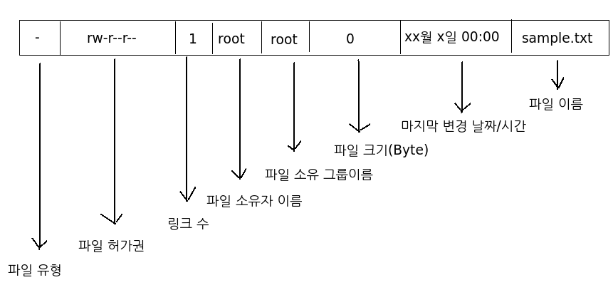
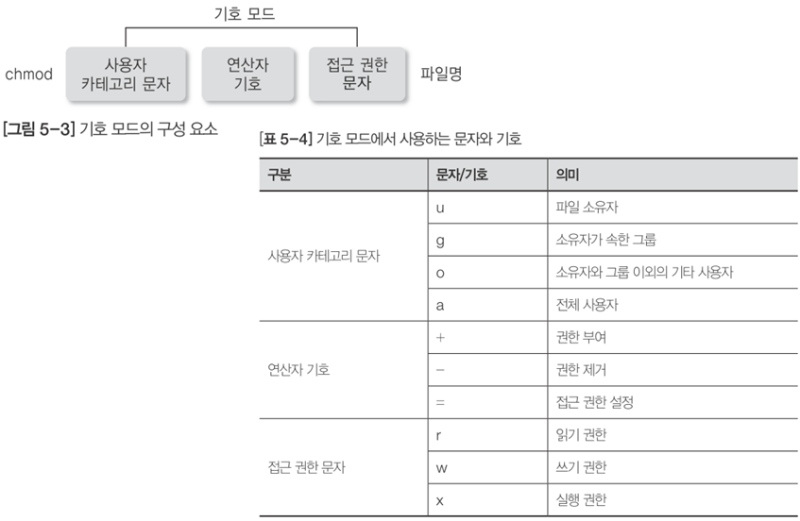
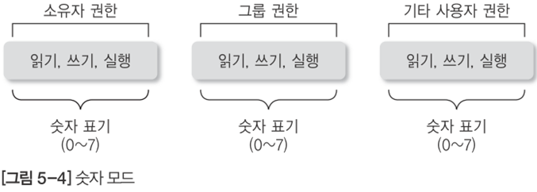
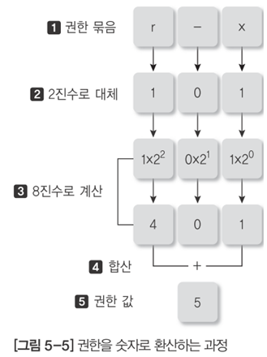
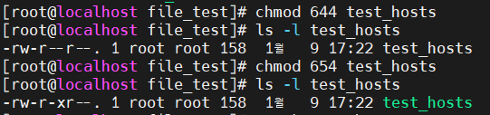

**목차**

1. [파일 속성](#파일-속성)

2. [파일의 접근 권한](#파일의-접근-권한)

   * [기호를 이용한 접근 권한](#기호를-이용한-접근-권한)

   * [숫자를 이용한 접근 권한](#숫자를-이용한-접근-권한)
   * [기본 접근 권한](#기본-접근-권한)
   * [특수 접근 권한](#특수-접근-권한)

---

## 파일 속성



| 번호 | 속성 값       | 의미                                                         |
| ---- | ------------- | ------------------------------------------------------------ |
| 1    | `-`           | 파일의 종류로, `-` 는 일반 파일 `d` 는 디렉터리              |
| 2    | `rw- rw- r--` | 파일을 읽고 쓰고 실행 수 있는 접근 권한 (순서대로 소유자, 그룹, 기타 사용자) |
| 3    | 1             | 하드 링크의 수                                               |
| 4    | `root`        | 파일 소유자의 로그인 ID                                      |
| 5    | `root`        | 파일 소유자의 그룹 이름                                      |
| 6    | `0`           | 파일의 크기 (byte 단위)                                      |
| 7    | `xx월 ~`      | 파일을 최종 수정한 일자와 시각                               |
| 8    | `sample.txt`  | 파일명                                                       |


## 파일의 접근 권한

| 접근 권한 | 파일                                                         | 디렉터리                                                     |
| --------- | ------------------------------------------------------------ | ------------------------------------------------------------ |
| 읽기 (r)  | 해당 파일을 읽거나 복사 가능                                 | ls 명령으로 디렉터리 목록을 확인<br />옵션은 실행 권한이 있을 경우만 허용 |
| 쓰기 (w)  | 파일을 수정, 이동, 삭제 가능<br />디렉터리에 쓰기 권한 있어야 한다 | 해당 파일을 삭제하거나 생성할 수 있다                        |
| 실행 (x)  | 셸 스크립트 또는 실행 파일에 대한 실행 가능                  | cd 명령 사용 가능, 파일을 디렉터리로 이동 또는 복사 가능     |

* 예시

  `rwx --- ---` 경우, 소유자만 읽기 쓰기 실행 전부 가능하며 그룹, 기타 사용자는 전부 불가능


**접근 권한 변경 명령 chmod**

* 접근 권한 변경은 파일 소유자와 시스템 관리자만 변경 가능
* change mode 의 약어
  * `-R` 하위 디렉터리까지 전부 접근 권한 바꾸기


### 기호를 이용한 접근 권한

**심볼릭 모드는 사용자 카테고리 문자, 연산자 기호, 접근 권한 문자를 사용해 파일 접근 권한 변경**

* 나열 (`,`) 과 조합 가능



* 예시

  ```bash
  # ls 로 현재 권한 정보 확인
  ls -l test_hosts
  
  # -rw-r--r--. 1 root root 158  1월  9 17:22 test_hosts
  # 사용자는 rw 권한, 그룹은 r 권한, 기타 사용자는 r 권한
  
  # 쉼표로 나열해서 권한 수정
  chmod u+x,g-r,o+w test_hosts
  
  # ls 로 수정된 권한 정보 확인
  ls -l test_hosts
  
  # -rwx---rw-. 1 root root 158  1월  9 17:22 test_hosts
  # 사용자는 rwx, 그룹은 아무것도 없고, 기타는 w 권한 부여
  ```


### 숫자를 이용한 접근 권한



* 세 자리 숫자로 표현하는 것
  * 문자의 조합이 많기 때문에 다소 간편한 숫자로 표현하는 것


**계산법**



* 권한이 있으면 1, 없으면 0

* 2 진수를 10 진수 변환 후 000 ~ 777 사이에 권한 주면 된다

  * 예시

    


### 기본 접근 권한

* 일반 파일인 경우에는 소유자와 그룹의 접근 권한은 읽기(r)와 쓰기 권한(w)만 설정되고 디렉터리의 경우에는 소유자와 그룹은 읽기, 쓰기, 실행 권한이 설정 되며 기타 사용자는 읽기와 실행 권한만 설정됨

* **mask**

  * 설정된 기본 접근 권한

    ```bash
    # 리눅스 시스템에 현재 설정돼있는 기본 접근권한을 출력하거나 변경
    # 숫자로 출력
    umask
    
    # 0022 가 나온다
    # mask 는 가린다는 의미로 최대 접근 권한에서 빼줘야 한다
    # 777 (최대 접근 권한) - 022 (첫 0은 특수 권한 의미하므로 제외한다) = 755
    # 디렉토리 접근 권한은 755 지만 파일의 접근 권한은 644
    
    # 문자로 접근 권한 출력
    umask -S
    ```

  * umask 란 파일이 생성될 때 사용할 파일의 권한에 대해 mask 를 인코딩하는 시스템 변수를 의미

  * 이러한 권한 값을 퍼미션이라고도 하며 퍼미션은 보통 4 자리(레드햇 7.2 이하 버전은 3 자리)로 표현

**(중요) 파일과 디렉터리의 기본 권한 값이 다르다**

| 마스크값             | 0    | 1    | 2    | 3    | 4    | 5    | 6    | 7    |
| -------------------- | ---- | ---- | ---- | ---- | ---- | ---- | ---- | ---- |
| 파일의 기본 권한     | 6    | 6    | 4    | 4    | 2    | 2    | 0    | 0    |
| 디렉터리의 기본 권한 | 7    | 6    | 5    | 4    | 3    | 2    | 1    | 0    |


### 특수 접근 권한

**SetUid**

* 다른 사용자들이 그 파일을 실행하였을 경우나 실행되는 동안에는 사용자의 권한 (아이디의 권한) 이 아닌 파일 소유자 권한으로 실행하게 된다
  * 소유자는 관리자지만 다른 사용자도 사용할 수 있도록 하는 것
  *  접근 권한에서 맨 앞자리에 4 를 설정해야 한다 
  * `s` 로 지정되게 된다 (실행 권한이 없을 경우 `S`)

**SetGid**

* 특수 권한이 설정된 파일을 실행할 경우 해당 파일이 실행되는 동안에는 파일 소유 그룹의 권한으로 실행되도록 적용 해주는 기능
  * 2 를 설정, `s` 로 지정된다 (실행 권한이 없을 경우 `S`)

**StickyBit**

* 일반 파일이 아닌 **디렉터리**에 대해 특수 권한을 설정하는 기능으로 아무런 제약 없이 누구나 디렉터리에 파일을 생성할 수 있음
* 이 디렉터리에 생성되는 파일은 파일을 생성한 소유자의 파일로 귀속, 다른 사용자는 이 파일에 대해 어떠한 이유라도 삭제할 수 없음
  * 1 을 설정, `t` 가 표시되나 실행 권한이 없는 파일은 `T` 가 표시된다

