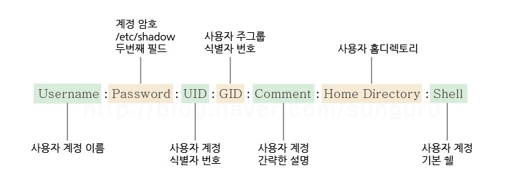

## 관리자 계정 접속

* 관리자 계정은 사용자 계정 생성과 권한 부여 등의 리눅스 시스템의 전반적인 관리를 수행

* 관리자 계정으로 접속하려면 먼저 터미널 창에 나타난 `$` 프롬프트를 `#` 프롬프트로 변경한 다음 관리자인 root 계정으로 로그인

---

**목차**

1. [프롬포트 변경](#프롬포트-변경)
2. [계정 정보 확인](#계정-정보-확인)
3. [사용자 계정 관리](#사용자-계정-관리)
   * [사용자 계정 생성](#사용자-계정-생성)
   * [암호 변경](#암호-변경)
   * [계정 정보 수정](#계정-정보-수정)
   * [사용자 계정 삭제](#사용자-계정-삭제)

---

## 프롬포트 변경 : su

* 터미널 창의 `$` 은 일반 사용자 계정으로 접속된 것을 의미
* 다른 계정 접속은 substitute 약어인 su 이용
* root &rarr; 다른 사용자 계정은 따로 암호를 묻지 않는다
  * root 는 모든 권한을 가지고 있기 때문

```bash
# - 옵션은 root 셸 환경변수를 가져와서 실행
# - 이 없으면 원래 사용자 계정의 환경변수를 사용하게 되므로, 온전히 관리자의 환경변수 사용하려면 - 사용

su - root
```

* GUI 에서 접속 가능
  * 재부팅 후 root 로 접속

---

## 계정 정보 확인

* 계정 일반 정보는 `/etc/passwd` 에서 확인 가능

  ```bash
  # 계정 정보와 bash 셸 사용한다는 등 정보 알 수 있다
  root:x:0:0:root:/root:/bin/bash
  ```

  

  * 여기서 그룹은 필수적인 값 (리눅스 시스템의 모든 사용자는 무조건 하나 이상의 그룹에 속해 있어야 한다)
    * GID 를 지정하지 않으면 자동으로 로그인 ID 가 그룹으로 등록된다
  * 계정 암호는 `/etc/shadow` 에 저장
    * 사용자 계정은 `Permission Denied` 뜬다 &rarr; 계정에 권한이 없는 것!
  * 셸 = 터미널 
    * 입력하고 실행시킬 때 사용하는 하나의 프로그램이라 보면 된다
    * centOS 는 bash 셸

---

## 사용자 계정 관리

### **사용자 계정 생성**

* 여러 명의 사용자가 리눅스 시스템에 접속해 사용할 때 사용자를 구별하는 역할 수행
* 사용자 계정은 사용자가 시스템에 접근할 수 있는 **유일한 방법**
* 시스템 관리자 입장에서도 사용자의 **접근 권한을 통제**할 수 있는 중요한 역할 수행

```bash
# 사용자 계정 생성 명령어
# adduser 보다 useradd 명령어를 사용

# adduser 은 홈 디렉터리를 자동으로 만들어 준다
adduser
# useradd 는 사용자에 대한 특정 값을 지정해 줄 수 있다 (옵션 多)
useradd
```

* `useradd` 옵션
  * `-d` 사용자 계정의 홈 디렉터리 지정
  * `-e` 유효 기간 설정 (YYYY-MM-DD)
  * `-p` 사용자 계정 패스워드 지정 가능


**사용자 계정 생성 후 이동**

```bash
useradd hyun
su - hyun

# [hyun@localhost ~]$ 로 표시된다
```

사용자 작업 공간은 `pwd` 로 확인 가능하며, `/home/` 하위 디렉터리에 존재한다


### **암호 변경**

```bash
passwd
# 인증 토큰 수정 오류가 나온다면 이는 계정에 권한이 없다는 것
```

* 모든 권한은 root 에 있으므로 root 로 돌아가서 암호 변경하면 된다
* `passwd [변경하고자 하는 계정명]`

&rarr; 사용자 계정으로 `ssh hyun@[ip 주소]` 명령어로 접속 가능!


### **계정 정보 수정**

```bash
# 이미 생성된 사용자 계정에 대한 정보 수정
usermod

# 예시
# 사용자 ID 변경
# hyun 계정에 대해 userID 를 2000 으로 바꾸는 것
usermod -u 2000 hyun

# usermod: user daou1 is currently used by process 13804
# 백그라운드에서 프로세스 점유 중이라 바꿀 수 없는 것
```

* 옵션

  * `-d` 사용자 계정의 홈 디렉터리 수정

    ```bash
    # hyun 의 홈 디렉터리를 /home/workspace 로 바꾸는 것
    usermod -d /home/workspace hyun
    ```

  * `-u` 사용자 계정의 UID 수정

  * -`g` 사용자 계정의 로그인 기본 그룹 GID 수정

  * `-l` 사용자 계정 이름을 변경

    ```bash
    # hyun 의 이름을 manager 로 변경
    usermod -l manager hyun
    ```

**사용자 암호 기한 설정 및 변경 : chage**

* 정보를 변경할 때는 usermod, 암호 등 변경은 chage

  ```bash
  # 관련된 정보 출력
  chage -l daou1
  ```

* root 에서 사용

* 옵션

  * `-M` 마지막 변경 이후의 암호 유효일 수 &rarr; 최대 일수

  * `-W` 암호 만료 기간 몇 일 전에 안내 메시지 출력

  * `-E` 계정 만료 일자

  * `-l` 현재 사용자의 암호 만기에 대한 기본 정보 출력

    ```bash
    chage -E 2023/02/03 hyun
    ```


### **사용자 계정 삭제**

1. `/etc/passwd` 파일에서 사용자 계정 삭제

   ```bash
   userdel -r 계정명
   ```

2. `/etc/group` 파일에서 사용자 그룹 삭제

   ```bash
   groupdel 계정명
   ```

3. `/home` 디렉터리에 있는 사용자의 홈 디렉터리 삭제

   ```bash
   rm -rf /home/계정명
   ```

4. `/var/spool/mail` 에 있는 사용자 메일 삭제

   ```bash
   rm /var/spool/mail/계정명
   ```

5. 데이터 베이스 연동에서 삭제하려는 계정 이름과 암호 삭제
6. 기타 응용 프로그램에 존재하는 사용자 계정의 정보 삭제
7. 리눅스 재시작

**삭제 명령어**

```bash
userdel 계정명
```

**계정 관련 정보 삭제**

```bash
# 파일 내용 중에서 UID 를 찾아서 관련된 파일을 모두 삭제하는 명령어
find -user UID -exec rm -r {} \;
```

---

### *삭제 관련 사항*

**사용자 이름 변경과 홈 디렉터리 변경**

```bash
# 유저 추가
useradd test001

# 제대로 유저가 만들어졌는지 확인
tail -3 /etc/passwd
# test001:x:1002:1002::/home/test001:/bin/bash

# 홈 디렉터리에는 방금 생성된 유저가 존재
ls /home
# test001

# test001 을 test0001 로 변경해보자
usermod -d /home/test0001 test001
# 다시 tail 로 확인해보면 다음과 같이 디렉터리가 변경해서 결과 값이 나온다
...
test001:x:1002:1002::/home/test0001:/bin/bash
...

# 여기서 /home/ 디렉터리 하위에 test0001 이 정말로 만들어졌는지 확인해야 한다
ls /home
# test001
# 즉, 사용자 정보만 바꾸고 실제 디렉터리는 생성되지 않는 것

# 유저 이름 (사용자 계정명) 을 바꿔보자
usermod -l test002 test001
# 확인
tail -3 /etc/passwd
...
test002:x:1002:1002::/home/test0001:/bin/bash
...
# 유저 이름이 성공적으로 test002 로 변경됐다
```

**이제 삭제 수행**

```bash
userdel -r test001
# userdel: 'test001' 사용자가 없습니다
# test002 라고 계정명 변경했기 때문

# 그렇다면!
userdel -r test002
# userdel: test002 home directory (/home/test0001) not found
# 홈 디렉터리가 삭제가 안된다 -> 정보만 변경된거지 실제로 만들어지진 않은 것이기 때문

# 확인해보면 지워져 있기는 하다
tail -3 /etc/passwd
```

* 보통 홈 디렉터리와 계정명을 맞춰 준다 (에러 줄이기)

