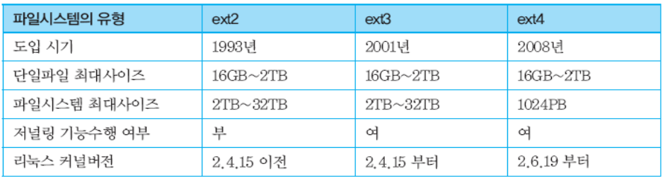
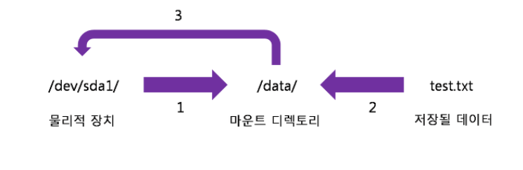
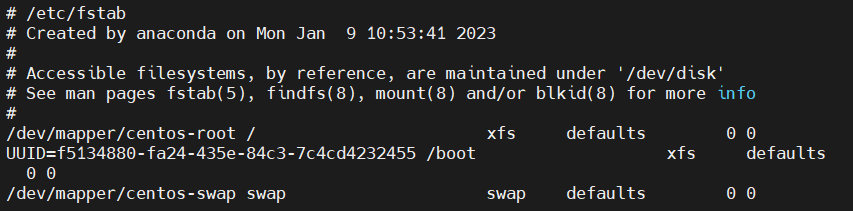
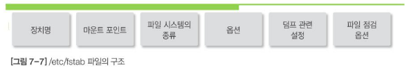
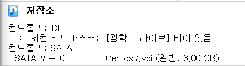
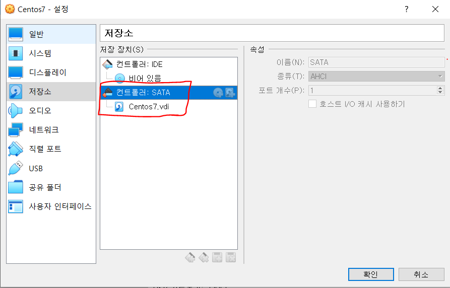
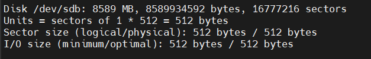
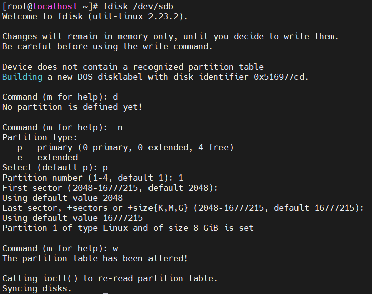
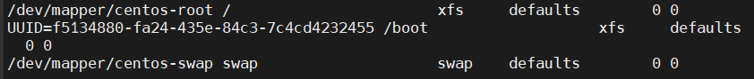
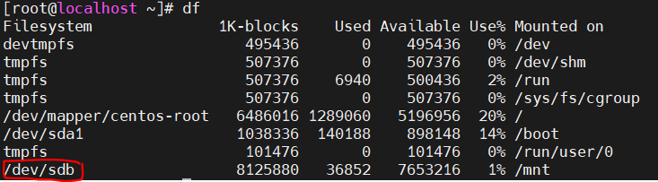

**목차**

1. [파일 시스템](#파일-시스템)
   * [가상 파일 시스템](#가상-파일-시스템)
   * [파일 시스템 확인](#파일-시스템-확인)
2. [파일 시스템 마운트](#파일-시스템-마운트)
   * [마운트 설정 파일](#마운트-설정-파일)
   * [마운트 관리 명령](#마운트-관리-명령)
3. [디스크 생성](#디스크-생성)
4. [mount 예시](#mount-예시)
5. [디스크 사용량 확인](#디스크-사용량-확인)

---

## 파일 시스템

**하드디스크, DVD, USB 등과 같은 저장 매체에 데이터를 저장하거나 삭제 또는 검색하는 방법을 제어하기 위한 시스템**

* `XFS` 파일 시스템은 `RHEL7` 과 `CentOS 7` 에서 사용되고 있는 기본 파일 시스템
  * 높은 확장성과 고성능을 지원하는 64 bit 파일 시스템
  * 파일 시스템을 사용하는 도중 장애가 발생하게 되면 파일 시스템의 빠른 복구를 지원하는 메타 데이터 저널링을 지원
    * 시스템의 오류 또는 전원 문제 등으로 인해 시스템이 재부팅 되었을 경우 파일 시스템의 무결성 체크를 통해 신속하고 정확하게 마운트 될 수 있도록 편의성을 제공해 주는 시스템을 의미
    * 디스크에 기록되는 데이터의 복구 기능을 강화하여 데이터를 디스크에 기록하기 전에 먼저 저널에 수정 사항을 기록하여 문제가 발생할 경우 저널의 기록을 보고 빠르게 복구할 수 있도록 편의성을 제공
  * 파일 시스템의 온라인 통신 중 단편화 제거와 용량 확장이 용이
* **EXT 파일 시스템의 특징**



* CentOS 가 지원하는 파일 시스템 종류

  | 파일 시스템의 종류 | 기능                                                      |
  | ------------------ | --------------------------------------------------------- |
  | hfs                | https 를 지원하기 위한 파일 시스템                        |
  | nfs                | 네트워크 파일 시스템으로 원격 서버와 디스크를 연결해 준다 |
  | ntfs               | 윈도우의 NTFS 를 지원하기 위한 파일 시스템                |
  | xfs                | 레드햇과 CentOS 7 의 기본 파일 시스템                     |

---

### 가상 파일 시스템

**VFS (Virtual File System)** 으로 표준 유닉스 파일 시스템과 관련된 모든 시스템 호출을 처리하는 커널 소프트웨어 계층과 실제 파일 시스템의 구현을 일관된 형태로 인식하도록 한다

* 사용자 프로세스 사이에 존재하는 추상화 계층 및 다른 여러 종류의 파일 시스템에 일반적인 공통 인터페이스를 제공하는 등의 특수한 용도에 따라 VFS는 존재했다가 사라지기도 함

* **리눅스에서 지원하는 VFS**

  | 파일 시스템의 종류 | 기능                                                       |
  | ------------------ | ---------------------------------------------------------- |
  | **proc**           | 커널의 현재 상태를 나타내는 파일 시스템 (/proc 디렉터리)   |
  | **swap**           | 스왑 영역을 관리하기 위한 파일 시스템                      |
  | **tmpfs**          | 임시 파일 저장을 위한 파일 시스템 (/tmp 디렉터리)          |
  | ramfs              | RAM 디스크를 지원하는 파일 시스템                          |
  | rootfs             | 루트 파일 시스템, 시스템 초기화 및 관리에 필요한 내용 관리 |

**(중요) VFS 에 지원되는 파일 시스템의 그룹**

* **디스크 기반 파일 시스템**
  * 로컬 디스크 파티션의 기억 장소를 관리하고 HDD, FDD, CD-ROM, DVD 와 같은 블록 디바이스에 저장
* **네트워크 파일 시스템**
  * 다른 네트워크 컴퓨터에 속한 파일 시스템에 쉽게 접근할 수 있도록 제공
* **특수 파일 시스템**
  * 사용자가 커널 데이터 구조 내용에 쉽게 접근할 수 있도록 간단한 인터페이스 제공

### 파일 시스템 확인

* 현재 컴퓨터에서 사용 중인 시스템에 따라 지원되는 파일 시스템의 목록을 확인

  * `cat` 명령어 

    ```bash
    cat -n /proc/filesystems
    ```

* 현재 사용 중인 리눅스 파일 시스템을 확인

  * `df` 명령어

---

## 파일 시스템 마운트

* 리눅스 시스템은 계층적 디렉터리의 구조를 가지고 있기 때문에 파일 시스템이 디렉터리 계층 구조와 연결되지 않으면 접근할 수 없음 
* 특정 디렉터리와 USB 메모리, CD-ROM, DVD, HDD, FDD 등과 같은 외부 장치와도 연결하는 것을 `마운트`라고 하며 디렉터리 계층 구조에서 파일 시스템이 연결되는 디렉터리를 **마운트 포인트**라고 함



### 마운트 설정 파일

* 일일이 마운트를 설정한다면 번거로울 것 

  * 그래서 리눅스 시스템이 부팅되며 자동으로 파일 시스템이 마운트 되도록 설정하는 게 좋다

* **설정**

  * `/etc/fstab` 파일에 마운트 수행 설정

  * root 계정으로 접속된 상태에서 진행하는 것 권장

    ```bash
    vi /etc/fstab
    ```

    

  * `/etc/fstab` 파일 구조



* 설정 옵션

  | 옵션    | 기능                                                         |
  | ------- | ------------------------------------------------------------ |
  | ro      | 읽기 전용 마운트 (read-only)                                 |
  | auto    | 부팅 시 자동으로 마운트<br />(mount -a 사용하면 auto 옵션이 장치 자동 마운트) |
  | remount | 이미 마운트 된 파일 시스템을 다시 마운트<br />(/etc/fstab 수정한 경우 또는 마운트를 잘못 수행한 경우) |
  | **dev** | 파일 시스템의 문자, 블록 특수 장치를 해석할 수 있는 마운트   |


### 마운트 관리 명령

```bash
mount [옵션] [장치명] [마운트 포인트]
```

```bash
# 마운트 해제
umount [옵션] [장치명 또는 마운트 포인트]
```

**디스크 파티션 명령**

```bash
# 새로 장착한 디스크의 파티션 작업 수행
fdisk [옵션] [디스크 드라이브 명]

# fdisk -l 로 디스크들 확인 가능
```

* 디스크 생성 하단 예시 참조

**USB 메모리 파일 시스템 생성 1 : mkfs 명령**

* fdisk 로 파티션을 생성 시켜야 mkfs 명령 가능

  ```bash
  # 파일 시스템 만들기 명령.xfs 형식으로 만들겠다 [관리 할 드라이브명]
  mkfs.xfs /dev/sdb1
  ```

* 관리할 수 있는 공간 (fdisk 로 만듦) 을 만들고 공간을 관리하는 파일 시스템 만듦 (mkfs 로)

  * USB 메모리에 파일 시스템 생성했으면 이 장치를 디렉터리에 연결하는 작업 (mount)

  * 이렇게 운영체제에 올려주고 나면 제대로 운영될 수 있다!

    ```bash
    # 마운트 할 장치명과 /mnt 를 마운트 포인트로 지정
    mount /dev/sdb1 /mnt
    ```

**USB 메모리 파일 시스템 생성 2 : mke2fs 명령**

* mkfs 가 확장된 mke2fs 명령어

  ```bash
  # 리눅스 확장 개정판 파일 시스템 생성
  mke2fs [옵션] [장치명] [마운트 포인트]
  ```

---

## **디스크 생성**



* SATA 개수에 따라 인식되는 하드 장치 다르다



* 시스템 종료 (완전히 끄기) 후 `설정 -> 저장소` 로 들어가서 컨트롤러에서 하드 디스크 추가

```bash
fdisk -l
```



* 명령어를 입력하면 이처럼 새로운 `/dev/sdb` 장치가 생겨 있다

---

### **mount 예시**

* `fdisk -l` 명령어로는 sdb 가 확인되나 `df` 로는 확인되지 않는다
* 설정 자체는 들어가 있으나 마운팅은 되지 않은 상태
  * 내부에서 사용할 수 있는 메모리가 존재하지 않는다

```bash
# 파티션 설정
fdisk /dev/sdb/
# 이제부터 Command (m for help) : 명령으로 진행

# 파티션 배정
# 전부 default 로 설정한 것

# w 로 만든 것 확인!
```



* 새로 생성된 파티션 확인하고 파일 시스템 만들기

  ```bash
  mkfs.ext4 /dev/sdb
  ```

* 파티션과 파일 시스템을 mount 해줘야 한다

  ```bash
  mount /dev/sdb /mnt
  ```

* `ls -al /mnt` 로 확인

  * `mount` 로 확인해보면 `/dev/sdb on /mnt type ext4 (rw,relatime,seclabel,data=ordered)` 로 나온다

* 공간 만들었고, 파일 시스템 만들었고, 마운트 포인트까지 만들었으니 시스템에 적용될 수 있도록 설정해줘야 한다

  * 이 모든 설정은 테이블에서 하기 때문에 테이블에 해당 내용이 들어가 있어야 한다

    ```bash
    # 파일 시스템 테이블 확인
    vi /etc/fstab
    ```

    

  * 위와 같이 고유한 UUID 값 등을 형식에 맞춰서 적어주면 된다

    * UUID 값 확인 방법

      ```bash
      # 블록 디스크에서 사용하는 값들 출력
      blkid
      
      # /dev/sdb: UUID="4046efb2-f97a-41aa-a42e-3a6a7c49bc95" TYPE="ext4"
      # 우리가 등록해야 할 값으로, 이를 테이블에 넣으면 마운팅 완료
      ```

  * `df` 로 확인해보면 `/dev/sdb` 를 확인할 수 있다

    

---

## 디스크 사용량 확인

```bash
df [옵션] [파일명]
```

* 옵션
  * `-h` 디스크 사용량을 보기 좋은 단위 (GB, KB, MB 등) 로 출력

```bash
# 특정 디렉터리 또는 사용자 별로 디스크 사용량을 확인
du
```

