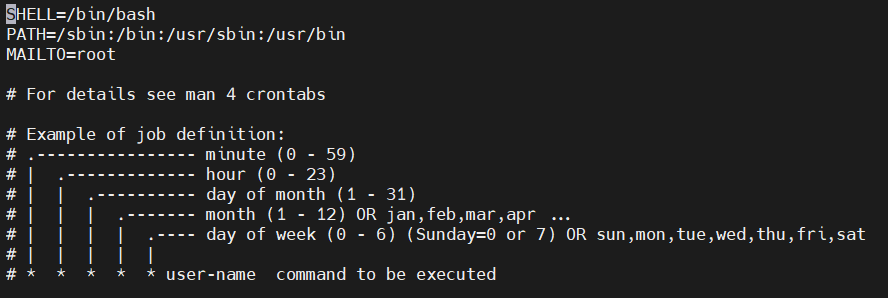

# 소프트웨어 관리

---

**목차**

1. [RPM 패키지](#rpm-패키지)
2. [Yum 패키지](#yum-패키지)
3. [ISO 파일](#iso-파일)
4. [파일 압축과 묶음](#파일-압축과-묶음)
   * [파일 압축](#파일-압축)
   * [파일 묶음](#파일-묶음)
5. [CRON과 AT](#cron과-at)
   * [CRON](#cron)
   * [AT](#at)

---

## RPM 패키지

Yum 이 나오기 전에 소프트웨어 관리를 위해 주로 사용돼 온 소프트웨어 업데이트 패키지

* 장점

  * 바이너리 파일로 구성되어 있으므로 따로 컴파일 과정이 필요 없음 

  * 패키지 형태로 파일들이 제공되므로 관련 디렉터리에 곧바로 설치됨 

  * 한 번에 설치된 패키지의 파일을 일괄 삭제가 가능하며 기존 패키지를 삭제하지 않고도 업데이트 가능

* 단점

  * 패키지 형태로 제공되기 때문에 관련 패키지가 먼저 설치돼야 한다
    * 의존성이 가장 큰 걸림돌 (기존 패키지가 없으면 패키지 설치 불가능)

```bash
rpm
```

* 옵션
  * `--version` 사용 중인 RPM 버전 출력
  * `-q` 현재 시스템에 설치돼 있는 RPM 패키지 조회


---

## Yum 패키지

* 특정 패키지를 설치할 때 이와 관련된 다른 패키지가 필요할 경우 자동으로 인터넷에서 다운 받아 설치해 주는 기능을 보유하고 있음
* 필요에 따라 필요한 패키지를 스스로 알아서 설치해 주므로 RPM을 이용할 때의 의존성을 완전히 해결
* Yum은 인터넷을 통해 패키지가 설치되므로 항상 인터넷에 연결되어 있어야 함

```bash
yum [옵션] [명령] [패키지 이름]
```

* 명령

  * `install` 지정한 패키지 설치

    ```bash
    # 파이어폭스 설치 예시
    yum install firefox
    ```

    * 패키지 삭제

      ```bash
      yum remove [패키지 명]
      ```

  * `update` 패키지 업데이트

  * `list` 패키지 목록 확인

  * `info` 패키지 정보 출력

  * `serach` 패키지 또는 소프트웨어 검색

    ```bash
    yum search java
    # 검색하는 다른 방법 (grep 이용)
    yum list | grep java
    ```

```bash
# 시스템에 설치된 패키지 중에서 업데이트할 패키지 확인
yum check-update
```

**유용한 사용 방법**

* 패키지 그룹 목록 확인

  ```bash
  yum grouplist
  ```

* 패키지 그룹 설치

  ```bash
  yum groupinstall [패키지명]
  ```

* GPG 키 검사 생략

  * GPG는 보안 관련 키를 의미

  * CentOS 7에서 인증되지 않은 RPM 파일을 설치할 때에는 `인증되지 않은 설치`라는 메시지가 출력 되면서 그냥 종료되는 경우가 발생하게 된다

    * 이와 같은 경우가 발생할 때 yum 명령과 함께 `–-nogpgcheck` 옵션을 사용하면 해결됨

      ```bash
      yum install --nogpgcheck rpm[파일이름].rpm
      ```

* 기존 패키지 저장소 비우기

  ```bash
  yum clean all
  ```

* 패키지의 종류

---

## ISO 파일

해당하는 소프트웨어를 사진 찍듯이 이미지로 복사해둔 것 (소프트웨어 관리 파일)

**ISO 파일 생성**

```bash
genisoimage
```

**마운트**

```bash
# 마운트 할 iso 디렉터리 생성
mkdir /media/iso
# iso 파일 마운트 설정
mount -o loop my_test.iso /media/iso
# 이미지 파일의 디렉터리 목록 확인
ls -l /media/iso
```

---

## 파일 압축과 묶음

### **파일 압축**

```bash
xz [파일 이름]
```

```bash
bzip2 [파일 이름]
```

* 옵션
  * `-d` 압축된 파일을 해제 (.bz2)

* 예시

  ```bash
  # 패키지가 없을 시 yum 매니저로 설치
  bzip2 test1
  ```

  ```bash
  # 압축 해제
  bzip2 -d test1.bz2
  ```

```bash
gzip [파일 이름]
```

```bash
# 윈도우용과 호환되는 확장자 zip 로 파일을 압축할 때 해제할 때 사용
zip [파일 이름]
```


 ### **파일 묶음**

리눅스와 유닉스에서는 파일 압축과 파일 묶음을 별개의 프로그램으로 제공

* 그러나 사용자의 편의성을 위해 압축과 묶음을 한 번에 수행할 수 있도록 `tar` 명령 제공

  ```bash
  tar 동작 [옵션]
  ```

  * **(중요) 동작과 옵션**
    * 동작
      * `c` 새로운 묶음 생성 
      * `x` 묶음 파일을 풀어 준다
      * `t` 묶음을 풀기 전에 묶인 경로를 출력
      * `C` 묶음을 풀 때 지정된 디렉터리에 풀어 준다 (지정하지 않으면 원래 디렉터리)
    * 옵션
      * `f` 묶음 파일의 이름을 지정 (필수 옵션)
      * `v` 파일이 묶이거나 풀어지는 과정을 출력 (생략 가능)
      * `J` tar + xz
      * `z` tar + gzip
      * `j` tar + bzip2

* 예시

  * 실습 하기 전에 파일을 미리 보기 

  ```bash
  # 여기서는 설정 관련 파일을 볼 것 (권한도 보기)
  ls /etc/sysconfig/
  ls -al /etc/
  ```

  * tar 파일 만들기 (묶음)

    ```bash
    # cvfJ : 새로운 묶음을 생성하고, 그 과정을 출력하며 tar.xz 파일로 만든다
    # f : 이름 지정, 여기서는 test 로 지정
    # /etc/sysconfig/ 를 묶음으로 지정
    tar cvfJ test.tar.xz /etc/sysconfig/
    ```

    * `ls` 로 확인해보면 `test.tar.xz` 만들어져 있다

  * tar 파일 묶음 풀기 (해제)

    ```bash
    tar xvfJ test.tar.xz
    ```

---

## CRON과 AT

### CRON

**주기적 반복 작업 설정**

* 일정한 주기 별로 수행해야 할 작업을 설정하는 기능을 **데몬** 이라 하며 데몬의 기능은 crond 명령에 의해 동작

* 시스템 업데이트 또는 디렉터리 백업 등 주기적 반복 작업 수행은 `crontab` 명령을 사용

  ```bash
  crontab [-u 사용자ID] [옵션] [파일 이름]
  ```

  * 옵션
    * `-e` 사용자의 crontab 파일 편집
    * `-l` crontab 파일의 목록 출력
    * `-r` crontab 파일 삭제

* cron 설정 관련 파일 작성 순서

  ```
  1. 데몬 실행 system status crond, service crond start 명령
  2. 기본 설정 파일 /etc/crontab
  3. 일정 /etc/cron.monthly, weekly, daily, hourly
  4. 수행할 명령은 명령 라인 또는 셸 프로그램에
  5. 개별 사용자들의 cron 설정 파일 /var/spool/cron
  6. 데몬 재실행 systemctl status crond 또는 service crond restart
  7. 데몬 실행 결과 확인은 ls 명령으로
  ```

```bash
# cron 파일 보기
vi /etc/crontab
```



* `day of week` 이 **0 부터 시작**하는 것 주의

  | *    | *    | *    | *    | *    | root   | run-parts /etc/cron.monthly |
  | ---- | ---- | ---- | ---- | ---- | ------ | --------------------------- |
  | 분   | 시   | 일   | 월   | 요일 | 사용자 | 실행 명령                   |

  * 예시

    


### AT

**일회성 작업 설정**

* 예약한 시간에 단 한 번만 실행하고 없어지게 된다

  ```bash
  at [옵션] 시간
  ```