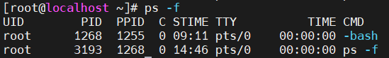
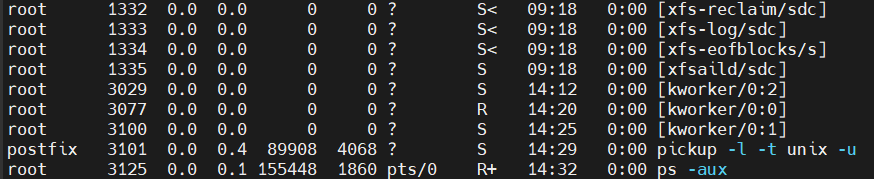
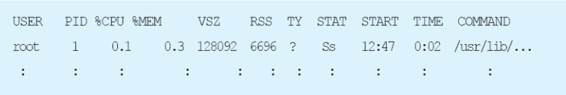
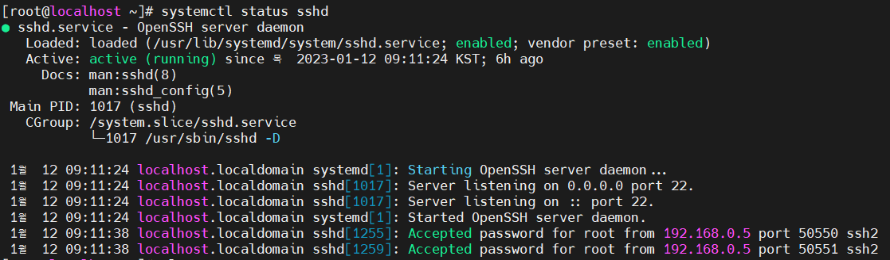
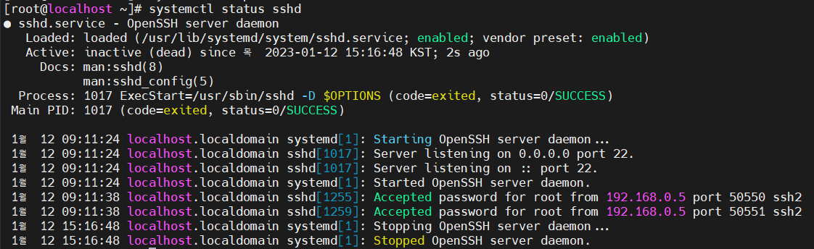
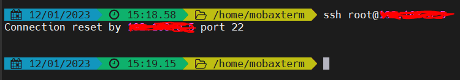

**목차**

1. [프로세스 개념](#프로세스-개념)
2. [프로세스 상태](#프로세스-상태)
3. [프로세스 종류](#프로세스-종류)
4. [프로세스 명령어](#프로세스-명령어)
5. [서비스와 소켓](#서비스와-소켓)

---

## 프로세스 개념

**메모리 상에 프로그램이 올라가 상태값을 가지고 기능을 수행할 수 있는 프로그램의 상태**

리눅스 시스템을 구동하기 위해 가장 먼저 활동하는 것이 시작 프로세스 (Unix 식 시동 프로세스와 유사)

* 프로세스는 컴퓨터에서 연속적 (실제로는 연속적이지 않으나 표현은 연속적이라 말한다) 으로 실행되고 있는 컴퓨터 프로그램을 의미
* 커널은 준비 큐, 대기 큐, 실행 큐 등의 자료 구조를 이용해 프로세스를 관리

---

## **프로세스 상태**

| 상태              | 설명                                                         |
| ----------------- | ------------------------------------------------------------ |
| 생성 (create)     | 프로세스가 생성되는 상태                                     |
| 실행 (running)    | 프로세스가 CPU 를 차지해 명령어들이 실행되고 있는 상태       |
| 준비 (ready)      | 프로세스가 CPU 를 사용하고 있진 않으나 언제든지 사용할 수 있는 상태<br />보통 준비 상태의 프로세스 중 우선 순위가 높은 프로세스가 CPU 할당 받음 |
| 대기 (waiting)    | 보류 (block) 이라 부르며 프로세스가 입출력 완료, 시그널 수신 등 사건을 기다리고 있는 상태 |
| 종료 (terminated) | 프로세스의 실행이 종료되는 단계                              |

**프로세스 상태 전이**

* 하나의 프로그램이 실행되면 그 프로그램에 대응되는 프로세스가 생성돼 준비 리스트의 끝에 들어간다
* 준비 리스트 상의 다른 프로세스들이 CPU를 할당 받아 순서대로 기다린 후 할당된 순서가 되면 CPU를 사용하게 됨 
* 이와 같은 과정 = 프로세스 상태 전이

**dispatch**

* 준비 리스트의 맨 앞에 있던 프로세스가 CPU 를 점유하게 되는 것 
  * 준비 상태 &rarr; 실행 상태 `dispatch (processname) : ready -> running`

**보류 (block)**

* 실행 상태의 프로세스가 허가 된 시간을 다 쓰기 전에 입출력 동작이 필요한 경우, 프로세스가 CPU 를 스스로 반납하고 보류 상태로 넘어가는 과정
  * `block (processname) : running -> blocked`

**시간 제한 (timeout)**

* 운영체제가 프로세스가 프로세서를 독점해서 사용하지 못하게 하기 위해 clock interrupt 둬서 (시분할 시스템의 time slice) 일정 시간 동안만 프로세서 점유할 수 있게 한다
  * `timeout (processtime) : running -> ready`

---

## 프로세스 종류

**포그라운드 프로세스**

화면에서 프로그램이 실행되고 있는 것을 눈으로 직접 확인할 수 있는 상태의 프로세스 구동

**백그라운드 프로세스**

프로세스가 실행됐지만 직접 눈으로 확인되지 않는 프로세스 (백신, 서버 데몬 등)


**프로세스 번호**

CPU 에서 처리하고자 하는 작업이 멀티태스킹과 같이 여러 개의 프로세스가 메모리에 로딩 돼있을 경우, 프로세스 구분 위해 각각 프로세스에 대한 고유 식별 방법이 존재해야 한다

* **CPU 가 프로세스를 구분하기 위해 부여되는 고유 번호를 의미**

**작업 번호**

현재 실행되는 백그라운드 프로세스가 CPU 를 점유해 작업 수행 시 순차 번호를 의미


**부모 프로세스와 자식 프로세스**

부모 프로세스는 **PPID (Parents Processor ID)** 를 가지며 자식 프로세스는 **PID (Processor ID)** 를 가지고 있으므로 서로 구분 된다

* 부모 프로세스를 종료하면 종속된 자식 프로세스도 강제 종료 된다

**좀비 프로세스**

자식 프로세스가 정상적 종료 되면 종속된 부모 프로세스에게 종료 정보를 보내게 되며, 이 정보는 커널에 존재하는 **PCB (Process Control Block)** 에서 자식 프로세스에 대한 정보가 제거 돼야 한다

* 하지만 PCB 목록에 남아 마치 살아 있는 프로세스인 것처럼 간주되는 프로세스를 좀비 프로세스라 한다

---

## 프로세스 명령어

**프로세스 상태 확인**

```bash
# 현재 실행 중인 프로세스의 상태 확인
ps

# 프로세스 상태에 대한 모든 정보 출력
ps -aux

# 부모 프로세스 정보 상세 확인
ps -f --ppid [프로세스 번호]
```

* (중요) 옵션

  * `-a` 터미널에서 실행한 프로세스의 정보 출력

  * `-e` 시스템에서 실행 중인 모든 프로세스의 정보 출력

  * `-u` 프로세스의 소유자, CPU 와 메모리 사용량 등 상세한 정보 출력

  * `-x` 시스템에서 실행 중인 모든 프로세스 정보 출력

  * `-ppid` pid 로 지정한 특정 프로세스의 정보 출력

  * `-f` 프로세스의 상태 상세한 정보 출력

    * `ps -f` 의 출력 결과

      

      | 항목 | 의미                      | 항목  | 의미                                 |
      | ---- | ------------------------- | ----- | ------------------------------------ |
      | UID  | 프로세스를 실행한 계정 ID | STIME | 프로세스의 시작 날짜                 |
      | PID  | 프로세스 번호             | TTY   | 프로세스가 실행된 터미널 종류와 번호 |
      | PPID | 부모 프로세스 번호        | TIME  | 프로세스 실행 시간                   |
      | C    | CPU 사용량 (%)            | CMD   | 실행되고 있는 프로그램 명령 이름     |

      

* `ps -aux` 출력 결과

  

  
  
  | 항목    | 의미                                                         |
  | ------- | ------------------------------------------------------------ |
  | USER    | 프로세스의 소유자                                            |
  | PID     | 실행 중인 프로세스를 구별하기 위한 프로세스의 고유 ID        |
  | %CPU    | 프로세스가 CPU 를 점유하는 비율                              |
  | %MEM    | 프로세스가 메모리를 점유하는 비율                            |
  | VSZ     | 프로세스가 사용 중인 가상 메모리의 크기 (KB)                 |
  | RSS     | 프로세스가 실제 사용 중인 물리적 메모리의 크기 (KB)          |
  | TY      | 프로세스가 시작되고 있는 터미널                              |
  | STAT    | 프로세스의 현재 상태<br />**R** 현재 실행되고 있는 프로세스 (running)<br />**S** 잠시 멈춘 상태로 인터럽트 가능한 상태 (sleep) &rarr; 20 초 이내<br />**D** 디스크의 입출력을 기다리는 상태 (In disk wait)<br />**T** 작업 제어에 의해 정지된 상태 (stopped)<br />**Z** 좀비 프로세스 (defunct)<br />**STIME** 프로세스의 시작 날짜 또는 시간<br />**s** 세션 리더 프로세스<br />**+** 포그라운드 프로세스 그룹<br />**l** 멀티 스레드 |
  | START   | 프로세스가 시작된 시각                                       |
  | TIME    | 현재까지 사용된 CPU 의 시간 (분 : 초)                        |
  | COMMAND | 프로세스가 실행한 명령행                                     |

**특정 프로세스 정보 검색**

```bash
pgrep [옵션] [패턴]
```

* 보통은 `ps -옵션` 으로 검색을 많이 한다

**프로세스 종료**

```bash
kill [시그널] PID
```

* 시그널
  * `-2` 인터럽트 시그널 전송 (`ctrl + c` 와 동일)
  * `-9` 프로세스 강제 종료
  * `-15` 프로세스가 관련 파일을 정리 후 종료 (종료되지 않는 프로세스도 있다)

* `pkill` 명령

  * PID 를 보내는 대신 프로세스의 명령 이름 (CMD) 으로 프로세스를 찾아서 종료
  * 같은 명령으로 수행한 프로세스를 명령 이름으로 찾아준다
    * 한꺼번에 같은 이름의 명령을 찾아서 모두 종료할 수 있다

  ```bash
  pkill
  ```

**프로세스 트리**

프로세스의 관계를 트리 형태로 출력

```bash
pstree
```

---

## 서비스와 소켓

### 서비스

**데몬 (Daemon)** 이라고 하며 서버 프로세스를 의미

* 네임 서버, 웹 서버, DB 서버 등의 프로세스 또는 네임 서버 데몬, 웹 서버 데몬, DB 서버 데몬 등으로 표현 된다
* 현재 시스템에서 동작 중인 프로세스므로 백그라운드 프로세스의 일종이라고 할 수 있다

서비스는 시스템과 상관없이 독자적으로 구동 돼 제공되는 프로세스

**실행과 종료는 `systemctl start/stop/restart 서비스 이름` 으로 사용**

* 실행 스크립트 파일은 `/usr/lib/systemd/system/` 디렉터리에 존재


### 소켓

서비스 (데몬) 은 필요 여부를 떠나 항상 가동하고 있는 서버 프로세스를 의미하는 반면, **소켓 (socket) 은 필요할 때만 작동하는 서버 프로세스**를 의미 (리눅스 한정)

* 외부에서 특정 서비스를 요청할 경우 systemd 서비스가 구동시키며 요청이 끝나면 소켓도 종료된다
* 관련 파일은 `/usr/lib/systemd/system` 디렉터리에 `소켓이름.socket` 이라는 이름으로 존재


### systemd 서비스 매니저

서비스와 소켓은 systemd 라 부르는 서비스 매니저 프로그램으로 작동과 관리

* 기존 유닉스의 `init` 프로세스가 수행하던 작업을 대신 수행

  * **(중요) `init` 과 다른 특징**
    * 셸과 독립적으로 부팅 가능
    * `fsck` 와 마운트 제어 가능
    * 소켓 기반 동작으로 inetd 와의 호환성 유지
    * 시스템 상태에 대한 스냅숏 유지
    * 서비스에 시그널 전달

* systemd 는 전체 시스템을 시작하고 관리하는데 **유닛 (unit)** 구성 요소를 사용

  | 유닛 종류   | 의미                                                     |
  | ----------- | -------------------------------------------------------- |
  | **service** | **가장 확실한 유닛으로 데몬을 시작, 종료, 재시작, 로딩** |
  | socket      | 소켓 관리                                                |
  | device      | 리눅스 장치 트리에 있는 장치 관리                        |
  | mount       | 디렉터리 계층 구조의 마운트 포인트 관리                  |
  | automount   | 디렉터리 계층 구조에서 자동 마운트 포인트 관리           |
  | path        | 경로 관리                                                |
  | snapshot    | 다른 유닛을 참조                                         |
  | swap        | 스왑 장치 관리                                           |
  | target      | 유닛들을 그루핑                                          |
  | timer       | 타이머 관련 기능 관리                                    |


### 명령어

```bash
# systemd 서비스 제어
systemctl [옵션] [명령] [유닛 이름]
```

* 명령
  * `start` 유닛 시작
  * `stop` 유닛 정지
  * `reload` 유닛 설정 파일 다시 읽어온다
  * `restart` 유닛 재시작
  * `status` 유닛 상태 출력
  * `enable` 부팅 시 유닛 자동 시작 설정
  * `disable` 부팅 시 유닛 자동 시작하지 않도록 설정
  * `kill` 유닛에 시그널 전송

---

**실습**

```bash
# ssh 서비스 구동 상태 확인
systemctl status sshd
```



* **active (running)** 을 확인할 수 있다

```bash
# ssh 서비스 구동 멈추기
systemctl stop sshd
```



* **inactive (dead)** 확인할 수 있다
  * 실제로 ssh 가 맡은 역할인 서버 접속을 시도해보면 안된다
  * 

```bash
# ssh 서비스 재구동
systemctl restart sshd
```

