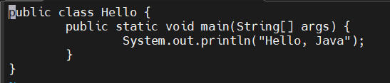

# 셸 스크립트와 환경 변수

**목차**

1. [셸의 개념과 기능](#셸의-개념과-기능)
2. [셸 스크립트 프로그래밍](#셸-스크립트-프로그래밍)
   * [변수 선언 및 사용](#변수-선언-및-사용)
   * [분기문과 관계 연산자](#분기문과-관계-연산자)
     * [분기문](#분기문)
     * [연산자](#연산자)
   * [함수](#함수)

---

## 셸의 개념과 기능

**사용자가 입력한 명령을 해석해 커널에게 전달하거나 커널의 처리 결과를 사용자에게 전달하는 역할을 수행**

* 명령어 해석 기능, 프로그래밍 기능, 사용자 환경 변수 설정 기능

* 환경 변수 종류

  

**환경 변수 설정 명령**

```bash
# 환경변수 설정
export [변수명]
# 환경변수 해제
unset [변수명]
```

* 환경 변수 설정 위해서는 먼저 셸 변수를 정의하고 `export` 명령으로 설정된 환경 변수 변경
  * `export 환경 변수 = 값` 형식으로 실행
  * 값 해제하려면 `unset 변수명` 명령 실행

**특징**

* 셸 스크립트는 셸이나 커맨드 라인 인터프리터에서 수행하도록 작성됐거나 운영체제를 위해 사용된 스크립트를 의미
* 단순한 도메인 고유 언어로 여겨지기도 한다
  * 파일 이용, 프로그램 실행, 문자열 출력 수행
* CentOS 기본 셸은 bash 로, 특징으로는 내역을 출력하는 history 기능이 있다
* **장점**
  * 다른 프로그래밍 언어에서 작성된 코드보다 훨씬 더 빠르다
  * 컴파일 (작성한 코드를 컴퓨터가 해석할 수 있도록 하는 과정) 과정이 없어서 코드를 빠르게 처리 가능
* **단점**
  * 실행되는 각 명령에 대한 잠재적으로 새로운 하부 프로세스가 많이 필요하게 돼 속도가 느려질 수 있다
  * 다양한 종류의 유닉스, 리눅스, BSD 운영체제, 시스템 유틸리티와의 호환성

---

## 셸 스크립트 프로그래밍

**셸 출력 명령**

```bash
# 화면에 한 줄의 문자열 출력
echo

# 환경변수 출력시 $[변수] 사용
echo $HOME
# /root
```

```bash
# 출력 형식 지정 명령
# %d, \n 등 C 언어에서 사용하는 출력함수로 형식을 지정해 출력
printf

# 숫자 (digit) 을 지정해서 출력
printf "%d + %d = %d \n" 10 20 30
# 10 + 20 = 30
```

**셸 스크립트 작성과 실행**

셸 스크립트란, 수행해야 할 명령이 모여있는 스크립트 (위에서 아래 &darr;, 왼쪽에서 오른쪽 &rarr; 으로 수행된다)

* 작성 시 주로 에디터를 사용한다
* 파일명 끝에 `.sh` 를 붙여서 셸 스크립트 파일임을 나타낸다

---

**실습**

* 파일 생성 후 에디터로 열기

  ```bash
  vi myname.sh
  ```

* `#! /bin/sh` 특별한 형태의 주석 (`#!`) 으로 bash 셸을 이용하겠다는 의미 (생략 불가능)

  ```bash
  #! /bin/sh
  ```

* 유저 이름과 호스트 이름을 출력하는 코드 작성

  ```bash
  #! /bin/sh
  
  echo $USERNAME
  echo $HOSTNAME
  
  # 종료 코드 (0 은 성공했다는 의미)
  exit 0
  ```

* 실행 시키기

  ```bash
  sh myname.sh
  
  #
  # localhost.localdomain
  ```

*반복적, 여러 명령을 묶어서 사용할 수 있기 때문에 셸 스크립트 사용하며, 이에 더해 원하는 기능을 만들 수 있기 때문에 사용*

---

### 변수 선언 및 사용

* C, C++, Java 등 프로그래밍에서는 변수를 사용하기 전에 먼저 변수 선언
* 셸 스크립트는 변수를 사용하기 전에 먼저 변수 선언하지 않고 변수에 처음 값이 할당되면 그 때 자동으로 변수 생성
  * **알파벳 대/소문자 엄격하게 구별하며 변수에 값을 대입할 때 `=` 좌우에 공백이 존재하면 안된다**

* **주의 사항**
  * 값 대입 시 큰 따옴표 `""` 로 묶어줘도 되고 안 해도 되지만 공백 있을 시 필수
  * 변수명 앞에 `$` 붙여줘야 한다
    * `$변수명` 또는 `"$ 변수명"` 이라 사용 (공백 있을 시 큰 따옴표 필수)

**숫자 계산**

셸 스크립트는 기본적으로 문자열로 처리 &rarr; 연산 수행하기 위해서는 ``expr` 형식으로 역 따옴표와 expr 을 공백 없이 붙여서 사용

* 연산식에서 괄호를 사용하려면 괄호 앞에 `\` 붙여야 한다
* 곱셈 연산 `*` 에서 앞에 반드시 `\` 붙여줘야 한다

```bash
#! /bin/sh

echo"====================================="
echo "첫 번째 정수 입력"
read num1 # 키보드로 입력한 값을 변수 num1 에 저장하는 read 명령
echo "두 번째 정수 입력"
read num2
echo "-----------------------"
echo "> 곱셈의 값"
gob=`expr $num1 \* $num2`
echo $gob
echo "-----------------------"
echo "===================================="

exit 0
```

**변수 설정 값**

```bash
# root 에 대한 설정 값
/etc/profile 
/etc/bashrc

# 사용자에 대한 설정 값
./bashrc
./bash_profile
```

---

**Java 실습**

* Hello.java 파일 생성

  ```bash
  vi Hello.java
  ```

  

* `Hello.java` 파일 생성 후 컴파일 명령어를 통해 `Hello.Class` 생성 후 실행

  ```bash
  # 컴파일 돼서 class 생긴다
  javac Hello.java
  
  # 실행
  java Hello
  # Hello, Java
  ```

---

**파라미터 변수**

자신이 실행한 명령어의 파라미터 (매개변수) 를 의미

* `$` 을 앞에 붙여 실행하는 명령의 부분을 각각 하나 씩 변수로 지정

---

## 분기문과 관계 연산자

### 분기문

프로그램의 흐름을 순차적으로 수행하다가 조건 또는 주어진 이유에 따라 다른 곳으로 흐름을 유도하는 구문을 의미

**조건문**

**if 문**

```bash
if [ 조건식 ] # 괄호와 조건식 사이, 조건식 내부에서도 = 좌우로 공백이 있어야 한다
			 # 예시 : if [ "space" = "space" ]
then
	조건식이 참일 경우 실행할 문장
fi # 셸 스크립트에서는 반드시 써줘야 한다
```

**if ~ else 문**

주어진 조건이 거짓일 경우에도 수행할 명령이 존재할 때 사용

```bash
if [ 조건식 ]
then
	조건식이 참일 경우 실행할 문장
else
	조건식이 거짓일 경우 실행할 문장
fi
```

* 조건이 많아지게 되면 구문이 복잡해지는 단점

* 복잡한 구문에서는 case ~ esac 분기문 사용하면 효과적

  * 여러 개의 조건을 펼쳐 놓고 어느 조건에 해당되는지 판별해 명령 수행

  ```bash
  case 파라미터 또는 키보드 입력값 in # 예시 : case "$1" in
  	조건 1 # 예시 : Spring
  		조건 1에 해당할 경우 실행할 명령 # 예시 : echo "봄"
  	조건 2 # 예시 : Summer
  		조건 2에 해당할 경우 실행할 명령 # 예시 : echo "여름"
      ...
  	조건 n # 예시 : Winter
  		조건 n에 해당할 경우 실행할 명령 # 예시 : echo "겨울"
  	*)
  		앞에서 주어진 조건 이외의 모든 경우 실행할 명령
  esac
  ```


**반복문**

누적되는 합을 구하거나 수행할 명령을 반복적으로 수행할 수 있도록 조건으로 제어

**for ~ in 문**

```bash
# Type 1
for ((초기값; 조건식; 증감값))
do
	조건식이 참일 동안 수행할 명령
done
```

```bash
# Type 2
for 변수 in seq 초기값 마지막값
do
	조건식이 참일 동안 수행할 명령
done
```

```bash
# Type 3
for 변수 in 값1, 값2, 값3 ...
do
	조건식이 참일 동안 수행할 명령
done
```

**while 문**

for 문은 반복 횟수를 정확히 알고 있을 때 주로 사용 &rarr; 반복 횟수를 모를 때 주로 while 문 사용

```bash
while [ 조건식 ]
do
	조건식이 참일 경우 실행할 문장
done
```

**until 문**

주어진 조건식이 항상 거짓일 경우에만 명령 수행 (조건식이 참일 때 멈추게 된다)

```bash
until [ 조건식 ]
do
	조건식이 거짓일 경우 실행할 문장
done
```

**break, continue, exit, return 문**

순서대로 수행 중이던 반복문 빠져나갈 때 사용, 반복문의 조건식으로 돌아가게 할 때 사용, 프로그램 종료 시 사용, 함수를 호출한 곳으로 반환값을 돌려줄 때 사용


### 연산자

두 개 이상의 값을 서로 비교할 때 사용하는 연산자이며 비교 연산자라고도 한다

**문자열 비교 연산자**

| 연산자 | 의미            | 사용 예                    | 결과                           |
| ------ | --------------- | -------------------------- | ------------------------------ |
| `=`    | 같음            | "문자열 1" `=` "문자열 2"  | 두 문자열이 같으면 참          |
| `!=`   | 같지 않음       | "문자열 1" `!=` "문자열 2" | 두 문자열이 같지 않으면 참     |
| `-n`   | Null 이 아닌 값 | `-n` "문자열"              | 문자열이 빈 문자열이 아니면 참 |
| `-z`   | Null 값         | `-z` "문자열"              | 문자열이 빈 문자열이면 참      |

**산술 비교 연산자**

| 연산자 | 의미        | 사용 예             | 결과                                 |
| ------ | ----------- | ------------------- | ------------------------------------ |
| `-eq`  | 같음        | 변수 1 `-eq` 변수 2 | 변수 1과 변수 2가 같으면 참          |
| `-ne`  | 같지 않음   | 변수 1 `-ne` 변수 2 | 변수 1과 변수 2가 같지 않으면 참     |
| `-gt`  | 큼          | 변수 1 `-gt` 변수 2 | 변수 1이 변수 2보다 크면 참          |
| `-ge`  | 크거나 같음 | 변수 1 `-ge` 변수 2 | 변수 1이 변수 2보다 크거나 같으면 참 |
| `-lt`  | 작음        | 변수 1 `-lt` 변수 2 | 변수 1이 변수 2보다 작으면 참        |
| `-le`  | 작거나 같음 | 변수 1 `-le` 변수 2 | 변수 1이 변수 2보다 작거나 같으면 참 |
| `!`    | 부정        | `!`변수 1           | 변수 1이 아니면 참                   |

**관계 연산자**

* 두 개 이상의 조건을 선언하고자 할 때 AND 와 OR 연산자
  * AND 연산자는 `-a` 또는 `&&` 사용
  * OR 연산자는 `-o` 또는 `||` 사용

---

## 함수

특정 목적을 수행하는 프로그램 모듈을 의미

**사용자 정의 함수 정의**

```bash
함수 이름 () # 함수 정의로, 예약어를 사용하면 안된다
{
수행하고자 하는 명령
return
}
```

**사용자 정의 함수 호출**

```bash
#! /bin/sh
..
함수 이름 # 함수를 호출하려는 위치에서 함수 이름을 코딩하면 호출된다
		# 파라미터도 같이 선언하려면 함수 이름 $1 $2 ... 식으로 호출
..
exit 0
```

---

**기타**

* 문자열을 명령문으로 인식

  * 현재는 거의 사용하지 않는다

  ```bash
  eval
  ```

* 출력 형식 지정

  ```bash
  printf
  ```

  