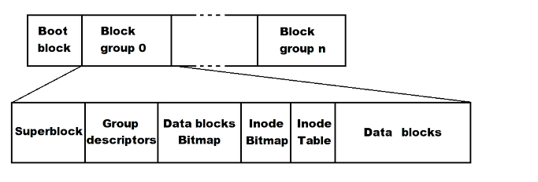
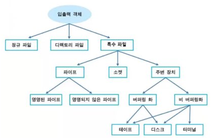

# 디렉터리와 파일

**목차**

1. [구성](#구성)
2. [종류](#종류)
3. [디렉터리와 파일 관리](#디렉터리와-파일-관리)

---

### 구성

**리눅스 시스템에서는 모든 처리 과정을 파일 단위로 처리**

* 파일의 구성은 계층적인 구조의 특성을 지님

**파일의 3 가지 요소 (중요)**

* **파일 이름** 

  * 사용자가 파일을 사용 목적에 맞도록 사용하고 해당 파일에 정확히 접근할 수 있도록 구별할 수 있는 변별력 제공
  * 리눅스 시스템에서는 파일의 속성을 지정하는 특별한 확장명은 제공되지 않는다 (확장자 정해져 있지 않다)
  * 리눅스 시스템에서 관리하는 모든 데이터는 파일이라는 단일 인터페이스를 지니고 있다

* **i-node (고유한 정보 값)** 

  * `Index Node` 의 줄임말로 파일을 기술하는 디스크 상 에서의 데이터 구조를 의미
  * 하나의 파일 생성 시 하나의 i-node 가 생성
    * 파일을 구별할 수 있도록 i-node 번호가 부여된다
  * **저장된 정보**
    * 파일의 종류
    * 파일의 소유권 - 사용자 (소유자) 와 그룹
    * 파일의 액세스 모드 (파일의 용도)
    * 파일의 타임 스탬프 (파일 갱신일)

* **데이터 블록**

  * 파일에서 데이터를 저장하는 블록을 의미

  * 일반 파일이나 디렉터리 파일의 데이터가 존재

  * 디스크 장치에 파일을 저장할 때 실제 데이터는 특별한 구분 없이 디스크에 저장하며 디스크의 어느 한 곳에 차례대로 쌓여있는 부분을 데이터 블록이라 한다

    

---

### 종류



**일반 파일**

* 데이터를 저장하는 파일이거나 실행하는 파일
* 실행 파일이나 이미지 파일의 경우 데이터가 바이너리 형태로 저장
* 일반 파일을 정규 파일이라고도 하며 정규 파일은 표준 입출력 시스템의 호출을 통해 참조된다

**디렉터리 파일**

* 디렉터리 (폴더) 를 의미 : 리눅스에서는 디렉터리 역시 파일로 취급된다
* 일반 파일과 마찬가지로 디스크에 저장돼 다른 파일을 조작하고 액세스하는데 필요한 정보 공유
* 디렉터리라는 파일을 이용해 전체 파일을 하나의 트리 구조로 관리

**특수 파일**

* 리눅스가 지원하는 **파이프, 소켓, 주변 장치 (디바이스)** 의미
  * 디바이스의 경우, 윈도우에서는 `C:`, `D:` 등으로 표시되지만 리눅스 시스템에서는 `/dev/hda1` 등으로 사용 된다
  * 파일의 영역은 키보드, 모니터, 마우스, 디스크 드라이브 등과 같이 컴퓨터의 모든 자원이 특수 파일로 사용되고 다뤄진다

기타 다른 파일

* 문서 파일과 이진 파일 (실행 파일)
* 링크 파일
* 등등

---

### 디렉터리와 파일 관리

```bash
# print working directory
# 현재 작업 디렉터리 위치 출력

pwd
```

**디렉터리 구조**


| 디렉터리 | 설명                                                         |
| -------- | ------------------------------------------------------------ |
| `bin@`   | 기본 명령어가 존재하는 심볼릭 링크 파일                      |
| `dev/`   | 시스템 디바이스 장치 파일이 존재하는 디렉터리                |
| `boot/`  | 리눅스 커널 등 부팅 시 필요한 파일들 포함                    |
| `etc/`   | 응용 프로그램의 설정 파일 등을 포함                          |
| `lib@`   | 공유 라이브러리가 존재하는 심볼릭 링크 파일                  |
| `home/`  | 일반 사용자들이 사용하는 홈 디렉터리                         |
| `tmp/`   | 시스템 임시 디렉터리로 다음 부팅 시 까지의 사용 될 임시 파일 저장 |
| `var/`   | 로그, 스풀, 메일 및 임시 파일을 포함                         |
| `lib64@` | 64 bit 운영체제 호환성과 관련된 파일이 존재하는 심볼릭 링크 파일 |
| `mnt/`   | 입/출력장치 등 파일 시스템을 임시로 마운트 하는 디렉터리     |
| `proc/`  | 프로세스 정보 등 커널 관련 정보가 저장되는 디렉터리          |
| `run/`   | 실행 중인 서비스와 관련된 파일이 저장되는 디렉터리           |
| `media/` | usb 메모리 등 임시로 마운트 되는 이동식 장치를 위한 디렉터리 |
| `srv/`   | FTP 또는 web 등 시스템에서 제공하는 서비스 데이터가 저장되는 디렉터리 |
| `usr/`   | 기본 실행 파일과 라이브러리 파일, 헤더 파일 등의 파일이 존재하는 디렉터리 |
| `sys/`   | 리눅스 커널과 관련된 파일이 존재하는 디렉터리                |
| `sbin@`  | 시스템 운영 관련 파일이 존재하는 심볼릭 링크 파일            |
| `root/`  | root 계정의 홈 디렉터리로 `/` (루트) 디렉터리와 성격이 다른 디렉터리 |
| `opt/`   | 리눅스 시스템에 존재하지 않는 프로그램이 추가 설치 되는 디렉터리 (3-rd Party 라이브러리) |

**작업 디렉터리**

사용자가 리눅스 시스템에 접속해 현재 사용하고 있는 디렉터리 의미

* 현재 작업 중 디렉터리는 `.` 으로 표시
* 현재 작업 중 디렉터리 확인 위해서는 pwd 명령 사용

**홈 디렉터리**

각 사용자에게 할당되는 디렉터리로 사용자 계정을 처음 만들 때 지정

* 홈 디렉터리의 표시는 `~` (틸드) 를 사용
* `guest_01` 계정의 홈 디렉터리는 `guest_01~` 과 같이 표시 된다

**절대 경로와 상대 경로**

* 리눅스 시스템에서 제공하고 있는 경로는 특정 파일이나 디렉터리의 위치를 나타내 준다

* 경로의 구분자는 `/` (슬래시)

  ```bash
  # 디렉토리 위치 이동
  # change directory
  
  cd
  ```

* **절대 경로**
  * 기준점 X, 어떤 위치더라도 접근할 수 있는 경로 (모든 경로를 전부 작성)

* **상대 경로**

  * 기준점을 기반으로 위치 설명 / 현재 작업하고 있는 디렉터리를 기준으로 계산된 상대적 경로

  - **.** : 현재 작업하는 위치

  - **..** : 현재 작업하는 위치의 상위 위치 (상위 폴더 / 부모 폴더)

**디렉터리 내용 확인**

list 의 약어인 ls 명령으로 디렉터리 내용 확인

```bash
# 디렉터리에 존재하는 파일이나 서브 디렉터리에 대한 정보 확인

ls [옵션] [파일명 또는 디렉터리명]
```

* 옵션
  * **`-a`** 숨겨 진 파일까지 포함해 모든 파일 리스트 출력
  * `-d` 지정한 디렉터리에 존재하는 파일과 디렉터리 정보 출력
  * **`-i`** 첫 번째 열에 i-node 번호를 출력
  * `-n` 호스트 네임 확인
  * **`-l`** 파일의 상세한 정보를 출력
  * **`-F`** 파일의 종류를 실행 파일은 `*` , 디렉터리는 `/` , 심볼릭 링크는 `@` 로 표시
  * `-L` 심볼릭 링크 파일은 원본 파일의 정보를 출력
  * `-R` 하위 디렉터리 리스트 출력 

**디렉터리 생성**

```bash
# Make directory 약어인 mkdir 명령으로 디렉터리 생성

mkdir [디렉터리명 1] [디렉터리명 2] [디렉터리명 3]
```

* 옵션
  * `-p` 하위 디렉터리 생성 시 중간 단계의 디렉터리가 없으면 자동으로 중간 디렉터리 생성

**디렉터리 제거**

```bash
# Remove Directory 의 약어인 기존에 존재하는 디렉터리 삭제
# 여러 개 삭제 가능

rmdir [옵션] [삭제할 디렉터리 명]
```

* 디렉터리가 비어있는 것만 지울 수 있다

  