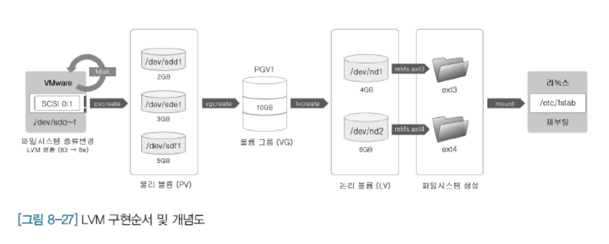
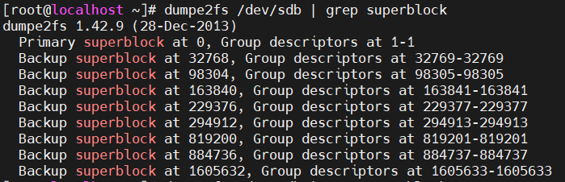

**목차**

1. [하드 디스크 추가](#하드-디스크-추가)
   * [디스크 파티션](#디스크-파티션)
   * [파일 시스템 생성](#파일-시스템-생성)
   * [디스크 마운트](#디스크-마운트)
2. [하드 디스크 관리](#하드-디스크-관리)
3. [파일 시스템 검사 및 복구](#파일-시스템-검사-및-복구)

---

**연결할 때 필요한 인터페이스 장치**

ATA 는 병렬 구조, SATA (serial ATA) 는 직렬 구조

SCSI 는 컴퓨터에 주변 기기를 연결할 때 직렬 방식으로 연결하기 위한 표준

* 현재 디스크 추가 실습은 SATA 사용했다

---

## 하드 디스크 추가

### 디스크 파티션

**디스크 파티션 작업의 의미**

* 물리적 하드 디스크를 독립된 영역으로 구분하는 것을 의미

* 디스크 전체를 하나의 파티션으로 사용할 수도 있고 여러 개의 파티션으로 나누어서 사용할 수도 있음

* 디스크 관리를 위해서는 디스크 장치 이름을 알아야 한다

  * 컨트롤러에 연결되는 디스크의 순서에 따라 이름은 알파벳이 추가 되는 방식으로 부여
    * `/dev/sda` &rarr; `/dev/sdb` &rarr; `dev/sdc`

  * 하나의 디스크를 여러 개의 파티션으로 구분해서 사용할 때
    * `/dev/sda` 디스크 장치 전체를 하나의 파티션으로 사용
    * `/dev/sda0`, `/dev/sda1` 설정된 용량 만큼의 파티션으로 구분

* 디스크 장치 전체를 하나의 파티션으로 사용하려 해도 **반드시 파티션 작업 수행해야 한다**

  ```bash
  # 파티션 만들기
  fdisk
  ```

  * 옵션
    * `-a` 부팅 파티션 설정
    * `-n` 새로운 파티션 추가
    * `-w` 파티션 정보 디스크에 저장 후 종료
    * `-v` 파티션 테이블 검사


### 파일 시스템 생성

**xfs (기본)**, ext2 ~ 4 등 CentOS 리눅스에서 사용되는 파일 시스템

```bash
mkfs.[파일 시스템] [하드디스크 명]
```


### 디스크 마운트

파티션 분할 후 파일 시스템 생성했다면 하드 디스크를 사용할 준비가 끝난 것

&rarr; 생성한 파일 시스템을 디렉터리 계층 구조에 마운트를 설정

* 마운트 포인트 필요

---

## 하드 디스크 관리

리눅스 시스템은 여러 사용자가 동시에 접속하여 사용

* 디스크의 용량은 언제든지 부족한 현상이 발생할 수 있음 

*&rarr; 디스크 용량이 부족할 때는 여러 개의 하드디스크를 하나의 하드 디스크처럼 사용할 수 있는 **LVM<sup>Logical Volume Manager</sup>** 기능을 활용*

**LVM**

* 파티션이 부족할 경우 다른 파티션의 용량을 가져와 사용할 수 있다

* **물리 볼륨 (PV)** 실제 하드 디스크의 파티션

* **볼륨 그룹 (VG)** 여러 개의 PV 를 합쳐서 1 개로 묶은 그룹

* **논리 볼륨 (LG)** VG 를 1 개 이상으로 적절한 크기로 나눈 파티션

  

---

## 파일 시스템 검사 및 복구

### 파일 시스템 검사

부적절한 시스템의 종료, 전원의 불안정, 기타 오류로 인해 손상된 파일 시스템이 존재하는지를 검사

* fsck 명령과 e2fsck 명령을 사용하여 파일 시스템을 검사

* file system check 약어로 디렉터리와 파일, I-node 와 블록, 파일 링크 등을 검사하고 필요한 경우 복구 작업도 수행

* `/etc/fstab` 에 지정된 파일 시스템을 대상으로 명령을 수행

  ```bash
  fsck [옵션] [장치명] [마운트 포인트]
  ```

  * 옵션
    * `-f` 강제적으로 파일 시스템 검사
    * `-p` 오류가 있는 파일 시스템을 자동 복구

**배드 블록 검사 : badblocks**

* 정전 등의 이유로 컴퓨터의 전원이 갑작스럽게 꺼지는 등의 비정상적인 시스템 구동으로 배드 블록 발생 

* 디스크에 심각한 오류와 데이터의 치명적인 피해를 유발 할 수 있으므로 주기적으로 배드 블록 검사가 필요

  ```bash
  badblocks [옵션] [디스크 장치명]
  ```


### 파일 시스템 복구

리눅스는 백업 슈퍼 블록을 제공하고 있으며 슈퍼 블록에는 다음과 같은 다양한 정보가 저장되어 있다

* 전체 블록의 수, 그룹 당 블록의 수, 블록의 크기, I-node 의 전체 노드의 수 등

  ```bash
  # 백업 슈퍼 블록의 위치 확인
  dumpe2fs [디스크 장치명]
  
  # 양이 정말 많으므로 grep 으로 조건 지정
  # superblock 만 출력
  dumpe2fs /dev/sdb | grep superblock
  ```

  

**현재 복구하려는 것은 파일 시스템!! 파일이 아니다**

**파일 시스템 복구하기** 

```bash
e2fsk -b [슈퍼블록 번호] [옵션] [디스크 장치명]

# e2fsck -b 8193 /dev/sdb
```

