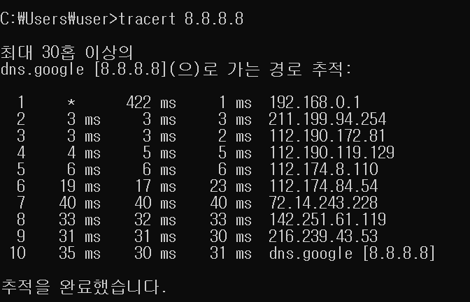
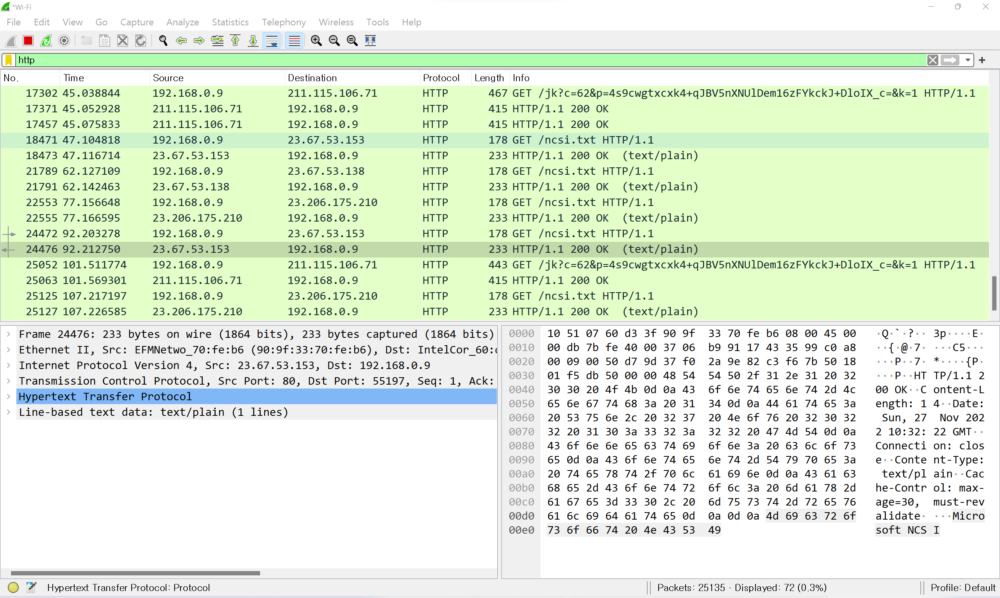

## 네트워크란 무엇인가

**목차**

1. [개념](#개념)
2. [분류](#분류)
3. [통신방식](#통신방식)
4. [프로토콜](#프로토콜)
5. [실습](#실습)

---

### 개념

**노드들이 데이터를 공유할 수 있게 하는 디지털 전기 통신망의 하나**

* 분산돼 있는 컴퓨터를 통신망으로 연결한 것
* 네트워크에서 여러 장치들은 노드 간 연결을 사용해 서로에게 데이터 교환
  * 노드 
    * 네트워크에 속한 컴퓨터 or 통신 장비를 뜻하는 말
  * 인터넷
    * 문서, 그림, 영상과 같은 여러가지 데이터를 공유하도록 구성
    * 세상에서 가장 크며 전세계를 연결하는 네트워크

---

### 분류

**크기에 따른 분류**

* **LAN (Local Area Network)**
  * 가까운 지역을 하나로 묶은 네트워크

* **WAN (Wide Area Network)**

  * 멀리 있는 지역을 하나로 묶은 네트워크

  * 가까운 지역끼리 묶인 LAN 들을 다시 하나로 묶은 것

**연결 형태에 따른 분류**

* **Star형**

  * 중앙 장비에 모든 노드가 연결돼 있다
    * LAN 대역일 때 많이 사용

  * 네트워크 장비가 고장난다면 연결돼있는 모든 장비가 작동 안된다

* **Mesh형**
  * 여러 노드들이 서로 그물처럼 연결

&rarr; 실제 인터넷은 여러 형태를 혼합한 형태로, **혼합형** 이다

---

### 통신방식

* **유니 캐스트**
  * 특정 대상과 1 : 1 으로 통신
* **멀티 캐스트**
  * 특정 다수와 1 : N 으로 통신
* **브로드 캐스트**
  * 네트워크에 있는 모든 대상과 통신

---

### 프로토콜

**네트워크에서 노드와 노드가 통신할 때 어떤 노드가 어느 노드에게 어떤 데이터를 어떻게 보내는지 작성하기 위한 양식**

* 각 프로토콜만의 양식이 있다 (eg. 택배 송장이나 편지 양식이 있는 것 처럼)
* 가까운 곳
  * Ethernet 프로토콜 (MAC 주소)
* 멀리 있는 곳
  * ICMP
  * IPv4
  * ARP (IP 주소)
* 여러가지 프로그램
  * TCP
  * UDP (포트 번호)

**여러가지 프로토콜**

* 패킷
  * 여러 프로토콜들로 캡슐화 된 것

---

### 실습

**첫번째**

1. CMD 검색 후 실행
2. `tracert 8.8.8.8` 실행

* dns.google 에 도착될 때 까지 10개의 네트워크 대역을 거쳤다는 의미

**두번째**

1. wireshark 설치
2. `get winPcap` 설치
3. 실행

