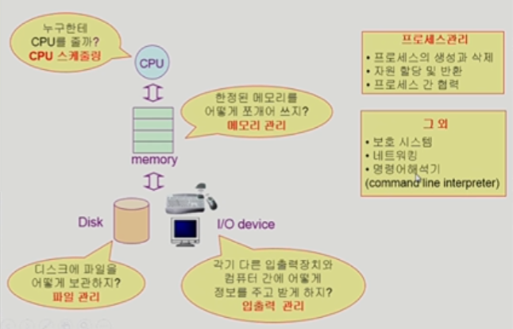

# 운영체제

## Introduction

**목차**

1. [운영체제란](#운영체제란)
2. [운영체제의 목표](#운영체제의-목표)
3. [운영체제의 분류](#운영체제의-분류)
4. [운영체제의 구조](#운영체제의-구조)

[[참고] 용어](#[참고]-용어)

---

#### 운영체제란

**컴퓨터 하드웨어 바로 위에 설치되며 사용자 및 다른 모든 소프트웨어와 하드웨어를 연결하는 소프트웨어 계층**

* 협의 
  * 운영체제의 핵심 부분으로 메모리에 상주하는 부분
  * 커널이라 부른다
* 광의
  * 커널 뿐 아니라 각종 주변 시스템 유틸리티를 포함한 개념

---

#### 운영체제의 목표

* 컴퓨터 시스템을 편리하게 사용할 수 있는 환경을 제공
  * 동시 사용자, 프로그램들이 각자 독자적 컴퓨터에서 수행되는 것 같은 착각 제공
  * 하드웨어를 직접 다루는 복잡한 부분을 운영체제가 대행
* 컴퓨터 시스템의 **자원을 효율적으로 관리**
  * 프로세서, 기억장치, 입출력 장치 등의 효율적 관리
    * 실행중인 프로그램들에게 짧은 시간씩 CPU 번갈아 할당
    * 실행중인 프로그램들에 메모리 공간을 적절히 분배
      * 사용자 간의 형평성 있는 자원 분배를 통해 주어진 자원으로 최대한의 효율을 낼 수 있도록

---

#### 운영체제의 분류

**동시 작업 가능 여부**

* 단일 작업 (single tasking)
  * 한 번에 하나의 작업만 처리
  * eg. MS-DOS 프롬포트 상에서는 한 명령의 수행을 끝내기 전에 다른 명령 수행시킬 수 없다
* 다중 작업 (multi tasking)
  * 동시에 두 개 이상의 작업 처리
  * eg. UNIX, MS Windows 등에서는 한 명령의 수행이 끝나기 전에 다른 명령이나 프로그램 수행 가능

**사용자의 수**

* 단일 사용자 (single user)
  * eg. MS-DOS, MS Windows
* 다중 사용자 (multi user)
  * eg. UNIX, NT server

**처리 방식**

* 일괄 처리 (batch processing)
  * 작업 요청의 일정량을 모아서 한꺼번에 처리
  * 작업이 완전 종료될 때까지 기다려야 한다 
* **시분할 (time sharing)**
  * 여러 작업을 수행할 때 컴퓨터 처리 능력을 일정한 시간 단위로 분할하여 사용
  * 일괄 처리 시스템에 비해 짧은 응답 시간을 가진다
  * interactive 한 방식, **현재 쓰는 방식**
* 실시간 (realtime OS)
  * 정해진 시간 안에 어떠한 일이 반드시 종료됨이 보장돼야 하는 실시간 시스템을 위한 OS
  * eg. 원자로, 공장 제어, 미사일 제어, 반도체 장비, 로봇 제어 등
    * Hard realtime system (경성 실시간 시스템)
    * Soft realtime system (연성 실시간 시스템)
      * 데드라인은 있으나 어겼다고 해서 크게 문제가 되지 않는 시스템
      * eg. 영화 (초당 프레임 맞추지 못하는 등)

---

#### 운영체제 예시

**UNIX (다중)**

* 코드의 대부분을 C 언어로 작성
* 높은 이식성과 복잡한 시스템에 맞게 확장 / 프로그램 개발에 용이
* 최소한의 커널 구조
* 소스 코드 공개

**DOS (단일)**

* MS 사에서 1981년 IBM-PC 를 위해 개발

* 단일 사용자용 운영체제
* 메모리 관리 능력의 한계 (주 기억장치 : 640KB)

**MS Windows**

* MS 사의 다중 작업용 GUI 기반 운영 체제
* Plug andPlay, 네트워크 환경 강화
* DOS 용 응용 프로그램과 호환성 제공
* 불안정성 (최근은 그다지 아닌 듯)
* 풍부한 지원 소프트웨어

**Handheld device를 위한 OS**

* PalmOS, Pocket PC (WinCE), Tiny OS

---

#### 운영체제의 구조

---

#### [참고] 용어

**Multitasking**

**Multiprogramming**

**Time sharing**

**Multiprocess**

* 컴퓨터에서 여러 작업을 동시에 수행하는 것 뜻하는 공통 의미
* Multiprogramming 은 메모리에 여러 프로그램이 올라가 있음을 강조
* Time sharing 은 CPU 의 시간을 분할해 나눠 쓴다는 의미 강조
* **Multiprocessor**
  * 하나의 컴퓨터에 CPU (processor) 가 여러 개 붙어있음을 의미

#### 
