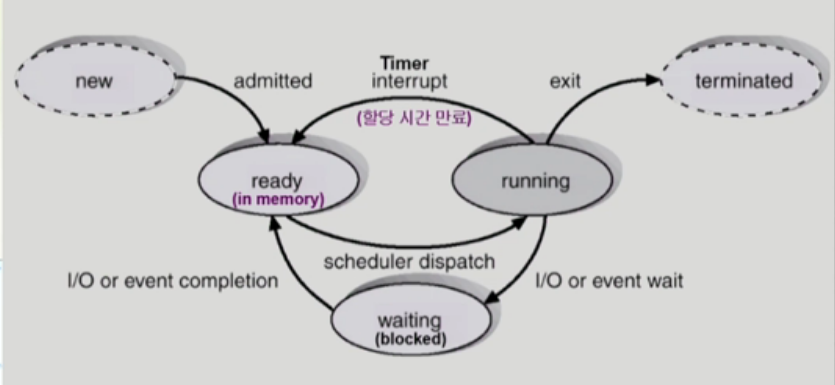
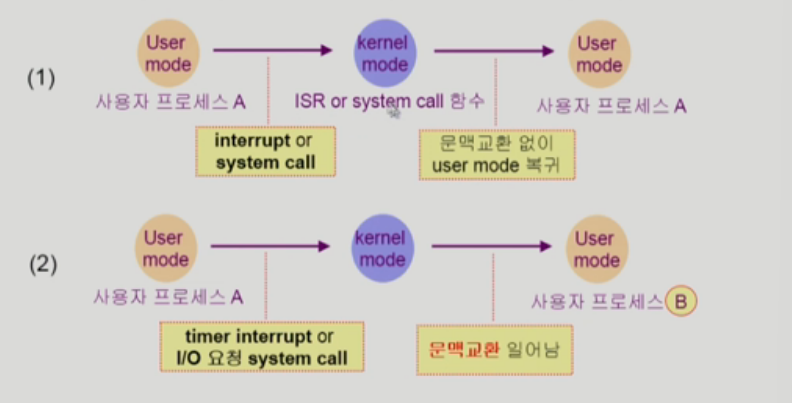
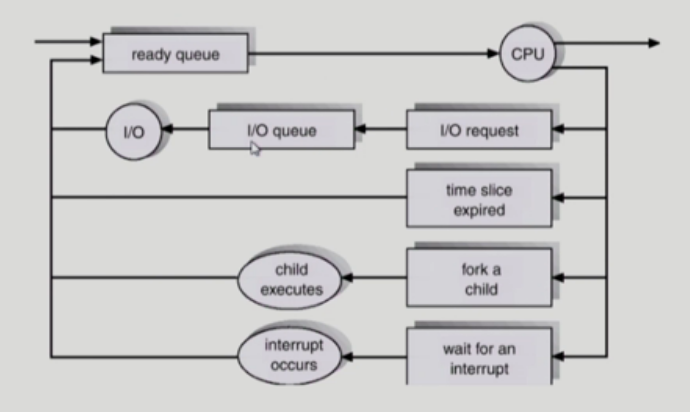
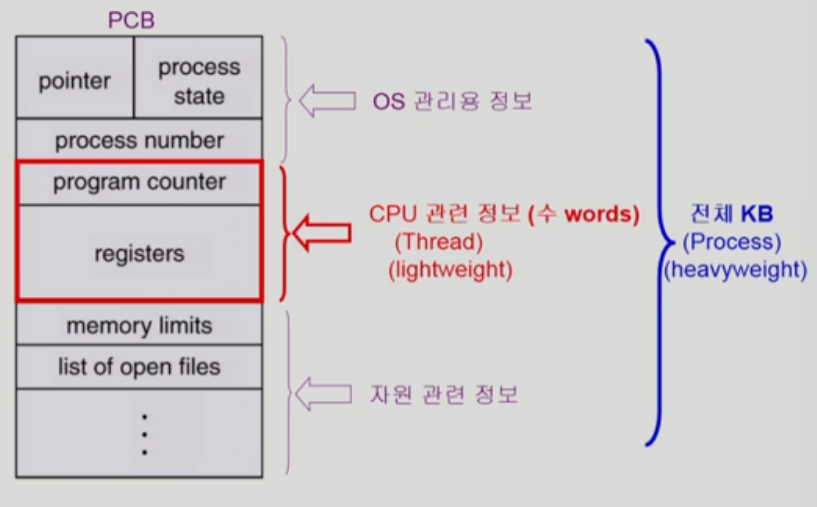

# Process

**Process is a program in execution**

**목차**

1. [개념](#개념)
2. [Process State (상태)](#process-state-(상태))
3. [문맥 교환 (Context Switch)](#문맥-교환-(context-switch))
4. [스케쥴링을 위한 큐](#스케쥴링을-위한-큐)
5. [스케쥴러 (Scheduler)](#스케쥴러-(scheduler))
6. [Thread](#thread)
7. [Thread 의 장점](#thread-의-장점)

---

### 개념

**프로세스의 문맥(context)**

* CPU 수행 상태를 나타내는 하드웨어 문맥
  * Program Counter
  * 각종 register
* 프로세스의 주소 공간
  * code, data, stack
* 프로세스 관련 커널 자료 구조
  * **PCB (Process Control Block)**
    * 운영체제가 각 프로세스를 관리하기 위해 프로세스 당 유지하는 정보
      * OS 가 관리상 사용하는 정보
        * Process State, Process ID
        * Scheduling information, priority
      * CPU 수행 관련 하드웨어 값
        * Program Counter, registers
      * 메모리 관련
        * Code, data, stack 의 위치 정보
      * 파일 관련
  * Kernel stack

---

### Process State (상태)

**프로세스는 상태 (state) 가 변경되며 실행된다**

* **Running**
  * CPU 를 잡고 instruction 을 수행 중인 상태
* **Ready**
  * CPU 를 기다리는 상태 (메모리 등 다른 조건은 모두 만족)
* **Blocked (wait, sleep)**
  * CPU 를 줘도 당장 instruction 을 수행할 수 없는 상태
  * Process 자신이 요청한 event (I/O 작업 등) 가 즉시 만족되지 않아 이를 기다리는 상태
  * 자신이 요청한 event 가 만족되면 Ready
* **Suspended (stopped)**
  * 외부적인 이유로 process 의 수행이 정지된 상태
  * process 는 통째로 디스크에 swap out 된다
    * eg. 사용자가 프로그램을 일시 정지 시킨 경우 (break key), 시스템이 여러 이유로 process 를 잠시 중단 시킨다 (메모리에 너무 많은 process 가 올라와 있을 때)
  * 외부에서 resume 해줘야 Active 
* New
  * 프로세스가 생성 중인 상태
* Terminated
  * 수행 (execution) 이 끝난 상태

---

### 문맥 교환 (Context Switch)

* CPU 를 한 프로세스에서 다른 프로세스로 넘겨주는 과정

  * CPU를 내어주는 Process 상태를 그 Process PCB 에 저장
  * CPU 를 새롭게 얻는 Process 의 상태를 PCB 에서 읽어온다

* System call 이나 Interrupt 발생시 반드시 Context Switch 가 일어나는 것은 아니다

  

  * (1) 의 경우에도 CPU 수행 정보 등 context 의 일부를 PCB 에 저장해야 하지만 문맥 교환을 하는 (2) 의 경우 그 부담이 훨씬 크다 (eg. cache memory flash)

---

### 스케쥴링을 위한 큐

**process 들은 각 queue 들을 오가며 수행된다**

**Job queue**

* 현재 시스템 내에 있는 모든 process 의 집합

**Ready queue**

* 현재 메모리 내에 있으면서 CPU 를 잡아서 실행되기를 기다리는 프로세스의 집합

**Device queues**

* I/O device 의 처리를 기다리는 프로세스의 집합

---

### 스케쥴러 (Scheduler)

**Long-term scheduler (장기 스케쥴러, Job scheduler)**

* 시작 process 중 어떤 것들을 ready queue 로 보낼지 결정
* process 에 memory 및 각종 자원을 주는 문제 관할
* Degree of Multiprogramming 을 제어
  * 메모리에 올라가 있는 process 의 수 (정도)
* Time sharing system 에는 보통 장기 스케쥴러가 없다 (무조건 Ready)

**Short-term scheduler (단기 스케쥴러, CPU scheduler)**

* 어떤 process 를 다음번에 running 시킬지 결정
* process 에 CPU 를 주는 문제 관할
* 충분히 빨라야 한다 (millisecond 단위)

**Medium-term scheduler (중기 스케쥴러, Swapper)**

* 여유 공간 마련을 위해 process 를 메모리에서 디스크로 이동 시킨다
  * 여기서 Suspended 상태가 추가된다
* process 에게서 memory 를 뺏는 문제 관할
* Degree of Multiprogramming 을 제어

---

### Thread

**Basic unit of CPU utilization**

**구성**

* Program counter
* register set
* stack space

**Thread 가 동료 thread 와 공유하는 부분 (=task)**

* code section
* data section
* OS resources

**다중 스레드로 구성된 태스크 구조에서는 하나의 서버 스레드가 blocked (waiting) 상태인 동안에도 동일한 태스크 내의 다른 스레드가 실행 (running) 되어 빠른 처리 가능**

* 동일한 일을 수행하는 다중 스레드가 협력하여 높은 처리율 (throughput) 과 성능 향상을 얻을 수 있다
* 스레드를 사용 시 병렬성을 높일 수 있다

---

### Thread 의 장점

**Responsiveness (응답성)**

* 높은 반응 속도 (if one thread is blocked another thread continues)
  * 읽어온 결과와 무관하게 실행할 수 있는 것 (일종의 비동기식 출력)

**Resource Sharing**

* N threads can share binary code, data, resource of the process
* 별도의 process 생성 대신 공유
  * 자원 효율적 이용

**Economy (경제성)**

* Creating & CPU switching thread (rather than a process)
* Solaris 의 경우 위 두 가지 overhead 가 각각 30배, 5배
  * process 생성이나 switching 보다 thread 생성이나 switching 이 훨씬 효율적

**Utilization of MP Architectures**

* Each thread may be running in parallel on a different processor
  * 병렬적으로 실행 가능